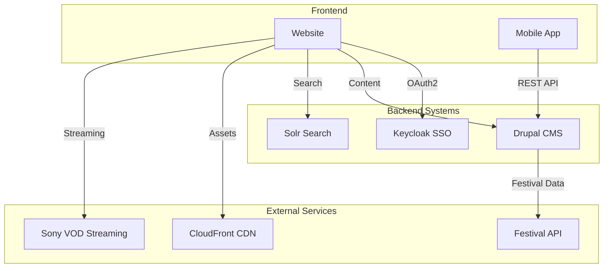

# Website Audit for Drupal Relaunches

## Overview

This skill provides a comprehensive, AI-first methodology for auditing existing websites in preparation for Drupal relaunches. Analyze websites systematically, map all features to Drupal architecture components (Content Types, Paragraphs, Taxonomies, Views), estimate project effort using baseline comparison, and generate professional VitePress documentation sites.

**Use this skill when:**
- Conducting website audits for Drupal relaunch projects
- Creating project estimates for client proposals
- Mapping existing website features to Drupal entities
- Generating comprehensive audit documentation
- Comparing projects to the adessoCMS baseline
- Planning migration strategies

**Key capabilities:**
- AI-powered website analysis using MCP tools
- Drupal-native feature mapping (Content Types, Paragraphs, Taxonomies, etc.)
- Baseline comparison against adessoCMS reference project
- Bottom-up estimation with multipliers and risk adjustment
- Performance analysis (Core Web Vitals)
- Accessibility audit (WCAG 2.1 Level AA)
- Migration planning and complexity assessment
- VitePress documentation site generation

## Audit Workflow

Follow this comprehensive workflow to conduct website audits. Each phase builds on the previous one to create a complete analysis.

### Phase 1: Discovery & Initial Analysis

#### 1.1 Navigate to Website

Use Chrome DevTools MCP or Puppeteer to access and analyze the website.

**Steps:**
1. Navigate to the website URL provided by the user
2. Take initial screenshots (homepage, key pages)
3. Extract site structure from navigation menus and footer
4. Identify main sections and page types

**MCP Tools:**
```
mcp__chrome-devtools__navigate_page (url: <website_url>)
mcp__chrome-devtools__take_screenshot (fullPage: true)
mcp__chrome-devtools__take_snapshot
```

**Save:** Screenshots to audit data directory as `screenshots/homepage.png`, `screenshots/key-page-*.png`

#### 1.2 Analyze Technology Stack

Inspect the page source and network requests to identify:
- Current CMS (WordPress, Joomla, Typo3, Drupal, custom)
- CMS version
- Frontend frameworks (React, Vue, jQuery)
- CSS frameworks (Bootstrap, Tailwind, custom)
- Hosting information
- CDN usage

**Detection patterns:**
- WordPress: `/wp-content/`, `<meta name="generator" content="WordPress">`
- Joomla: `/components/`, `/modules/`
- Typo3: `typo3temp/`, `typo3conf/`
- Drupal: `/sites/default/files/`, `Drupal.settings`

**MCP Tools:**
```
mcp__chrome-devtools__evaluate_script (function: "() => document.documentElement.outerHTML")
mcp__chrome-devtools__list_network_requests
```

**Document:** Current technology stack in audit data

#### 1.3 Assess Content Volume

Find and analyze sitemap to understand content scale:

1. Check for sitemap.xml at `/sitemap.xml`, `/sitemap_index.xml`
2. Parse sitemap to extract all URLs
3. Categorize URLs by pattern (e.g., `/news/`, `/events/`, `/team/`)
4. Count pages per category
5. Identify URL patterns for content types

**MCP Tools:**
```
mcp__chrome-devtools__navigate_page (url: 'https://example.com/sitemap.xml')
mcp__chrome-devtools__take_snapshot
```

**Document:** Content volume breakdown by page type

### Phase 2: Content Architecture Analysis

#### 2.1 Identify Page Types

Sample diverse pages to identify distinct page types and their structures.

**Process:**
1. Select representative pages from each URL pattern category
2. For each page, navigate and analyze structure
3. Document fields and components present
4. Take screenshots for reference
5. Identify patterns and variations

**For each page type, document:**
- Page type name (e.g., "Landing Page", "Article", "Event")
- Title/heading structure
- Body content (rich text, plain text, structured)
- Images (hero, gallery, inline)
- Metadata (author, date, categories, tags)
- Custom fields (location, price, date range, etc.)
- Related content sections
- CTAs and forms
- Typical page count

**Map to Drupal:**
Each page type becomes a Drupal **Content Type** with:
- Appropriate field structure
- Taxonomy references
- Paragraph field for flexible content
- View modes (full, teaser, search result)

Refer to `references/drupal_architecture_patterns.md` for Content Type patterns.

#### 2.2 Inventory Content Components

Analyze page layouts to identify reusable content components that will map to Paragraph types.

**Component categories to identify:**

**Layout Components:**
- Sections/containers with background colors
- Multi-column layouts (2-col, 3-col, etc.)
- Accordions and tabs
- Sidebyside layouts

**Content Components:**
- Text blocks (WYSIWYG)
- Images with captions
- Galleries (grid, slider, lightbox)
- Videos (embedded or uploaded)
- Quotes/testimonials
- CTAs (buttons with text)
- Hero sections (banner + image + text + CTA)

**Interactive Components:**
- Carousels/sliders
- Statistics/counters with animation
- Maps (Google, OpenStreetMap)
- Forms (contact, registration)

**Advanced Components:**
- Cards (image + title + text + link)
- Card grids
- Feature grids (icons + text)
- Team grids (person references)
- Logo grids (partners/clients)
- News/blog grids
- Embedded views/blocks

**For each component, document:**
- Component name
- Visual appearance (screenshot)
- Content fields needed
- Layout variations
- Usage frequency (high/medium/low)
- Complexity (simple/medium/complex)
- Mapping to Drupal Paragraph type

Refer to `references/drupal_architecture_patterns.md` for Paragraph type patterns.

**Best practice:** Consider using the `adesso_paragraph_section` pattern where common fields (theme variant, width, spacing) are automatically added to ALL paragraph types programmatically.

#### 2.3 Document Taxonomies

Identify all classification systems used on the website:

**Taxonomy types:**
- Categories (hierarchical or flat)
- Tags (free-form keywords)
- Locations (geographic classification)
- Authors (if not using User entities)
- Topics/industries
- Content formats

**For each taxonomy:**
- Vocabulary name
- Hierarchical or flat structure
- Approximate number of terms
- Usage (which content types use it)
- Mapping to Drupal vocabulary

#### 2.4 Analyze Media Usage

Sample media usage across pages to understand requirements:

**Media types:**
- Images (JPEG, PNG, SVG, WebP)
- Documents (PDF, DOC, XLS)
- Videos (MP4, YouTube, Vimeo)
- Audio (MP3, WAV)
- Icons (SVG, icon fonts)

**Document:**
- Media type name
- Usage frequency
- Typical file sizes
- Organization patterns
- Metadata needs (alt text, captions, credits)
- Mapping to Drupal Media types

### Phase 3: Functionality & Features Analysis

#### 3.1 Identify Interactive Features

Systematically test and document interactive functionality:

**Forms:**
- Contact forms (fields, validation, submission handling)
- Search functionality (full-text, filters, autocomplete)
- Event registration
- Newsletter signups
- Quote/inquiry forms
- File upload forms

**Map to:** Webform module or Search API

**User Features:**
- Login/registration
- User profiles
- Comments/discussion
- Ratings/reviews

**Integrations:**
- Social media (share buttons, feeds)
- Maps (embedded, interactive)
- Analytics (Google Analytics, Matomo)
- Marketing (newsletter, CRM)
- Payment gateways (if e-commerce)
- Third-party APIs

**For each feature:**
- Feature name and description
- Complexity (simple/medium/complex)
- Required Drupal modules
- Custom development needed
- Integration requirements

#### 3.2 Document Navigation Structure

Map all navigation elements:

**Navigation types:**
- Main navigation (levels, mega menu)
- Footer navigation
- Utility navigation (language, login, etc.)
- Breadcrumbs
- Related content links

**Document:** Menu structure and hierarchy

#### 3.3 Inventory Views & Listings

Identify all content listing pages:

**Listing types:**
- News/blog listings (grid, list, featured)
- Event calendars
- Team directories
- Product catalogs
- Search results
- Archive pages
- Category/tag pages

**For each listing:**
- Content type displayed
- Layout style (grid, list, table, carousel)
- Pagination or infinite scroll
- Filters and facets available
- Sorting options
- Items per page
- Mapping to Drupal View configuration

Refer to `references/drupal_architecture_patterns.md` for View patterns.

### Phase 4: Performance Analysis

#### 4.1 Measure Core Web Vitals

Use Chrome DevTools Performance panel to capture metrics:

**MCP Tools:**
```
mcp__chrome-devtools__performance_start_trace (reload: true, autoStop: true)
mcp__chrome-devtools__performance_stop_trace
mcp__chrome-devtools__performance_analyze_insight
```

**Metrics to capture:**
- Largest Contentful Paint (LCP) - target: < 2.5s
- First Input Delay (FID) - target: < 100ms
- Cumulative Layout Shift (CLS) - target: < 0.1
- Time to First Byte (TTFB)
- Total page size
- Number of requests
- JavaScript execution time

**Document:** Performance scores and identify bottlenecks

#### 4.2 Analyze Asset Optimization

Check network requests for optimization opportunities:

**MCP Tools:**
```
mcp__chrome-devtools__list_network_requests (resourceTypes: ['image', 'stylesheet', 'script'])
```

**Analyze:**
- Image formats and sizes (opportunities for WebP conversion)
- CSS/JS bundles (minification, compression)
- Font loading strategies
- Third-party scripts
- CDN usage
- Caching headers

**Document:** Asset optimization recommendations

### Phase 5: Accessibility Analysis

#### 5.1 Run WCAG 2.1 Audit

Use Accessibility MCP to test compliance:

**MCP Tools:**
```
mcp__a11y-accessibility__test_accessibility (url: <website_url>, tags: ['wcag2aa'])
mcp__a11y-accessibility__check_color_contrast (foreground, background)
mcp__a11y-accessibility__check_aria_attributes (html)
```

**Test homepage and representative pages from each page type.**

**Issues to identify:**
- Color contrast failures
- Missing alt text on images
- Invalid ARIA attributes
- Missing form labels
- Poor heading hierarchy
- Keyboard navigation issues
- Focus indicator problems
- Missing skip links

**Categorize by severity:**
- Critical (blocks access)
- Serious (major barrier)
- Moderate (significant barrier)
- Minor (minor inconvenience)

**Document:** Accessibility audit results and remediation plan

#### 5.2 Estimate Remediation Effort

Calculate hours needed to achieve WCAG 2.1 Level AA compliance:

- Audit: 4-8 hours
- Implementation: 16-32 hours (depends on issue count)
- Testing: 8-16 hours

Refer to `references/drupal_architecture_patterns.md` for accessibility patterns.

### Phase 6: Integration & System Landscape Analysis

#### 6.1 Identify External Systems

Analyze all external integrations and third-party systems:

**Common integration types:**
- SSO/Authentication (SAML, OAuth2, LDAP, Keycloak)
- Payment gateways (Stripe, PayPal, custom)
- CRM systems (Salesforce, HubSpot)
- Marketing automation (Mailchimp, Marketing Cloud)
- Analytics (Google Analytics, Adobe Analytics)
- Search engines (Solr, Elasticsearch, Algolia)
- CDN (CloudFront, Akamai, Cloudflare)
- Video platforms (YouTube, Vimeo, custom streaming)
- APIs (REST, GraphQL, SOAP)
- Mobile apps (iOS, Android)

**Analysis steps:**
1. Review network requests for API calls
2. Check JavaScript for integration libraries
3. Inspect backend code (if accessible)
4. Interview stakeholders about integrations
5. Document each integration's:
   - Purpose and functionality
   - Technical implementation (API, SDK, embed)
   - Data flow direction (inbound/outbound/bidirectional)
   - Authentication method
   - Update frequency
   - Business criticality (critical/important/nice-to-have)
   - Migration complexity (low/medium/high)

**Output:** Integration inventory with system landscape diagram

#### 6.2 Create System Landscape Diagram

Use Mermaid to visualize the system architecture:



**Save diagram** to `docs/integrationen/systemlandschaft.md`

#### 6.3 Document Integration Requirements

For each critical integration, create detailed documentation:

**Template:**
```markdown
# [Integration Name]

## Overview
[Purpose and business value]

## Current Implementation
- **Technology:** [API/SDK/Embed/etc.]
- **Authentication:** [OAuth2/API Key/None/etc.]
- **Data Format:** [JSON/XML/etc.]
- **Update Frequency:** [Real-time/Hourly/Daily/etc.]

## Drupal Migration Strategy
- **Approach:** [Custom module/Contrib module/Service]
- **Complexity:** [Low/Medium/High]
- **Estimated Effort:** [X hours]
- **Risks:** [List potential issues]

## Dependencies
- [Required Drupal modules]
- [External service requirements]

## Testing Strategy
- [How to test integration]
```

**Save** each integration doc to `docs/integrationen/[integration-name].md`

### Phase 7: Migration Analysis

#### 7.1 Assess Export Capabilities

Determine migration approach based on source system:

**Best → Worst:**
1. Structured export (XML, JSON, CSV) - BEST
2. Database access with SQL queries - GOOD
3. API with pagination - MEDIUM
4. Web scraping - CHALLENGING (last resort)

**Check for:**
- CMS export functionality
- Database access availability
- API endpoints
- Admin access level

**Document:** Recommended migration approach

#### 7.2 Assess Content Cleanup Requirements

Identify cleanup needed during migration:

**Common cleanup tasks:**
- HTML tag cleanup (remove inline styles, deprecated tags)
- Image path corrections
- Broken link fixing
- Content deduplication
- Metadata normalization
- File organization
- Shortcode → Paragraph conversion (WordPress)

**Classify cleanup complexity:**
- Simple: Direct field mapping, minimal cleanup
- Medium: Some HTML cleanup, taxonomy restructuring
- Complex: Extensive parsing, significant restructuring

**Document:** Content cleanup scope

#### 7.3 Calculate Migration Effort

Use migration complexity to estimate hours:

**Formula:**
```
Base setup: 20-40 hours

Per content type (per 100 nodes):
- Simple: 8-12 hours × 1 = 8-12 hours
- Medium: 8-12 hours × 2 = 16-24 hours
- Complex: 8-12 hours × 3-4 = 24-48 hours
```

**Document:** Migration plan with phased approach and effort estimate

Refer to `references/estimation_guidelines.md` for migration estimation details.

### Phase 8: Technology Comparison & AI Opportunities

#### 8.1 Current Tech → Drupal Analysis

Create migration analysis comparing current technology to Drupal:

**Steps:**
1. Document detected CMS/technology stack
2. Map current features to Drupal equivalents
3. Identify what can be preserved vs. rebuilt
4. Estimate migration complexity
5. Document risks and mitigations

**Output:** `current-to-drupal.md` in VitePress docs

Refer to `references/migration-patterns.md` for detailed migration paths by source system.

#### 8.2 CMS Comparison Matrix

Generate comparison of Drupal CMS vs. alternatives:

**Compare:**
- Drupal 11 (vanilla)
- Drupal CMS 2.0 (recommended)
- Enterprise alternatives (Magnolia, Umbraco, Ibexa)

**Criteria:**
- Licensing & TCO
- Time to market
- AI capabilities
- Editor experience
- Scalability
- Security
- Ecosystem

**Output:** `cms-matrix.md` in VitePress docs

Refer to `references/cms-comparison.md` for detailed comparison data.

#### 8.3 Identify AI Opportunities

Analyze website for AI enhancement potential:

**Categories to assess:**
- Content creation (drafting, SEO, meta)
- Content enhancement (tone, grammar, translation)
- Automation (tagging, alt text, summaries)
- Search & discovery (semantic, recommendations)
- User interaction (chatbots, assistants)
- Moderation (quality, compliance)

**For each opportunity:**
1. Current state (manual/none)
2. AI-enabled state
3. Drupal AI module/feature
4. Estimated time savings
5. Implementation effort

**Output:** `ai-opportunities.md` in VitePress docs

Refer to `references/drupal-ai-capabilities.md` for AI module features.

#### 8.4 Drupal CMS Recipe Mapping

Map required features to Drupal CMS recipes:

**Check which recipes apply:**
- Content types (blog, news, events, person, project, case study)
- Functionality (forms, search, authentication, anti-spam)
- SEO & analytics (basic SEO, SEO tools, Google Analytics)
- Privacy & accessibility
- AI features

**Calculate time savings:**
- List applicable recipes
- Sum PT savings per recipe (see drupal-cms-features.md)
- Compare to custom development

**Output:** `drupal-cms-benefits.md` in VitePress docs

Refer to `references/drupal-cms-features.md` for recipe details and PT savings.

---

### Phase 9: Drupal Architecture Design

#### 9.1 Design Content Types

Map each page type to a Drupal Content Type:

**For each content type:**
1. Choose machine name (lowercase_with_underscores)
2. Define fields:
   - Field type (text, entity reference, image, etc.)
   - Cardinality (single or multiple values)
   - Required or optional
   - Default values
3. Add paragraph field for flexible content
4. Attach taxonomies
5. Define view modes (full, teaser, search result)
6. Plan workflows if needed
7. Classify complexity (simple/medium/complex)

**Use patterns from:** `references/drupal_architecture_patterns.md`

#### 9.2 Design Paragraph Types

Map each content component to a Paragraph type:

**For each paragraph:**
1. Choose machine name
2. Define fields with types and cardinality
3. Plan allowed parent types
4. Consider nesting (can paragraphs contain other paragraphs?)
5. Plan for section wrapper fields (theme, width, spacing)
6. Map to theme component (SDC)
7. Classify complexity (simple/medium/complex)

**Consider:** Using `adesso_paragraph_section` pattern for consistent styling fields

#### 9.3 Design Views

Map each listing page to a Drupal View:

**For each view:**
1. Choose name and purpose
2. Define content type queried
3. Plan display types (page, block, feed, attachment)
4. Configure filters (exposed, contextual)
5. Set sorting options
6. Choose display format (grid, list, table, calendar)
7. Configure pagination or ajax loading
8. Plan caching strategy
9. Classify complexity (simple/medium/complex)

#### 9.4 Select Modules

Identify required contributed modules:

**Core functionality:**
- Paragraphs 1.17 (flexible layouts)
- Webform 6.3+ (forms)
- Pathauto (URL patterns)
- Focal Point (responsive images)
- Media Library (media management)

**Admin UX:**
- Gin 5.x (admin theme)
- Admin Toolbar (enhanced toolbar)

**SEO:**
- Yoast SEO for Drupal
- Metatag
- XML Sitemap

**Search:**
- Search API
- Search API Solr (if needed)

**Performance:**
- BigPipe (core)
- CSS/JS Aggregation (core)

**Custom modules:**
Document any custom modules needed for:
- Business logic
- Integrations (APIs, external services)
- Custom calculations
- Security/access control
- Custom field types

### Phase 10: Estimation

#### 10.1 Bottom-Up Estimation

Calculate base hours using the estimation table:

**Count entities:**
- Content Types: ___
- Paragraph Types: ___
- Taxonomies: ___
- Media Types: ___
- Views: ___
- Webforms: ___
- Blocks: ___
- Custom Modules: ___
- Theme Components (SDC): ___

**For each entity:**
1. Classify complexity (simple/medium/complex)
2. Apply hours from estimation table
3. Sum totals by type

**Estimation table:**

| Entity | Simple | Medium | Complex |
|--------|--------|--------|---------|
| Content Type | 3h | 6h | 12h |
| Paragraph | 1.5h | 3.5h | 6h |
| Taxonomy | 1.5h | 3h | 6h |
| Media Type | 1.5h | 3h | 3.5h |
| View | 3h | 6h | 12h |
| Webform | 3h | 6h | 12h |
| Block | 1.5h | 3h | 6h |
| Custom Module | 12h | 28h | 70h |
| Theme Component | 3h | 6h | 12h |

**Apply multipliers:**
- Testing: +20-30%
- Documentation: +10-15%
- QA: +15-20%
- Multilingual: +30-50% (if needed)
- Advanced permissions: +20-30% (if needed)
- Custom integrations: +50-100% (if needed)
- Security: +30-50% (if high requirements)
- Performance optimization: +20-30% (if needed)
- Accessibility: +20-30% (for WCAG 2.1 AA)

**Add migration effort:**
From Phase 6.3 calculation

**Add additional effort:**
- Infrastructure setup: 60h
- Project management (18% of subtotal)
- Training & handover: 30h

**Apply buffer:**
- Low risk: +15%
- Medium risk: +20%
- High risk: +25%

**Use the script:** `scripts/calculate_estimate.py` to automate calculation

Refer to `references/estimation_guidelines.md` for complete methodology.

#### 10.2 Baseline Comparison

Validate estimate against adessoCMS baseline:

**Baseline (adessoCMS):**
- 6 Content Types
- 32 Paragraph Types
- 27 Views
- 1,136 config files
- **693 hours total effort**

**Calculate scale factor:**
```
Scale = (Project Entities / Baseline Entities)
```

**Example:**
```
If project has ~700 config files:
Scale = 700 / 1,136 = 0.62 (62% of baseline)

Estimated hours = 693h × 0.62 × complexity_factor
If similar complexity (1.0): 430h
If more complex (1.2): 516h
```

**Compare:** Bottom-up estimate vs. baseline-derived estimate

- If difference < 15%: Estimates align well
- If difference 15-30%: Review assumptions
- If difference > 30%: Investigate complexity differences

Use the more conservative (higher) estimate or average the two.

Refer to `references/baseline_adessocms.md` for complete baseline analysis.

#### 10.3 Risk Assessment

Identify and document risks:

**Risk factors:**
- Unclear requirements
- Complex migration
- Significant custom code needed
- Team experience gaps
- Tight deadlines
- Budget constraints
- Third-party dependencies

**Classify overall risk:** Low / Medium / High

**Apply appropriate buffer:**
- Low: +15%
- Medium: +20%
- High: +25%

**Document assumptions:**
- List all assumptions made during estimation
- Note any uncertainties
- Identify dependencies

### Phase 11: Documentation Generation

#### 11.1 Compile Audit Data

Create structured JSON with all audit findings:

**Required fields:**
- project_name
- url
- current_cms
- audit_date
- summary (counts, totals)
- key_findings (executive summary, strengths, opportunities, challenges)
- technology_stack (current, recommended)
- content_volume
- content_architecture (page_types, paragraph_types, taxonomies, media_types)
- features
- performance
- accessibility
- migration

**Use template:** `assets/vitepress-template/audit_report_template.json`

Save as: `audit_data/audit_report.json`

#### 11.2 Generate Estimation Data

Create entities JSON for estimation:

**Required fields:**
- project_name
- audit_date
- content_types: [{name, complexity}]
- paragraphs: [{name, complexity}]
- taxonomies: [{name, complexity}]
- media_types: [{name, complexity}]
- views: [{name, complexity}]
- webforms: [{name, complexity}]
- theme_components: [{name, complexity}]
- custom_modules: [{name, description, complexity}]
- multipliers: {testing, documentation, qa, etc.}
- migration: {nodes, complexity}
- risk_level
- assumptions: []
- risks: []

Save as: `audit_data/entities.json`

#### 11.3 Run Estimation Script

Calculate detailed estimates:

```bash
python scripts/calculate_estimate.py audit_data/entities.json
```

**Outputs:**
- `audit_data/estimation_report.md` (detailed breakdown)
- `audit_data/estimation_result.json` (structured data)

#### 11.4 Generate VitePress Site with adesso Branding

Create professional documentation site with adesso SE corporate design:

```bash
python scripts/generate_vitepress_site.py audit_data audit-docs --with-theme
```

**This creates:**
- Complete VitePress project structure with adesso branding
- Custom theme with adesso colors and typography
- Configuration files with Google Fonts integration
- Markdown pages for all sections
- Navigation and sidebar with blue gradient
- Homepage with project overview
- All audit findings organized by section
- Integration system landscape diagrams
- CMS comparison matrices

**adesso SE Corporate Theme includes:**
- **Colors:**
  - Primary: `#006EC7` (adesso Blue)
  - Secondary: `#461EBE` (adesso Violet)
  - Gradient navbar/sidebar (blue to violet)
  - White text on blue gradient backgrounds
- **Typography:**
  - Body: Fira Sans (Google Fonts)
  - Headings: Fira Sans Condensed (Google Fonts)
  - Larger base font size (17px) for readability
- **Layout:**
  - Full-width content (max-width: 1920px)
  - Professional spacing and hierarchy
  - Accessible color contrast (WCAG AA compliant)

**Theme customization files created:**
- `docs/.vitepress/theme/index.js` - Theme entry point
- `docs/.vitepress/theme/custom.css` - adesso brand colors and styles
- `docs/.vitepress/theme/README.md` - Theme documentation

**Next steps for user:**
```bash
cd audit-docs
npm install
npm run docs:dev  # Preview at http://localhost:5173
npm run docs:build  # Build for deployment
```

**Deployment options:**
- **Netlify (recommended):** Connect Git repo, auto-deploy on push
- **GitHub Pages:** Set `base: '/repo-name/'` in config.js
- **Custom server:** Deploy `docs/.vitepress/dist/` directory

#### 11.5 Review and Finalize

**Before delivering:**
- Review all estimates for accuracy
- Validate complexity classifications
- Check assumptions and risks
- Ensure screenshots are included
- Verify all sections are complete
- Test VitePress site locally

**Deliverables checklist:**
- [ ] VitePress documentation site
- [ ] Estimation report (Markdown + JSON)
- [ ] Audit report JSON
- [ ] Screenshots directory
- [ ] README with setup instructions

## Key Principles

### 1. AI-First Analysis

Leverage MCP tools extensively:
- Chrome DevTools MCP for website interaction
- Puppeteer MCP for automation
- Accessibility MCP for WCAG testing
- Never do manually what can be automated

### 2. Drupal-Native Thinking

Always map features to Drupal entities:
- Page types → Content Types
- Components → Paragraph Types
- Categories → Taxonomies
- Listings → Views
- Forms → Webforms
- Assets → Media Types

Think in terms of configuration over custom code.

### 3. Baseline Comparison

Always compare to adessoCMS baseline:
- Use scale factor for validation
- Apply complexity adjustments
- Cross-check bottom-up vs. baseline estimates
- Document differences and rationale

### 4. Risk-Adjusted Estimation

Include appropriate buffers:
- Document all assumptions
- Identify risks explicitly
- Apply 15-25% buffer based on risk level
- Present estimates as ranges (optimistic/likely/pessimistic)

### 5. Comprehensive Documentation

Generate professional deliverables:
- Structured JSON data
- Markdown reports
- VitePress documentation sites
- Screenshots and diagrams
- Clear next steps

## Common Patterns

### Small Project (~300-450h)

**Characteristics:**
- 3-4 content types
- 10-15 paragraph types
- 2 taxonomies
- 30-40 theme components
- 100-200 pages
- Simple migration

**Timeline:** 8-11 weeks @ 40h/week

### Medium Project (~550-850h)

**Characteristics:**
- 4-6 content types
- 15-25 paragraph types
- 3-4 taxonomies
- 40-60 theme components
- 200-500 pages
- Moderate migration complexity

**Timeline:** 14-21 weeks @ 40h/week

**Example:** adessoCMS baseline (693h)

### Large Project (~1,000-1,600h)

**Characteristics:**
- 8-12+ content types
- 40-60+ paragraph types
- 6-10+ taxonomies
- 80-120+ theme components
- 500-1,500+ pages
- Complex migration

**Timeline:** 25-40 weeks @ 40h/week

## Resources

### references/

**baseline_adessocms.md** - Complete 84-page analysis of the adessoCMS Drupal 11 project serving as the estimation baseline. Includes all content types, paragraph types, views, components, and effort calculations.

**drupal_architecture_patterns.md** - Comprehensive reference for mapping website features to Drupal entities. Covers Content Types, Paragraph Types, Taxonomies, Media Types, Views, Webforms, Blocks, Custom Modules, and Theme Components with estimation guidelines.

**estimation_guidelines.md** - Systematic estimation methodology including bottom-up calculation, baseline comparison, multipliers, risk assessment, and validation checklist. Includes estimation template and formulas.

**audit_methodology.md** - Step-by-step audit process covering all 10 phases from discovery through documentation generation. Includes MCP tool commands, quality checklists, and timeline guidelines.

**drupal-cms-features.md** - Complete documentation of Drupal CMS 2.0 features including all 22 recipes, Canvas (Experience Builder), Mercury Theme, and PT savings calculations. Essential for proposal selling points.

**drupal-ai-capabilities.md** - Comprehensive guide to Drupal AI module capabilities including all submodules (AI Core, Explorer, Automators, Search, Chatbot, CKEditor, Content, Translate), supported providers, and ROI calculations.

**cms-comparison.md** - Detailed comparison matrix of Drupal/Drupal CMS vs. enterprise alternatives (Magnolia, Umbraco, Ibexa) across 10 criteria. Includes decision matrix template and proposal arguments.

**migration-patterns.md** - Migration paths from common CMS platforms (WordPress, Typo3, Magnolia, Umbraco, Ibexa) to Drupal with content mapping, effort estimation, and complexity factors.

### scripts/

**calculate_estimate.py** - Python script that calculates project estimates from structured entity data. Takes entities.json as input, applies estimation table and multipliers, generates detailed markdown report and JSON results.

```bash
python scripts/calculate_estimate.py audit_data/entities.json
```

**generate_vitepress_site.py** - Python script that generates complete VitePress documentation sites from audit data. Creates structure, config, pages, navigation, and copies adesso theme files from template.

```bash
python scripts/generate_vitepress_site.py audit_data audit-docs
```

**Features:**
- Generates VitePress config with Google Fonts integration
- Copies adesso SE corporate theme from `assets/vitepress-theme/`
- Creates all documentation pages with proper navigation
- Includes Integration section for system landscape

### assets/

**vitepress-template/** - Template files and structure for VitePress documentation sites. Includes README with setup instructions, example audit_report_template.json showing expected data format, and structure documentation.

**vitepress-theme/** - adesso SE corporate theme for VitePress documentation:
- `.vitepress/theme/index.js` - Theme entry point
- `.vitepress/theme/custom.css` - Complete adesso branding (colors, typography, gradients)
- `.vitepress/theme/README.md` - Theme documentation with customization guide

**Theme Features:**
- adesso Blue (#006EC7) and Violet (#461EBE) gradient navbar/sidebar
- Fira Sans typography (body) and Fira Sans Condensed (headings)
- WCAG AA accessible color contrast (21:1 for body text)
- Full-width layout (max-width: 1920px)
- Light mode only (consistent brand presentation)

## Tips for Success

### During Analysis

1. **Take many screenshots** - Visual documentation is invaluable
2. **Sample diverse pages** - Don't assume all pages of a type are identical
3. **Test interactions** - Click forms, filters, search to understand functionality
4. **Check mobile** - Use responsive mode to see mobile layouts
5. **Document as you go** - Don't wait until the end to structure findings

### During Estimation

1. **Be conservative** - Better to overestimate than underestimate
2. **Include ALL phases** - Setup, development, testing, documentation, training
3. **Don't forget migration** - Often underestimated, especially cleanup effort
4. **Validate with baseline** - Cross-check bottom-up calculation
5. **Document assumptions** - What you're assuming affects the estimate
6. **Apply appropriate buffer** - 15-25% based on risk level

### During Documentation

1. **Use templates** - Follow audit_report_template.json structure
2. **Be specific** - "5 content types" not "some content types"
3. **Include visuals** - Screenshots help stakeholders understand
4. **Organize clearly** - Use sections and subsections logically
5. **Test VitePress site** - Run locally before delivering

## Troubleshooting

**Problem:** MCP tools can't access website

**Solution:** Check if website requires authentication, uses bot detection, or has restrictive CORS. May need to use manual analysis or request credentials.

---

**Problem:** Baseline comparison shows huge difference (>50%)

**Solution:** Review complexity classifications. Projects can legitimately differ greatly. Use bottom-up as primary estimate and document why baseline doesn't apply well.

---

**Problem:** Too many page variations to categorize

**Solution:** Group by primary structure, not minor variations. Use paragraph flexibility to handle variations within one content type.

---

**Problem:** Migration complexity unclear

**Solution:** Request sample export or database access to assess data quality. When in doubt, estimate as "medium" and apply 20% buffer.

---

**Problem:** Client wants detailed timeline with milestones

**Solution:** Use effort distribution percentages from estimation_guidelines.md to break down phases. Typical: Discovery 5-10%, Infrastructure 5-8%, Content Architecture 15-20%, Components 25-35%, Theme 20-30%, Migration 10-20%, Testing 10-15%, Documentation 5-8%, Training 5-8%.

## Quick Reference

### MCP Tools for Audits

```
# Navigate and screenshot
mcp__chrome-devtools__navigate_page (url)
mcp__chrome-devtools__take_screenshot (fullPage: true)
mcp__chrome-devtools__take_snapshot (verbose: true)

# Performance
mcp__chrome-devtools__performance_start_trace (reload: true, autoStop: true)
mcp__chrome-devtools__performance_stop_trace
mcp__chrome-devtools__performance_analyze_insight (insightSetId, insightName)

# Network
mcp__chrome-devtools__list_network_requests (resourceTypes)
mcp__chrome-devtools__get_network_request (reqid)

# Accessibility
mcp__a11y-accessibility__test_accessibility (url, tags: ['wcag2aa'])
mcp__a11y-accessibility__check_color_contrast (foreground, background)
mcp__a11y-accessibility__check_aria_attributes (html)

# Interactions
mcp__chrome-devtools__click (uid)
mcp__chrome-devtools__fill (uid, value)
mcp__chrome-devtools__evaluate_script (function)
```

### Estimation Formulas

```
Base Hours = Σ (Entity Count × Complexity Hours)

Multiplier Hours = Base Hours × Σ (Multiplier Percentages)

Migration Hours = Setup (30h) + (Nodes / 100 × Hours per 100 × Complexity)

Additional Hours = Infrastructure (60h) + Training (30h) + PM (18% of subtotal)

Subtotal = Base + Multipliers + Migration + Additional

Buffer = Subtotal × Risk Percentage (15-25%)

Total = Subtotal + Buffer
```

### Scale Factors

```
Small Project: 40-60% of baseline (~300-450h)
Medium Project: 70-100% of baseline (~550-850h)
Large Project: 140-200% of baseline (~1,000-1,600h)
```

---

**Remember:** This skill is about providing accurate, defensible estimates based on systematic analysis and proven baseline comparison. Take the time to be thorough - it pays off in realistic expectations and successful projects.
