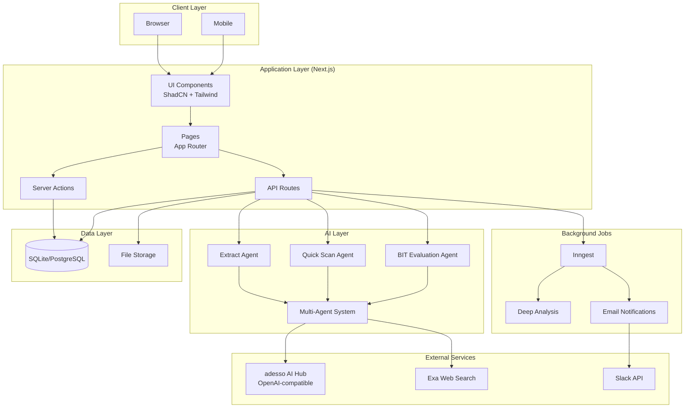
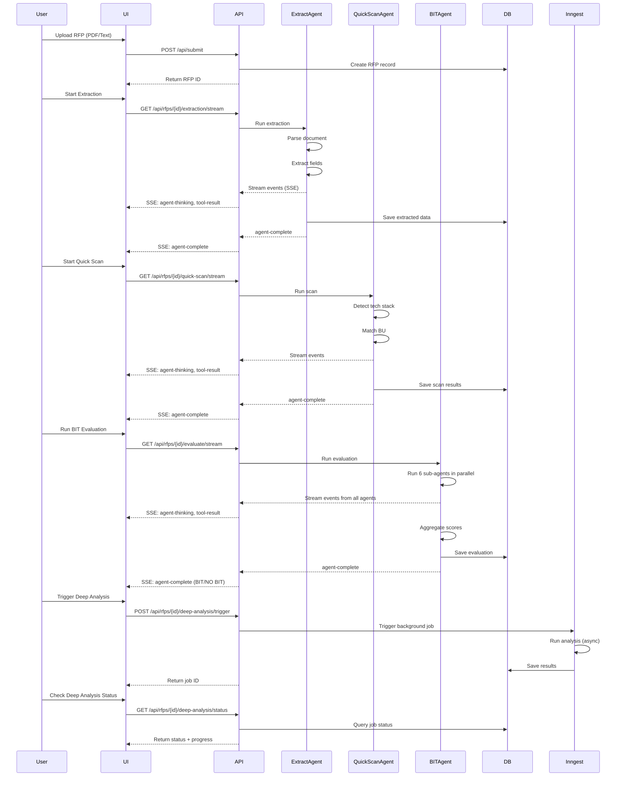
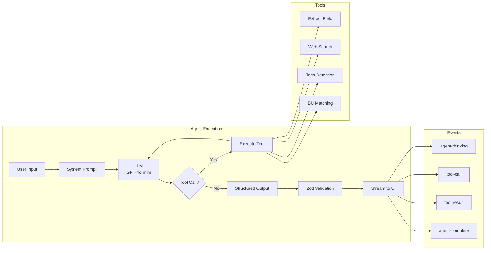
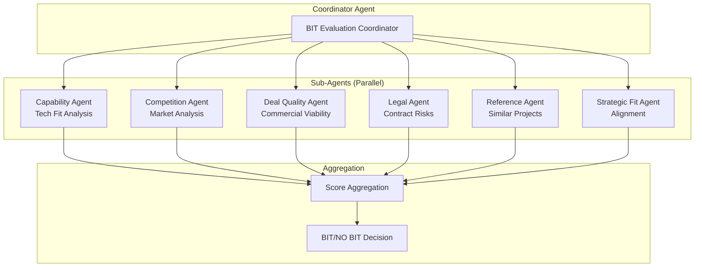
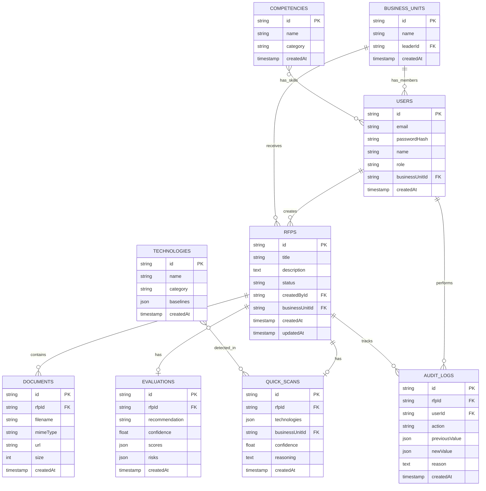
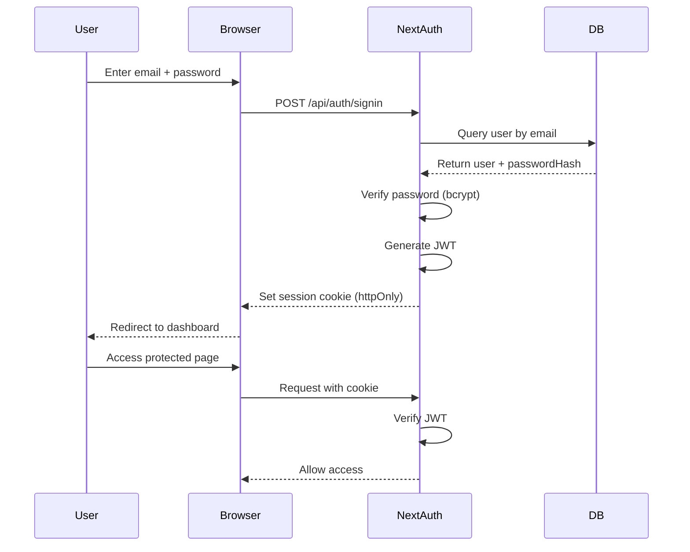
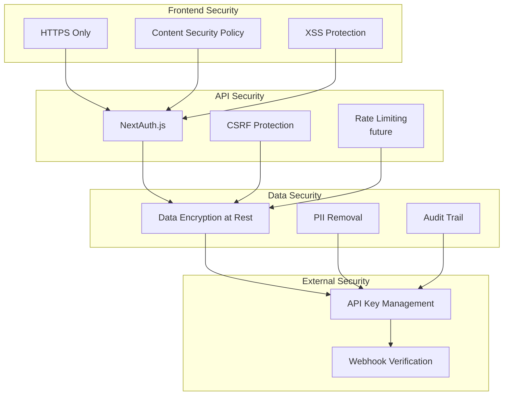
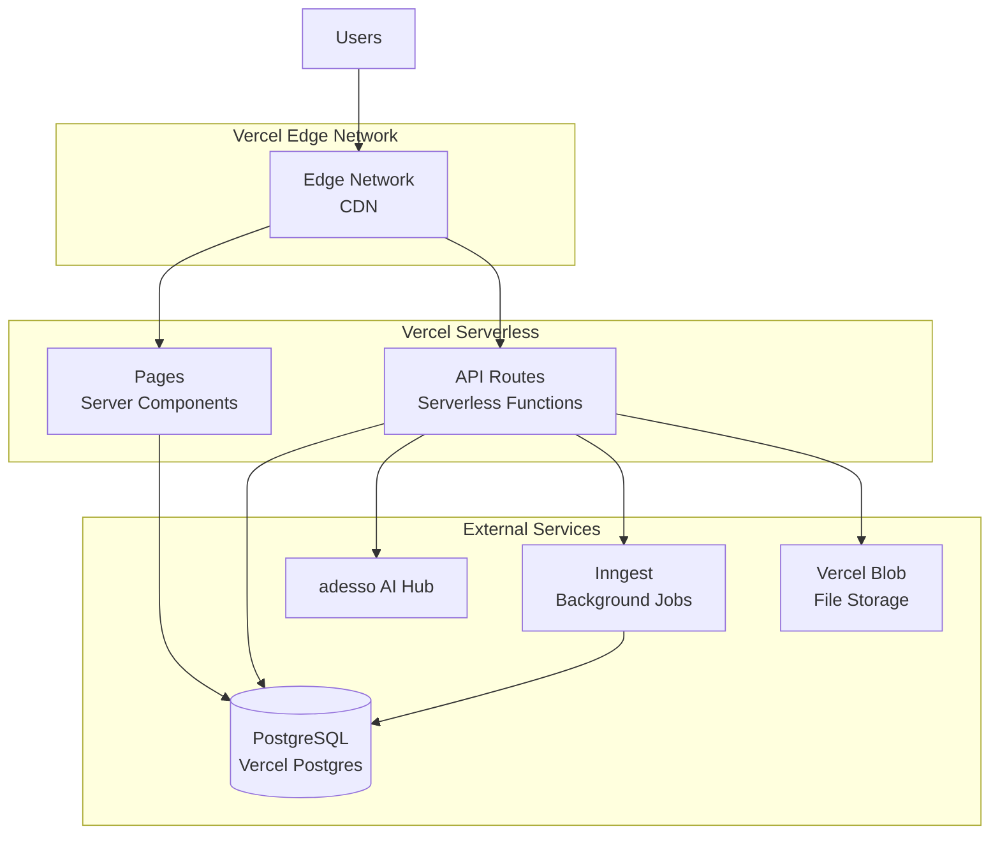
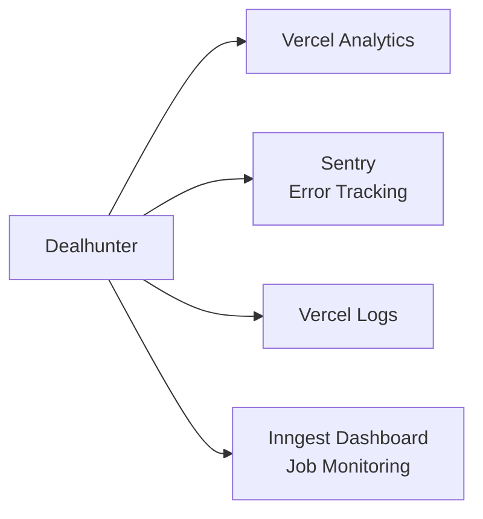

# System Architecture

This document describes the architecture of Dealhunter, an AI-powered BD decision platform.

## Table of Contents

- [High-Level Architecture](#high-level-architecture)
- [Technology Stack](#technology-stack)
- [System Components](#system-components)
- [Data Flow](#data-flow)
- [AI Agent Architecture](#ai-agent-architecture)
- [Database Schema](#database-schema)
- [Security Architecture](#security-architecture)
- [Deployment Architecture](#deployment-architecture)

---

## High-Level Architecture



---

## Technology Stack

### Frontend

| Layer | Technology | Purpose |
|-------|-----------|---------|
| **Framework** | Next.js 16 (App Router) | React framework with SSR/SSG |
| **UI Library** | ShadCN UI | Component library (Radix + Tailwind) |
| **Styling** | Tailwind CSS v4 | Utility-first CSS framework |
| **AI UI** | Vercel AI SDK Elements | Streaming conversation UI |
| **Charts** | Recharts | Data visualization |
| **Forms** | React Hook Form + Zod | Form handling & validation |
| **State** | Zustand | Client state management |

### Backend

| Layer | Technology | Purpose |
|-------|-----------|---------|
| **Runtime** | Node.js 20+ | JavaScript runtime |
| **Framework** | Next.js API Routes | API endpoints |
| **AI SDK** | Vercel AI SDK v5 | LLM orchestration |
| **Database** | Drizzle ORM | Type-safe SQL queries |
| **Auth** | NextAuth.js v5 | Authentication & sessions |
| **Jobs** | Inngest | Background job processing |
| **Validation** | Zod | Schema validation |

### Data & Storage

| Component | Technology | Purpose |
|-----------|-----------|---------|
| **Database** | SQLite (dev)<br/>PostgreSQL (prod) | Relational data storage |
| **File Storage** | Vercel Blob (prod)<br/>Local FS (dev) | Document storage |
| **Cache** | In-memory (dev)<br/>Redis (future) | Caching layer |

### AI & External Services

| Service | Provider | Purpose |
|---------|----------|---------|
| **LLM** | adesso AI Hub (OpenAI-compatible) | GPT-4o, GPT-4o-mini |
| **Web Search** | Exa | Semantic web search |
| **Notifications** | Slack API | Team notifications |
| **Email** | Resend (future) | Email notifications |

---

## System Components

### 1. Frontend Layer

```
app/
├── (dashboard)/              # Authenticated routes
│   ├── layout.tsx           # Sidebar layout
│   ├── page.tsx             # Dashboard home
│   ├── bids/                # RFP management
│   │   ├── page.tsx         # RFP list
│   │   ├── new/             # Upload form
│   │   └── [id]/            # RFP detail
│   ├── accounts/            # Account management
│   ├── analytics/           # Analytics dashboard
│   └── admin/               # Admin panel
├── (auth)/                  # Public routes
│   ├── login/
│   └── register/
└── api/                     # API routes
```

**Key Patterns:**
- Server Components by default
- Client Components marked with `'use client'`
- Server Actions for mutations
- Streaming responses for AI

### 2. API Layer

```
app/api/
├── auth/                    # NextAuth.js
├── submit/                  # File upload
├── rfps/[id]/
│   ├── extraction/stream/   # SSE: Extraction
│   ├── quick-scan/stream/   # SSE: Quick Scan
│   ├── evaluate/stream/     # SSE: BIT Evaluation
│   ├── deep-analysis/       # Background job control
│   ├── visualization/       # json-render UI
│   └── bu-matching/         # BU recommendation
├── admin/
│   └── technologies/        # Tech research
├── documents/[id]/download/ # File download
├── inngest/                 # Background job webhook
└── slack/                   # Slack webhook
```

**API Characteristics:**
- RESTful design
- SSE for streaming
- JSON responses
- NextAuth.js authentication
- Zod validation

### 3. AI Agent Layer

```
lib/
├── agents/
│   ├── extraction/          # Extract Agent
│   │   ├── agent.ts        # Main agent logic
│   │   └── tools/          # Extraction tools
│   ├── quick-scan/          # Quick Scan Agent
│   │   ├── agent.ts
│   │   └── tools/          # Tech detection, BU matching
│   └── bit-evaluation/      # BIT Evaluation Agent
│       ├── agent.ts
│       └── agents/         # Sub-agents
│           ├── capability-agent.ts
│           ├── competition-agent.ts
│           ├── deal-quality-agent.ts
│           ├── legal-agent.ts
│           ├── reference-agent.ts
│           └── strategic-fit-agent.ts
```

**Agent Design Pattern:**
- Tool-calling agents (Vercel AI SDK)
- Streaming responses
- Structured outputs (Zod)
- Multi-agent orchestration
- Event-driven updates

### 4. Data Layer

```
lib/db/
├── schema.ts               # Drizzle schema
├── index.ts                # DB connection
└── seed.ts                 # Seed data

Schema Tables:
- users                     # User accounts
- businessUnits            # Business units
- rfps                      # RFP opportunities
- quickScans               # Quick scan results
- evaluations              # BIT evaluations
- technologies             # Tech catalog
- competencies             # Skill catalog
- documents                # Uploaded files
- auditLogs                # Audit trail
```

### 5. Background Jobs

```
lib/jobs/
├── deep-analysis.ts        # Deep analysis workflow
├── email-notifications.ts  # Email sending
└── tech-research.ts        # Tech research

Inngest Functions:
- "deep-analysis"           # Full company analysis
- "send-notification"       # Email/Slack notifications
- "tech-research"           # Technology documentation scraping
```

---

## Data Flow

### RFP Lifecycle Flow



### AI Agent Flow



---

## AI Agent Architecture

### Multi-Agent System



### Agent Capabilities

| Agent | Model | Tools | Output |
|-------|-------|-------|--------|
| **Extract Agent** | GPT-4o-mini | Extract fields, PII removal | Structured JSON |
| **Quick Scan Agent** | GPT-4o-mini | Tech detection, BU matching | Tech stack + BU |
| **Capability Agent** | GPT-4o-mini | Skill matching, gap analysis | Capability score (0-1) |
| **Competition Agent** | GPT-4o-mini | Web search, competitor analysis | Competition score (0-1) |
| **Deal Quality Agent** | GPT-4o-mini | Budget analysis, ROI calculation | Deal quality score (0-1) |
| **Legal Agent** | GPT-4o-mini | Contract analysis, risk detection | Legal score (0-1) |
| **Reference Agent** | GPT-4o-mini | Project similarity search | Reference score (0-1) |
| **Strategic Fit Agent** | GPT-4o-mini | Alignment analysis | Strategic fit score (0-1) |

### Event-Driven Streaming

```typescript
// Agent event stream
type AgentEvent =
  | { type: 'agent-start', data: { agentName: string } }
  | { type: 'agent-thinking', data: { thought: string } }
  | { type: 'tool-call', data: { toolName: string, args: any } }
  | { type: 'tool-result', data: { toolName: string, result: any } }
  | { type: 'agent-message', data: { message: string } }
  | { type: 'agent-complete', data: { result: any } }
  | { type: 'error', data: { message: string } }

// Event emitter pattern
const emitter = createAgentEventStream()
emitter.emit('agent-thinking', { thought: 'Analyzing tech stack...' })
```

---

## Database Schema



---

## Security Architecture

### Authentication Flow



### Authorization Model

| Role | Permissions |
|------|------------|
| **admin** | Full system access, user management, admin panel |
| **bl** (BU Lead) | View/edit RFPs in own BU, assign teams |
| **bd** (BD Manager) | Create/edit own RFPs, view all RFPs |

### Security Layers



---

## Deployment Architecture

### Vercel Deployment



### Environment Configuration

| Environment | Database | File Storage | Cache | Jobs |
|------------|----------|--------------|-------|------|
| **Development** | SQLite | Local FS | In-memory | Inngest Dev |
| **Preview** | PostgreSQL | Vercel Blob | In-memory | Inngest |
| **Production** | PostgreSQL | Vercel Blob | Redis (future) | Inngest |

### Scaling Characteristics

- **Serverless Functions:** Auto-scale based on load
- **Database:** Connection pooling via Drizzle
- **File Storage:** CDN-backed blob storage
- **Background Jobs:** Inngest auto-scales workers

---

## Performance Considerations

### Optimization Strategies

1. **Server Components by Default**
   - Reduce client-side JavaScript
   - Faster initial page load

2. **Streaming Responses**
   - Progressive rendering
   - Better perceived performance

3. **ISR (Incremental Static Regeneration)**
   - Static pages with revalidation
   - Fast response times

4. **Database Indexes**
   - Indexed on common query fields
   - Optimized joins

5. **AI Model Selection**
   - GPT-4o-mini for speed
   - GPT-4o for quality

### Performance Targets

| Metric | Target |
|--------|--------|
| **Upload** | < 30s (extraction complete) |
| **Quick Scan** | < 60s |
| **BIT Evaluation** | 5-15 minutes |
| **Deep Analysis** | 10-30 minutes (background) |
| **Page Load** | < 2s (FCP) |

---

## Monitoring & Observability

### Future Integrations



---

## References

- [Next.js Documentation](https://nextjs.org/docs)
- [Vercel AI SDK](https://sdk.vercel.ai)
- [Drizzle ORM](https://orm.drizzle.team)
- [NextAuth.js](https://next-auth.js.org)
- [Inngest](https://inngest.com/docs)
- [ShadCN UI](https://ui.shadcn.com)
