# Dealhunter MVP Specification

**Version:** 1.0
**Erstellt:** 2026-01-21
**Fokus:** Three-Phase Workflow - Qualification → BID/NO-BID → Team Staffing

---

## Executive Summary

Dealhunter ist eine AI-gestützte BD-Entscheidungsplattform für adesso SE, die RFP-Verarbeitung in einem **dreistufigen Workflow** automatisiert:

1. **Phase 1: QUALIFICATION** (BD Manager) - Quick Decision (BID/NO-BID)
2. **Phase 2: BID/NO-BID DECISION** (Bereichsleiter) - Deep Analysis & Vote
3. **Phase 3: TEAM STAFFING** (später) - Team Builder & Notification

**Benchmark-Qualität:** Phase 2 Report muss dem **Locarno Festival Audit** (`audits/audit_lucarnofestival.ch/`) entsprechen - strukturierte Knowledgebase mit Navigation, Visualisierungen und konkreten Empfehlungen.

---

## Three-Phase Workflow Overview

```mermaid
graph TD
    %% PHASE 1: QUALIFICATION (BD Manager) %%
    subgraph phase1["🔵 PHASE 1: QUALIFICATION (BD Manager)"]
        A[📄 RFP Upload] --> B[🤖 AI Extraction]
        B --> C[👤 BD Review & Edit]
        C --> D[🔍 Quick Scan]
        D --> E{10 Questions<br/>Answered?}
        E -->|Yes| F{BD Decision}
        E -->|No| G[❌ Early Reject]
        F -->|BIT| H[🎯 Route to BL]
        F -->|NO BIT| I[📦 Archive]
    end

    %% HANDOFF POINT %%
    H --> HANDOFF{{🔄 RFP → Lead Conversion}}

    %% PHASE 2: BID/NO-BID DECISION (BU Lead) %%
    subgraph phase2["🟢 PHASE 2: BID/NO-BID DECISION (Bereichsleiter)"]
        HANDOFF --> J[📊 Lead Dashboard]
        J --> K[🌐 Full Website Audit]
        K --> L[📐 Baseline Comparison]
        L --> M[📅 PT Estimation]
        M --> N[🏆 Competition Analysis]
        N --> O[📚 Reference Matching]
        O --> P{BL Vote}
        P -->|BID| Q[✅ BID Approved]
        P -->|NO-BID| R[❌ NO-BID Decision]
    end

    %% PHASE 3: TEAM STAFFING (Future) %%
    subgraph phase3["🟡 PHASE 3: TEAM STAFFING (später)"]
        Q --> S[👥 Team Builder Tool]
        S --> T[📧 Notification]
        T --> U[✅ Handoff Complete]
    end

    %% Styling %%
    style A fill:#4dabf7,stroke:#1971c2,color:#fff
    style H fill:#51cf66,stroke:#2f9e44,color:#fff
    style HANDOFF fill:#ffd43b,stroke:#f59f00,color:#000
    style J fill:#4dabf7,stroke:#1971c2,color:#fff
    style Q fill:#51cf66,stroke:#2f9e44,color:#fff
    style R fill:#ff6b6b,stroke:#c92a2a,color:#fff
```



---

## Phase 1: QUALIFICATION (BD Manager) ✅ FAST IMPLEMENTIERT

**Ziel:** Schnelle BID/NO-BID Entscheidung in 5-15 Minuten
**User:** BD Manager
**Status:** ✅ ~90% implementiert

### Workflow

| Status            | Beschreibung                   | View                              | Implementiert |
| ----------------- | ------------------------------ | --------------------------------- | ------------- |
| `draft`           | RFP hochgeladen                | `/rfps/[id]`                      | ✅            |
| `extracting`      | AI-Extraktion läuft            | `/rfps/[id]` - ActivityStream     | ✅            |
| `reviewing`       | BD prüft extrahierte Daten     | `/rfps/[id]` - ExtractionPreview  | ✅            |
| `quick_scanning`  | Quick Scan läuft               | `/rfps/[id]`                      | ✅            |
| `questions_ready` | 10 Fragen beantwortet          | `/rfps/[id]` - QuickScanResults   | ✅            |
| `bid_pending`     | BD muss BID/NO-BID entscheiden | `/rfps/[id]` - BidDecisionActions | ✅            |
| `evaluating`      | Multi-Agent BID Evaluation     | `/rfps/[id]` - ActivityStream     | ✅            |
| `decision_made`   | BID Ergebnis liegt vor         | `/rfps/[id]` - DecisionCard       | ✅            |
| `routed`          | An BL weitergeleitet           | `/rfps/[id]`                      | ✅            |

### AI Agents (Phase 1)

| Agent               | Purpose                                                   | Input            | Output                    | Status |
| ------------------- | --------------------------------------------------------- | ---------------- | ------------------------- | ------ |
| **Duplicate Check** | Prüft ob RFP bereits existiert                            | PDF Text         | Duplikat-Score            | ✅     |
| **Extract Agent**   | PII-Cleaning + Field Extraction                           | RFP PDF          | Structured Data           | ✅     |
| **Quick Scan**      | 10 Fragen beantworten                                     | Extracted Data   | Quick Scan Results        | ✅     |
| **Multi-Agent BIT** | Parallel Evaluation (TECH, COMMERCIAL, RISK, LEGAL, TEAM) | RFP + Quick Scan | BID/NO-BID Recommendation | ✅     |

### Datenmodell (Phase 1)

```typescript
interface RFP {
  id: string;
  status:
    | 'draft'
    | 'extracting'
    | 'reviewing'
    | 'quick_scanning'
    | 'questions_ready'
    | 'bid_pending'
    | 'evaluating'
    | 'decision_made'
    | 'routed';

  // Basic Info
  customerName: string;
  projectTitle: string;
  industry?: string;
  deadline?: Date;
  budget?: number;

  // Extraction Data
  extractedData?: {
    projectDescription: string;
    requirements: string[];
    technologies: string[];
    contactPerson?: string;
    contactEmail?: string;
  };

  // Quick Scan Results
  quickScanResults?: {
    questions: QuickScanQuestion[]; // 10 Fragen
    confidence: number; // 0-100
    recommendation: 'BIT' | 'NO_BIT';
    businessLineId?: string;
  };

  // BID Evaluation
  bidEvaluation?: {
    techScore: number;
    commercialScore: number;
    riskScore: number;
    legalScore: number;
    teamScore: number;
    overallScore: number;
    recommendation: 'BIT' | 'NO_BIT';
  };

  // Routing
  businessLineId?: string;
  routedAt?: Date;

  createdBy: string;
  createdAt: Date;
  updatedAt: Date;
}
```

### Was noch fehlt (Phase 1)

| Issue  | Beschreibung                                        | Priorität |
| ------ | --------------------------------------------------- | --------- |
| DEA-32 | Website-URL-Vorschläge funktionieren nicht sichtbar | 🔴 High   |
| DEA-31 | Layout geht über Bildschirmbreite hinaus            | 🔴 High   |

---

## Phase 2: BID/NO-BID DECISION (Bereichsleiter) ❌ FEHLT KOMPLETT

**Ziel:** Fundierte BID/NO-BID Entscheidung basierend auf vollständigem Report
**User:** Bereichsleiter (BL)
**Dauer:** Stunden bis Tage (ausführliche Review)
**Benchmark:** Locarno Festival Audit (`audits/audit_lucarnofestival.ch/`)

### Workflow

| Status          | Beschreibung             | View                             | Implementiert |
| --------------- | ------------------------ | -------------------------------- | ------------- |
| `routed`        | Lead Dashboard verfügbar | `/leads/[id]`                    | ❌ FEHLT      |
| `full_scanning` | Deep Analysis läuft      | `/leads/[id]` - ActivityStream   | ❌ FEHLT      |
| `bl_reviewing`  | BL prüft Report          | `/leads/[id]` - Review Interface | ❌ FEHLT      |

**WICHTIG:** Phase 2 endet mit BL Vote (BID/NO-BID) - **KEIN Team Assignment!**

### Lead Dashboard Struktur (wie Locarno Audit)

```
┌─────────────────────────────────────────────────────────────┐
│ 📊 Lead Dashboard - [Customer Name]                        │
├─────────────────────────────────────────────────────────────┤
│                                                             │
│ 📋 Sidebar Navigation                                       │
│ ├─ 📄 Executive Summary                                    │
│ ├─ 🎯 Quick Scan Results (Phase 1)                        │
│ ├─ 🔍 BID Evaluation (Multi-Agent)                        │
│ ├─ 🌐 Website Audit (Deep Analysis)                       │
│ │  ├─ Tech Stack                                          │
│ │  ├─ Content Architecture                               │
│ │  ├─ Performance & Accessibility                        │
│ │  └─ Migration Complexity                               │
│ ├─ 📐 Baseline Comparison                                 │
│ │  ├─ adessoCMS Drupal Baseline                         │
│ │  ├─ CMS-Vergleich (Drupal vs. Alternatives)           │
│ │  └─ Differenz-Analyse                                  │
│ ├─ 📅 PT Estimation                                       │
│ │  ├─ Timeline & Meilensteine                           │
│ │  ├─ Aufwand pro Phase                                 │
│ │  └─ Risiko-Faktoren                                   │
│ ├─ 📚 Referenzen (Auto-matched)                           │
│ ├─ 🏆 Wettbewerber (Competition Intelligence)             │
│ ├─ 🎲 Risiken & Mitigation                               │
│ └─ 📎 Dokumente (Original RFP, etc.)                      │
│                                                             │
│ ⚡ BL Actions:                                             │
│ [ BID ] [ NO-BID ] [ Request More Info ]                  │
│                                                             │
└─────────────────────────────────────────────────────────────┘
```

### AI Agents (Phase 2) - NEU

| Agent                   | Purpose                     | Input                                            | Output                        | Status  |
| ----------------------- | --------------------------- | ------------------------------------------------ | ----------------------------- | ------- |
| **Full-Scan Agent**     | Deep Website Analysis       | Website URL (aus Phase 1) + RFP                  | Website Audit Report          | ❌ TODO |
| **CMS-Match Agent**     | Multi-Kriterien CMS-Auswahl | RFP Data + Tech Stack + Branche + Größe + Budget | CMS Recommendation Matrix     | ❌ TODO |
| **Baseline Comparison** | Vergleich mit gewähltem CMS | Website Audit + CMS-Match                        | Delta-Analyse                 | ❌ TODO |
| **PT Estimation Agent** | Aufwand & Timeline schätzen | Baseline Delta + Complexity                      | PT Schätzung + Timeline       | ❌ TODO |
| **Reference Matching**  | Passende Referenzen finden  | Tech Stack + Industry                            | Matched References            | ❌ TODO |
| **Competition Intel**   | Wettbewerber analysieren    | Customer + Industry                              | Competition Report (DB + Web) | ❌ TODO |

---

#### CMS-Match Agent: Multi-Kriterien Algorithmus

**Input (aus Phase 1):**

```typescript
{
  // RFP Requirements
  requirements: [
    "Multilingual (4 Sprachen: EN/IT/FR/DE)",
    "10.000+ Film Archive Pages",
    "5.000 req/min Peak Load",
    "Keycloak SSO Integration",
    "Video Streaming (Sony VOD)",
    "Search (Solr Enterprise)"
  ],

  // Extracted Data
  customerName: "Locarno Film Festival",
  industry: "Media & Entertainment",
  budget: "€300.000",
  projectSize: "1.700-2.200 Seiten",
  currentCMS: "Magnolia CMS 6.3",

  // Tech Stack (aus Full-Scan)
  techStack: {
    cms: { name: "Magnolia", version: "6.3", language: "Java" },
    frontend: "React 18.2",
    backend: "Java 17",
    database: "MySQL 8.0"
  }
}
```

**Scoring Logic:**

```typescript
// Pseudo-Code für CMS-Match Agent
interface CMSScore {
  cms: 'Drupal' | 'Magnolia' | 'Umbraco' | 'Ibexa';
  featureMatch: number; // 0-100
  industryFit: number; // 0-100
  sizeFit: number; // 0-100
  budgetFit: number; // 0-100
  migrationPath: number; // 0-100
  total: number; // Weighted Average
}

function calculateCMSScore(lead: Lead): CMSScore[] {
  const scores = [];

  for (const cms of ['Drupal', 'Magnolia', 'Umbraco', 'Ibexa']) {
    // 1. Feature Match (40% Weight)
    const featureMatch = scoreFeatures(cms, lead.requirements);

    // 2. Industry Fit (20% Weight)
    const industryFit = scoreIndustry(cms, lead.industry);

    // 3. Size Fit (15% Weight)
    const sizeFit = scoreSize(cms, lead.projectSize);

    // 4. Budget Fit (15% Weight)
    const budgetFit = scoreBudget(cms, lead.budget);

    // 5. Migration Path (10% Weight)
    const migrationPath = scoreMigration(cms, lead.techStack.cms);

    // Weighted Total
    const total =
      featureMatch * 0.4 +
      industryFit * 0.2 +
      sizeFit * 0.15 +
      budgetFit * 0.15 +
      migrationPath * 0.1;

    scores.push({ cms, featureMatch, industryFit, sizeFit, budgetFit, migrationPath, total });
  }

  return scores.sort((a, b) => b.total - a.total);
}

// Feature Matching
function scoreFeatures(cms: string, requirements: string[]): number {
  const cmsCapabilities = {
    Drupal: {
      multilingual: 100, // Best-in-class
      largeArchive: 95, // Search API + Solr
      highTraffic: 90, // BigPipe + Caching
      sso: 90, // OAuth2 Module
      videoStreaming: 80, // Video Embed Field
      enterpriseSearch: 95, // Search API + Solr
    },
    Magnolia: {
      /* ... */
    },
    Umbraco: {
      /* ... */
    },
    Ibexa: {
      /* ... */
    },
  };

  // Match Requirements gegen Capabilities
  let totalScore = 0;
  for (const req of requirements) {
    const capability = detectCapability(req); // 'multilingual', 'largeArchive', etc.
    totalScore += cmsCapabilities[cms][capability] || 0;
  }

  return totalScore / requirements.length;
}
```

**Output Beispiel (Locarno Festival):**

```json
{
  "recommendations": [
    {
      "cms": "Drupal CMS 2.0",
      "scores": {
        "featureMatch": 95,
        "industryFit": 90,
        "sizeFit": 85,
        "budgetFit": 100,
        "migrationPath": 80,
        "total": 90
      },
      "reasoning": [
        "✅ Best-in-class Multilingual Support (Core)",
        "✅ Search API + Solr für 10.000+ Archive",
        "✅ BigPipe für 5.000 req/min Peak",
        "✅ Open Source = €0 Lizenzkosten",
        "✅ adessoCMS Baseline spart 693 PT"
      ],
      "baseline": "adessoCMS-drupal",
      "baselinePT": 693
    },
    {
      "cms": "Magnolia",
      "scores": {
        /* ... */
      },
      "reasoning": [
        /* ... */
      ]
    }
  ],
  "winner": "Drupal CMS 2.0"
}
```

### Website Audit Report Struktur (Locarno-Qualität)

**Referenz:** `audits/audit_lucarnofestival.ch/audit_data/performance_summary.md`

#### 1. Executive Summary

```markdown
## Executive Summary

**Website:** [customer-url]
**Audit Date:** [date]
**Overall Grade:** A/B+/B/C

### Key Metrics

- LCP: [value]ms (Target: <2500ms)
- CLS: [value] (Target: <0.1)
- TTFB: [value]ms (Target: <800ms)

### Key Findings

- **Strength:** [top 3 strengths]
- **Opportunity:** [top 3 improvements]
- **Impact:** [potential savings/improvements]
```

#### 2. Tech Stack Analysis

```markdown
## Tech Stack

| Layer    | Technology          | Version | Notes            |
| -------- | ------------------- | ------- | ---------------- |
| CMS      | Magnolia/Drupal/... | 6.3     | End of Life 2027 |
| Frontend | React/Vue/...       | 18.2    | Modern           |
| Backend  | Java/PHP/...        | 17      | LTS              |
| Database | MySQL/PostgreSQL    | 8.0     | OK               |
| Hosting  | Azure/AWS/...       | -       | -                |

**Migration Complexity:** 🟠 Medium (Magnolia → Drupal)
```

#### 3. Content Architecture

```markdown
## Content Architecture

### Seitentypen (Content Types)

| #   | Content Type | Anzahl | Komplexität | Drupal Mapping  |
| --- | ------------ | ------ | ----------- | --------------- |
| 1   | Homepage     | 1      | Hoch        | Landing Page CT |
| 2   | Product Page | 200    | Mittel      | Product CT      |
| 3   | News Article | 100    | Einfach     | Article CT      |

**Total:** ~1.500-2.000 Seiten

[→ Vollständige Content Type Mapping](/technologie/content-types)
```

#### 4. Performance Audit

```markdown
## Performance Analysis

### Core Web Vitals

- **LCP:** 364ms ✅ Excellent
- **CLS:** 0.0 ✅ Perfect
- **TTFB:** 53ms ✅ Excellent

### Bottlenecks

1. 🔴 Vimeo Video Auto-Load (6 MB)
2. 🟠 No WebP Images (-30-50% size)
3. 🟡 Font Loading blocks render (235ms)

### Quick Wins

✅ Add font-display: swap (5 min)
✅ Lazy load videos (15 min)
✅ Add preconnect tags (5 min)
```

#### 5. CMS Recommendation Matrix & Baseline Comparison

```markdown
## CMS Recommendation (Multi-Kriterien Match)

### Scoring Matrix

| CMS                | Feature Match | Industry Fit | Size Fit | Budget Fit      | Migration Path | **TOTAL**     |
| ------------------ | ------------- | ------------ | -------- | --------------- | -------------- | ------------- |
| **Drupal CMS 2.0** | 95/100        | 90/100       | 85/100   | 100/100 (OSS)   | 80/100         | **90/100** ⭐ |
| Magnolia           | 90/100        | 85/100       | 90/100   | 60/100 (Lizenz) | 95/100 (Same)  | **84/100**    |
| Umbraco            | 80/100        | 75/100       | 80/100   | 80/100          | 50/100 (.NET)  | **73/100**    |
| Ibexa              | 85/100        | 80/100       | 75/100   | 70/100          | 70/100         | **76/100**    |

**Empfehlung:** Drupal CMS 2.0
**Begründung:**

- ✅ Best-in-class Multilingual (4 Sprachen)
- ✅ Keine Lizenzkosten (Open Source)
- ✅ 22 OOTB Recipes (SEO, A11y, Forms, Media)
- ✅ adessoCMS Baseline spart 693 PT

---

## Baseline Comparison: Drupal CMS 2.0 vs. Customer Site

| Metric             | Customer Site (Magnolia)        | adessoCMS Drupal Baseline | Delta               |
| ------------------ | ------------------------------- | ------------------------- | ------------------- |
| Content Types      | 23                              | 15                        | +8 custom (120 PT)  |
| Components         | 35                              | 20                        | +15 custom (90 PT)  |
| Languages          | 4 (EN/IT/FR/DE)                 | Multilingual Support ✅   | 0 PT                |
| Integration Points | 6 (Keycloak, Fiona, Sony, Solr) | -                         | +6 custom (80 PT)   |
| Performance Grade  | B+                              | A (Target)                | Optimization needed |

**Zusätzlicher Aufwand:** +290 PT (Custom Content Types + Components + Integrationen)
**Baseline Vorteil:** 693 PT gespart durch adessoCMS Foundation

**Net Effort:** 693 PT (Baseline) + 290 PT (Custom) = **983 PT Total**
```

#### 6. PT Estimation

````markdown
## PT Estimation & Timeline

### Aufwand Breakdown

| Phase                | Aufwand (PT) | Dauer         |
| -------------------- | ------------ | ------------- |
| Foundation           | 693 PT       | 6 Wochen      |
| Custom Content Types | +120 PT      | 2 Wochen      |
| Integrationen        | +80 PT       | 3 Wochen      |
| Migration            | +60 PT       | 2 Wochen      |
| Testing & QA         | +40 PT       | 2 Wochen      |
| **TOTAL**            | **993 PT**   | **15 Wochen** |

### Timeline (Gantt)


````

**GO-LIVE Target:** 2026-08-01

````

#### 7. Risiken & Mitigation
```markdown
## Risiken & Mitigation Strategies

| Risiko | Wahrscheinlichkeit | Impact | Mitigation |
|--------|-------------------|--------|------------|
| Keycloak Integration fehlschlägt | 30% | Hoch | OAuth2 Fallback vorbereiten |
| Migration Data Loss | 20% | Kritisch | Incremental Migration + Rollback Plan |
| Performance Regression | 40% | Mittel | Load Testing + Performance Budget |
````

### Datenmodell (Phase 2)

```typescript
interface Lead {
  id: string;
  rfpId: string; // Verweis auf ursprüngliches RFP
  status: 'routed' | 'full_scanning' | 'bl_reviewing';

  // Full-Scan Results (Deep Analysis)
  fullScanResults?: {
    // Website Audit
    websiteAudit: {
      url: string;
      techStack: TechStack;
      performance: PerformanceMetrics;
      accessibility: AccessibilityScore;
      contentArchitecture: ContentArchitecture;
      migrationComplexity: 'low' | 'medium' | 'high';
    };

    // Baseline Comparison
    baselineComparison: {
      baseline: 'adessoCMS-drupal' | 'adessoCMS-magnolia';
      deltaContentTypes: number;
      deltaComponents: number;
      additionalPT: number;
    };

    // PT Estimation
    ptEstimation: {
      foundation: number;
      customDevelopment: number;
      integrations: number;
      migration: number;
      testing: number;
      total: number;
      timeline: {
        startDate: Date;
        goLiveDate: Date;
        milestones: Milestone[];
      };
    };

    // References
    matchedReferences: Reference[];

    // Competition
    competitors: Competitor[];

    // Risks
    risks: Risk[];
  };

  // BL Decision
  blDecision?: {
    vote: 'BID' | 'NO-BID';
    votedAt: Date;
    votedBy: string;
    reasoning: string;
    confidenceScore: number; // 0-100
  };

  businessLineId: string;
  assignedTo: string; // Bereichsleiter User ID
  createdAt: Date;
  updatedAt: Date;
}

interface TechStack {
  cms: { name: string; version: string; eol?: Date };
  frontend: { framework: string; version: string };
  backend: { language: string; framework: string };
  database: { type: string; version: string };
  hosting: { provider: string; type: string };
}

interface PerformanceMetrics {
  lcp: number;
  cls: number;
  ttfb: number;
  pageSize: number;
  grade: 'A' | 'B+' | 'B' | 'C' | 'D';
  bottlenecks: Bottleneck[];
}

interface ContentArchitecture {
  contentTypes: ContentType[];
  totalPages: number;
  components: Component[];
  languages: string[];
}

interface Milestone {
  name: string;
  date: Date;
  phase: string;
}

interface Risk {
  title: string;
  probability: number; // 0-100
  impact: 'low' | 'medium' | 'high' | 'critical';
  mitigation: string;
}
```

### UI/UX Requirements (Phase 2)

#### Lead Dashboard Layout

**Orientierung:** VitePress-ähnliche Navigation (wie Locarno Audit)

```typescript
// /app/(dashboard)/leads/[id]/layout.tsx
const leadSections = [
  { id: 'overview', label: 'Executive Summary', icon: FileText },
  { id: 'quick-scan', label: 'Quick Scan (Phase 1)', icon: Zap },
  { id: 'bid-evaluation', label: 'BID Evaluation', icon: Target },
  { id: 'website-audit', label: 'Website Audit', icon: Globe },
  { id: 'baseline', label: 'Baseline Vergleich', icon: BarChart },
  { id: 'estimation', label: 'PT Estimation', icon: Calendar },
  { id: 'references', label: 'Referenzen', icon: BookOpen },
  { id: 'competition', label: 'Wettbewerber', icon: TrendingUp },
  { id: 'risks', label: 'Risiken', icon: AlertTriangle },
  { id: 'documents', label: 'Dokumente', icon: Paperclip },
];
```

#### Section: Executive Summary

```typescript
// /app/(dashboard)/leads/[id]/page.tsx
<div className="executive-summary">
  <h1>{lead.rfp.customerName}</h1>
  <div className="metrics-grid">
    <MetricCard
      label="Overall Grade"
      value="B+"
      icon={TrendingUp}
      color="green"
    />
    <MetricCard
      label="PT Estimation"
      value="993 PT"
      icon={Clock}
    />
    <MetricCard
      label="Timeline"
      value="15 Wochen"
      icon={Calendar}
    />
    <MetricCard
      label="Risk Score"
      value="Medium"
      icon={AlertTriangle}
      color="orange"
    />
  </div>

  <KeyFindings
    strengths={strengths}
    opportunities={opportunities}
    impact={impact}
  />

  <BLActions
    onBid={() => handleVote('BID')}
    onNoBid={() => handleVote('NO-BID')}
    onRequestInfo={() => handleRequestInfo()}
  />
</div>
```

#### Section: Website Audit

```typescript
// /app/(dashboard)/leads/[id]/website-audit/page.tsx
<div className="website-audit">
  <TechStackCard techStack={audit.techStack} />

  <PerformanceMetrics
    lcp={audit.performance.lcp}
    cls={audit.performance.cls}
    ttfb={audit.performance.ttfb}
    grade={audit.performance.grade}
  />

  <BottlenecksList
    bottlenecks={audit.performance.bottlenecks}
  />

  <ContentArchitectureView
    contentTypes={audit.contentArchitecture.contentTypes}
    totalPages={audit.contentArchitecture.totalPages}
  />
</div>
```

#### Section: Baseline Comparison

```typescript
// /app/(dashboard)/leads/[id]/baseline/page.tsx
<div className="baseline-comparison">
  <ComparisonTable
    baseline="adessoCMS Drupal"
    customerSite={audit}
    delta={baselineComparison.delta}
  />

  <AdditionalEffortCard
    customContentTypes={baselineComparison.deltaContentTypes}
    customComponents={baselineComparison.deltaComponents}
    additionalPT={baselineComparison.additionalPT}
  />

  <CMSComparisonMatrix
    drupal={drupalScore}
    magnolia={magnoliaScore}
    umbraco={umbracoScore}
    recommendation="Drupal CMS 2.0"
  />
</div>
```

#### Section: PT Estimation

```typescript
// /app/(dashboard)/leads/[id]/estimation/page.tsx
<div className="pt-estimation">
  <EffortBreakdown
    foundation={estimation.foundation}
    custom={estimation.customDevelopment}
    integrations={estimation.integrations}
    migration={estimation.migration}
    testing={estimation.testing}
    total={estimation.total}
  />

  <TimelineGantt
    milestones={estimation.timeline.milestones}
    startDate={estimation.timeline.startDate}
    goLiveDate={estimation.timeline.goLiveDate}
  />

  <RiskFactors risks={risks} />
</div>
```

### Was Phase 2 NICHT ist

❌ **Kein Team Assignment** - Das ist Phase 3!
❌ **Keine Notifications** - Das ist Phase 3!
❌ **Kein Background Job** - BL arbeitet aktiv mit dem Report

✅ **Phase 2 ist:** Knowledgebase für fundierte BID/NO-BID Entscheidung

---

## Phase 3: TEAM STAFFING (später) 🟡 NOCH NICHT SPEZIFIZIERT

**Ziel:** Team zusammenstellen und Stakeholder benachrichtigen
**User:** Bereichsleiter / Project Manager
**Status:** ⏸️ Warten auf Phase 2 Completion

### Workflow (Vorläufig)

| Status          | Beschreibung                 | View                        |
| --------------- | ---------------------------- | --------------------------- |
| `team_building` | Team Vorschlag wird erstellt | `/leads/[id]/team`          |
| `team_assigned` | Team wurde zugewiesen        | `/leads/[id]/team`          |
| `notified`      | Stakeholder benachrichtigt   | `/leads/[id]/notifications` |
| `handed_off`    | Abgeschlossen                | `/leads/[id]`               |

**WICHTIG:** Phase 3 ist ein separates Epic und wird NACH Phase 2 spezifiziert.

---

## Implementierungsstrategie

### Epic Breakdown

| Epic ID    | Name                              | Priorität   | Abhängigkeiten | PT    |
| ---------- | --------------------------------- | ----------- | -------------- | ----- |
| **DEA-31** | Layout Fix: RFP Detail Seite      | 🔴 Urgent   | -              | 4 PT  |
| **DEA-32** | Fix: Website URL Vorschläge       | 🔴 Urgent   | -              | 8 PT  |
| **DEA-33** | Lead Dashboard (Phase 2)          | 🔴 Critical | DEA-31, DEA-32 | 80 PT |
| **DEA-34** | Full-Scan Agent                   | 🔴 Critical | DEA-33         | 40 PT |
| **DEA-35** | CMS-Match Agent (Multi-Kriterien) | 🔴 Critical | DEA-33, DEA-34 | 32 PT |
| **DEA-36** | Baseline Comparison Agent         | 🟠 High     | DEA-35         | 24 PT |
| **DEA-37** | PT Estimation Agent               | 🟠 High     | DEA-36         | 24 PT |
| **DEA-38** | Reference Matching Agent          | 🟡 Medium   | DEA-33         | 16 PT |
| **DEA-39** | Competition Intel Agent           | 🟡 Medium   | DEA-33         | 16 PT |
| **DEA-40** | BL Actions & Vote System          | 🔴 Critical | DEA-33         | 16 PT |

**Total Phase 2:** ~260 PT (~7 Wochen bei 2 Entwicklern)

### Rollout Timeline


**Target:** Phase 2 GO-LIVE Ende Februar 2026

---

## Technische Architektur

### Status Flow (Komplett)

```
Phase 1 (RFP):
draft → extracting → reviewing → quick_scanning →
questions_ready → bid_pending → evaluating → decision_made → routed

Phase 2 (Lead):
routed → full_scanning → bl_reviewing

Phase 3 (Lead):
team_building → team_assigned → notified → handed_off
```

### Database Schema Extensions

```sql
-- Lead Table (Phase 2)
CREATE TABLE leads (
  id TEXT PRIMARY KEY,
  rfp_id TEXT NOT NULL REFERENCES rfps(id),
  status TEXT NOT NULL, -- 'routed' | 'full_scanning' | 'bl_reviewing'
  business_line_id TEXT NOT NULL REFERENCES business_units(id),
  assigned_to TEXT NOT NULL REFERENCES users(id),

  -- Full-Scan Results (JSON)
  website_audit JSONB,
  baseline_comparison JSONB,
  pt_estimation JSONB,
  matched_references JSONB,
  competitors JSONB,
  risks JSONB,

  -- BL Decision
  bl_vote TEXT, -- 'BID' | 'NO-BID'
  bl_voted_at TIMESTAMP,
  bl_voted_by TEXT REFERENCES users(id),
  bl_reasoning TEXT,
  bl_confidence INTEGER, -- 0-100

  created_at TIMESTAMP NOT NULL DEFAULT NOW(),
  updated_at TIMESTAMP NOT NULL DEFAULT NOW()
);

-- Website Audits (Separate für Wiederverwendbarkeit)
CREATE TABLE website_audits (
  id TEXT PRIMARY KEY,
  url TEXT NOT NULL,

  -- Tech Stack
  cms_name TEXT,
  cms_version TEXT,
  cms_eol DATE,
  frontend_framework TEXT,
  backend_language TEXT,
  database_type TEXT,
  hosting_provider TEXT,

  -- Performance
  lcp INTEGER,
  cls DECIMAL(3,2),
  ttfb INTEGER,
  page_size INTEGER,
  performance_grade TEXT,
  bottlenecks JSONB,

  -- Content
  total_pages INTEGER,
  content_types JSONB,
  components JSONB,
  languages JSONB,

  -- Migration
  complexity TEXT, -- 'low' | 'medium' | 'high'

  created_at TIMESTAMP NOT NULL DEFAULT NOW()
);
```

### API Routes (Phase 2)

```typescript
// Lead Dashboard
GET    /api/leads/:id                    // Lead Details
GET    /api/leads/:id/audit              // Website Audit Report
GET    /api/leads/:id/baseline           // Baseline Comparison
GET    /api/leads/:id/estimation         // PT Estimation
GET    /api/leads/:id/references         // Matched References
GET    /api/leads/:id/competitors        // Competition Analysis

// BL Actions
POST   /api/leads/:id/vote               // BID/NO-BID Vote
POST   /api/leads/:id/request-info       // Request More Info

// Background Jobs (Full-Scan Agent)
POST   /api/leads/:id/scan               // Trigger Full-Scan
GET    /api/leads/:id/scan-status        // Check Scan Progress
```

---

## Qualitätskriterien

### Phase 2 Report Qualität

**Benchmark:** `audits/audit_lucarnofestival.ch/`

✅ **MUSS HABEN:**

- Executive Summary mit Key Metrics
- Strukturierte Navigation (Sidebar)
- Visualisierungen (Mermaid Gantt, Stats Grids)
- Detaillierte Analysen mit Zahlen
- Konkrete Empfehlungen
- Downloadable Data (JSON Reports)
- Professional Formatting (Markdown + Custom CSS)

✅ **SECTIONS:**

1. Executive Summary (Quick Decision Facts)
2. Quick Scan Results (Phase 1 Recap)
3. BID Evaluation (Multi-Agent Recap)
4. Website Audit (Tech Stack, Performance, Content)
5. Baseline Comparison (Delta zu adessoCMS)
6. PT Estimation (Timeline, Aufwand, Risiken)
7. Referenzen (Auto-matched)
8. Wettbewerber (Competition Intel)
9. Risiken & Mitigation
10. Dokumente (Original RFP, etc.)

✅ **BL ACTIONS:**

- BID Button (mit Confidence Slider)
- NO-BID Button (mit Reasoning Field)
- Request More Info Button

---

## Next Steps

### Immediate (Diese Woche)

1. ✅ **SPEC-MVP.md erstellt** - Klare 3-Phasen-Architektur
2. 🔲 **DEA-31 Fix:** Layout-Problem beheben
3. 🔲 **DEA-32 Fix:** Website-URL-Vorschläge sichtbar machen

### Short-term (Nächste 2 Wochen)

4. 🔲 **DEA-33:** Lead Dashboard Grundstruktur
   - Layout mit Sidebar Navigation
   - Executive Summary View
   - BL Actions Component

5. 🔲 **DEA-34:** Full-Scan Agent implementieren
   - Website Crawling
   - Tech Stack Detection
   - Performance Audit (Chrome DevTools MCP)
   - Content Architecture Analysis

### Mid-term (Woche 3-4)

6. 🔲 **DEA-35:** Baseline Comparison Agent
7. 🔲 **DEA-36:** PT Estimation Agent
8. 🔲 **DEA-37:** Reference Matching Agent
9. 🔲 **DEA-38:** Competition Intel Agent

### Final (Woche 5-6)

10. 🔲 **DEA-39:** BL Vote System
11. 🔲 Testing & Refinement
12. 🔲 **Phase 2 GO-LIVE**

---

## Design-Entscheidungen (beantwortet 2026-01-21)

### ✅ Full-Scan Agent Trigger

**Entscheidung:** Automatisch bei `routed` Status
**Begründung:** BL kann währenddessen Quick Scan/BIT Results reviewen, Report ist fertig wenn BL bereit ist

### ✅ Website URL Quelle

**Entscheidung:** Aus Phase 1 Extraction (mit Override im Dashboard)
**Begründung:** URL wurde bereits in Phase 1 extrahiert/vorgeschlagen, BL kann bei Bedarf korrigieren

### ✅ CMS-Match Algorithmus (NEU)

**Entscheidung:** Multi-Kriterien Match gegen alle CMSe
**Kriterien:**

- Features für den Lead (aus RFP Requirements)
- Branche (Industry-Fit)
- Projektgröße (Seiten, Complexity)
- Budget/Finanzstärke
- Bestehender Tech Stack (Migration Path)

**Wichtig:** Alle Daten werden bereits in Phase 1 erhoben! CMS-Match Agent nutzt diese für Scoring.

**Output:** CMS Recommendation Matrix mit Scores für Drupal/Magnolia/Umbraco/Ibexa/etc.

### ✅ Reference Matching Kriterien

**Entscheidung:** Tech Stack + Industry
**Scoring:**

- Tech Stack Match: 60% Weight (CMS, Framework)
- Industry Match: 40% Weight (Branche, ähnliche Use Cases)

### ✅ Competition Intelligence Quelle

**Entscheidung:** Hybrid (Database + Web Search)
**Flow:**

1. Prüfe interne Competitors-Datenbank
2. Falls < 3 Ergebnisse: Web Search (LinkedIn, Company Websites)
3. Merge & Dedupliziere

---

## Änderungshistorie

| Version | Datum      | Änderung                                                       |
| ------- | ---------- | -------------------------------------------------------------- |
| 1.0     | 2026-01-21 | Initial MVP Spec - 3-Phasen-Workflow                           |
| 1.1     | 2026-01-21 | Design-Entscheidungen beantwortet, CMS-Match Agent hinzugefügt |

---

**Erstellt von:** Claude Code
**Geprüft von:** Marc Philipps
**Status:** ✅ Ready for Implementation
