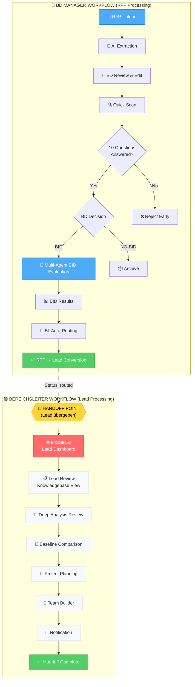

# Dealhunter Workflow-Diagramm

## Übersicht: BD Manager vs. Bereichsleiter (BL) Workflow



## Status-Übersicht

### ✅ Implementiert (BD Manager Workflow)

| Status            | Beschreibung                   | View                                |
| ----------------- | ------------------------------ | ----------------------------------- |
| `draft`           | RFP hochgeladen                | `/rfps/[id]`                        |
| `extracting`      | AI-Extraktion läuft            | `/rfps/[id]` - ActivityStream       |
| `reviewing`       | BD prüft extrahierte Daten     | `/rfps/[id]` - ExtractionPreview    |
| `quick_scanning`  | Quick Scan läuft               | `/rfps/[id]`                        |
| `questions_ready` | 10 Fragen beantwortet          | `/rfps/[id]` - QuickScanResults     |
| `bid_pending`     | BD muss BID/NO-BID entscheiden | `/rfps/[id]` - BidDecisionActions   |
| `evaluating`      | Multi-Agent BID Evaluation     | `/rfps/[id]` - ActivityStream       |
| `decision_made`   | BID Ergebnis liegt vor         | `/rfps/[id]` - DecisionCard         |
| `routed`          | An BL weitergeleitet           | `/rfps/[id]` - **KEINE BL-VIEW** ❌ |

### ❌ Fehlend (Bereichsleiter Workflow)

| Status          | Sollte zeigen        | Fehlende View                         |
| --------------- | -------------------- | ------------------------------------- |
| `routed`        | **Lead Dashboard**   | `/leads/[id]` - Lead Knowledgebase ❌ |
| `full_scanning` | Deep Analysis Review | `/leads/[id]` - Website Audit View ❌ |
| `bl_reviewing`  | BL Review UI         | `/leads/[id]` - Review Interface ❌   |
| `team_assigned` | Team Summary         | `/leads/[id]` - Team View             |
| `notified`      | Notification Status  | `/leads/[id]` - Notification Summary  |
| `handed_off`    | Abgeschlossen        | `/leads/[id]` - Final Summary         |

## Das fehlende Lead-Dashboard

### Was der BL braucht (ähnlich Website-Audit-Skill):

```
┌─────────────────────────────────────────────────────────────┐
│ 📊 Lead Dashboard - Saudi Pro League (SPL)                 │
├─────────────────────────────────────────────────────────────┤
│                                                             │
│ 📋 Navigation Sidebar                                       │
│ ├─ 📄 Übersicht (Executive Summary)                        │
│ ├─ 🎯 BID Evaluation (Multi-Agent Results)                │
│ ├─ 🔍 Quick Scan (10 Fragen + Confidence)                 │
│ ├─ 🌐 Website Audit (Deep Analysis)                       │
│ │  ├─ Tech Stack                                          │
│ │  ├─ Content Architecture                               │
│ │  ├─ Migration Complexity                               │
│ │  └─ Accessibility Audit                                │
│ ├─ 📐 Baseline Comparison                                 │
│ ├─ 📅 Projekt-Planung (PT-Schätzung)                     │
│ ├─ 👥 Team Vorschlag                                       │
│ ├─ 📚 Referenzen (Auto-matched)                           │
│ ├─ 🏆 Wettbewerber (Competition Intelligence)             │
│ └─ 📎 Dokumente                                            │
│                                                             │
│ ⚡ Actions:                                                │
│ [ Approve ] [ Request Changes ] [ Reject ]                 │
│                                                             │
└─────────────────────────────────────────────────────────────┘
```

### Qualität des Lead-Dashboards:

**Orientierung an Website-Audit-Skill Output:**

- Strukturierte Navigation
- Alle AI-Agent Ergebnisse aggregiert
- Knowledgebase-View für fundierte Entscheidungen
- Inline-Editing wo nötig
- Action-Buttons für Workflow-Steuerung

## Workflow-Unterschiede

| Aspekt       | BD Manager                 | Bereichsleiter                       |
| ------------ | -------------------------- | ------------------------------------ |
| **Ziel**     | BID/NO-BID Entscheidung    | Lead verarbeiten & Team zuweisen     |
| **Dauer**    | 5-15 Min (Quick Decision)  | Stunden/Tage (Detailed Review)       |
| **View**     | `/rfps/[id]` - Streamlined | `/leads/[id]` - **Knowledge Hub** ❌ |
| **Actions**  | BID/NO-BID Button          | Approve/Edit/Reject Workflow         |
| **AI Depth** | Quick Scan + Multi-Agent   | Deep Analysis + Baseline + Planning  |
| **Output**   | Routing Decision           | Team Assignment + PT-Schätzung       |

## Nächste Schritte

### Epic 16: Lead Dashboard (NEU)

**Priorität:** 🔴 Kritisch (Blocker für BL-Workflow)

#### Anforderungen:

| ID       | Anforderung               | Beschreibung                                                 |
| -------- | ------------------------- | ------------------------------------------------------------ |
| LEAD-001 | Lead List View            | `/leads` - Alle gerouteten Leads für einen BL                |
| LEAD-002 | Lead Dashboard            | `/leads/[id]` - Knowledgebase View mit Navigation            |
| LEAD-003 | Website Audit Integration | Deep Analysis Results als strukturierte View                 |
| LEAD-004 | Baseline Comparison View  | Vergleich mit CMS-Baselines (Drupal, Magnolia, etc.)         |
| LEAD-005 | PT-Schätzung View         | Projekt-Planung mit Breakdown                                |
| LEAD-006 | Team Builder Integration  | Existing Team Builder in Lead-Kontext                        |
| LEAD-007 | Reference Matching View   | Auto-matched Referenzen mit Relevanz-Score                   |
| LEAD-008 | Competition Intelligence  | Wettbewerber-Analyse                                         |
| LEAD-009 | BL Actions                | Approve/Request Changes/Reject Workflow                      |
| LEAD-010 | Status Tracking           | Lead Pipeline für BL (routed → bl_reviewing → team_assigned) |

#### UI-Struktur:

```typescript
// /app/(dashboard)/leads/[id]/layout.tsx - Navigation Sidebar
const leadSections = [
  { id: 'overview', label: 'Übersicht', icon: FileText },
  { id: 'bid-evaluation', label: 'BID Evaluation', icon: Target },
  { id: 'quick-scan', label: 'Quick Scan', icon: Zap },
  { id: 'website-audit', label: 'Website Audit', icon: Globe },
  { id: 'baseline', label: 'Baseline Vergleich', icon: BarChart },
  { id: 'planning', label: 'Projekt-Planung', icon: Calendar },
  { id: 'team', label: 'Team Vorschlag', icon: Users },
  { id: 'references', label: 'Referenzen', icon: BookOpen },
  { id: 'competition', label: 'Wettbewerber', icon: TrendingUp },
  { id: 'documents', label: 'Dokumente', icon: Paperclip },
];
```

#### Unterschied zu RFP View:

| Feature        | RFP View (`/rfps/[id]`) | Lead View (`/leads/[id]`)     |
| -------------- | ----------------------- | ----------------------------- |
| **User**       | BD Manager              | Bereichsleiter                |
| **Focus**      | Quick Decision          | Deep Analysis                 |
| **Navigation** | Linear Workflow         | **Sidebar Navigation** ✅     |
| **Content**    | Streaming (Real-time)   | **Static Report** ✅          |
| **Layout**     | Cards (Sequential)      | **Tabs/Sections** ✅          |
| **Actions**    | BID/NO-BID              | Approve/Edit/Reject           |
| **Data Depth** | Summary                 | **Complete Knowledgebase** ✅ |

## Fazit

**Aktueller Stand:**

- ✅ BD Manager kann RFPs hochladen, evaluieren, BID/NO-BID entscheiden
- ❌ BL bekommt nur eine "routed" Notification, aber keine strukturierte Lead-View
- ❌ Deep Analysis Results sind vorhanden, aber nicht als Knowledgebase aggregiert

**Was fehlt:**
Ein vollständiges **Lead Dashboard** (`/leads/[id]`) mit:

1. Navigation Sidebar (wie Website-Audit-Skill)
2. Aggregierte AI-Results (alle Agents)
3. Deep Analysis als strukturierte Sections
4. BL-spezifische Actions (Approve/Edit/Reject)
5. Knowledge Hub für fundierte Entscheidungen

---

**Erstellt:** 2026-01-21
**Quelle:** User Feedback - Lead Dashboard Gap Analysis
