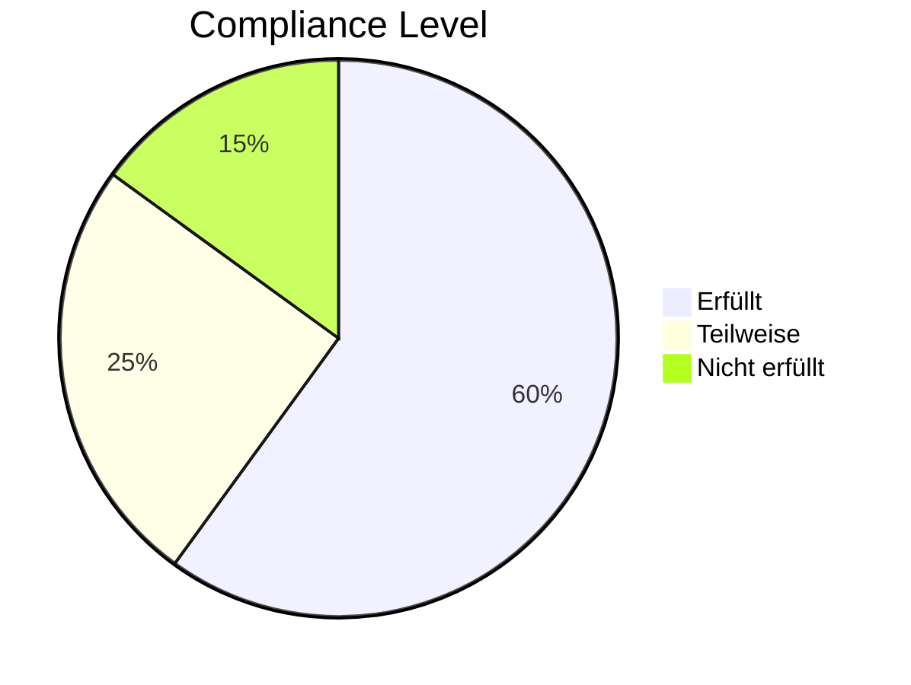

# Accessibility Audit

## Zusammenfassung

| Aspekt | Status | Bewertung |
|--------|--------|-----------|
| **Aktueller Stand** | Partial WCAG 2.1 A | ⚠️ |
| **Ziel** | WCAG 2.1 Level AA | 🎯 |
| **Kritische Issues** | 3-5 | ❌ |
| **Moderate Issues** | 10-15 | ⚠️ |

## WCAG 2.1 Compliance Status

## Positive Aspekte

✅ **Vorhandene Stärken:**
- Responsive Design für verschiedene Geräte
- Strukturierte Überschriften (H1-H6)
- Alt-Texte für die meisten Bilder
- Ausreichende Schriftgrößen
- Fokus-Reihenfolge grundsätzlich logisch

## Identifizierte Probleme

### Kritisch (Blockiert Zugang)

| Issue | WCAG | Betroffene Elemente |
|-------|------|---------------------|
| Fehlende Skip-Links | 2.4.1 | Navigation |
| Unzureichender Kontrast | 1.4.3 | Einige Texte |
| Fehlende ARIA-Labels | 4.1.2 | Interaktive Elemente |

### Schwerwiegend (Erhebliche Barriere)

| Issue | WCAG | Betroffene Elemente |
|-------|------|---------------------|
| Keyboard-Navigation | 2.1.1 | Slider, Modals |
| Fokus-Indikatoren | 2.4.7 | Links, Buttons |
| Formular-Labels | 1.3.1 | Suchfeld |

### Moderat (Signifikante Beeinträchtigung)

| Issue | WCAG | Betroffene Elemente |
|-------|------|---------------------|
| Link-Texte | 2.4.4 | "Mehr lesen" Links |
| Bildunterschriften | 1.1.1 | Videos |
| Sprache | 3.1.1 | lang-Attribut |

[Details zu Issues →](./issues)

## Remediation-Aufwand

| Kategorie | Stunden |
|-----------|---------|
| Audit | 8h |
| Kritische Fixes | 16h |
| Schwerwiegende Fixes | 24h |
| Moderate Fixes | 16h |
| Testing | 16h |
| **Gesamt** | **~80h** |

[WCAG 2.1 Audit Details →](./wcag-audit)

[Remediation Plan →](./remediation)

## Drupal Accessibility Features

### Core Features
- Semantic HTML Output
- ARIA Landmarks
- Skip Link (ab Drupal 8)
- Accessible Admin Interface (Gin Theme)

### Contrib Module
- **A11Y Checker** - Content Accessibility Validation
- **CKEditor Accessibility** - Editor-seitige Prüfung
- **Tota11y** - Development Tool

### Best Practices
- Use Drupal's Form API (automatische Labels)
- Responsive Images mit alt-Text Pflichtfeld
- Fokus-Management bei AJAX
