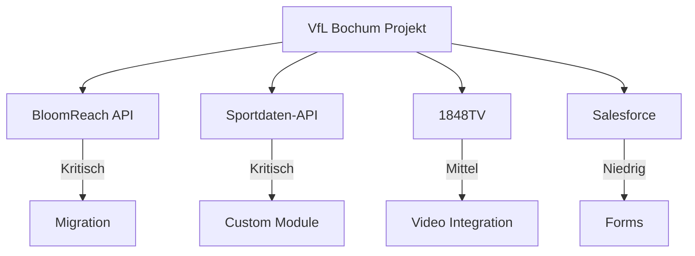

# Assumptions & Dependencies

## Projektannahmen

### Technische Annahmen

| # | Annahme | Impact wenn falsch |
|---|---------|-------------------|
| A1 | BloomReach API erlaubt strukturierten Export | Migration +50h, evtl. Scraping |
| A2 | Sportdaten-API bleibt verfügbar | Custom Module Redesign |
| A3 | 1848TV oEmbed/API funktioniert | Video-Integration +20h |
| A4 | Drupal 11 ist stabil | Framework-Wechsel |
| A5 | Design-System ist adaptierbar | Theme-Aufwand +50% |

### Projekt-Annahmen

| # | Annahme | Impact wenn falsch |
|---|---------|-------------------|
| A6 | Keine grundlegende Redesign nötig | Scope +30% |
| A7 | Content-Freeze ist möglich | Delta-Migration +30h |
| A8 | Team hat Drupal 10+ Erfahrung | Onboarding +40h |
| A9 | Kunde stellt UAT-Ressourcen | Launch-Verzögerung |
| A10 | Kein Multilingual erforderlich | Aufwand +50% wenn doch |

### Business-Annahmen

| # | Annahme | Impact wenn falsch |
|---|---------|-------------------|
| A11 | Budget ist genehmigt | Projekt-Stop |
| A12 | Timeline ist flexibel | Qualitätskompromisse |
| A13 | Salesforce bleibt CRM | Integration-Änderung |
| A14 | Shop/Ticketing bleiben extern | Scope +100h wenn Integration |

## Dependencies

### Externe Dependencies

| Dependency | Owner | Kritikalität | Status |
|------------|-------|--------------|--------|
| BloomReach API-Zugang | VfL IT | Kritisch | Zu klären |
| Sportdaten-API Doku | VfL IT / Provider | Kritisch | Zu klären |
| 1848TV API/oEmbed | 1848TV | Mittel | Zu klären |
| Salesforce Credentials | VfL IT | Niedrig | Zu klären |
| Design-System Zugang | VfL Marketing | Mittel | Zu klären |

### Interne Dependencies

| Dependency | Beschreibung | Blocker für |
|------------|--------------|-------------|
| Infrastructure | Hosting, CI/CD | Development Start |
| Content Types | Drupal Config | Paragraphs, Views |
| Media Types | Media Config | Content Migration |
| Custom Modules | Sportdata etc. | Theme Integration |
| Theme | Frontend | UAT |

## Constraints

### Zeitliche Constraints

| Constraint | Beschreibung | Impact |
|------------|--------------|--------|
| Bundesliga-Saison | Go-Live idealerweise vor/nach Saison | Timeline-Planung |
| Content-Freeze | Max. 1-2 Wochen möglich | Migrations-Fenster |
| Spieltage | Kein Deploy während Spielen | Deployment-Windows |

### Technische Constraints

| Constraint | Beschreibung | Impact |
|------------|--------------|--------|
| PHP Version | Mind. PHP 8.2 | Hosting-Anforderung |
| Drupal Version | Drupal 11 / Drupal CMS 2.0 | Module-Kompatibilität |
| HTTPS | Muss durchgängig sein | SSL-Zertifikate |
| GDPR | Cookie Consent, Datenschutz | Implementation |

### Budget Constraints

| Constraint | Beschreibung | Impact |
|------------|--------------|--------|
| Festes Budget | ~2,200h max | Scope-Begrenzung |
| Phasen-basiert | Freigabe je Phase | Cashflow |

## Offene Punkte

### Zu klären vor Projektstart

- [ ] API-Zugang BloomReach (Credentials, Dokumentation)
- [ ] Sportdaten-Provider kontaktieren (API-Docs anfordern)
- [ ] 1848TV Integration klären (oEmbed oder API?)
- [ ] Design-System Zugang (Figma, Storybook?)
- [ ] Hosting-Anforderungen definieren
- [ ] Content-Freeze Zeitraum abstimmen
- [ ] Stakeholder für UAT benennen
- [ ] Go-Live Datum festlegen

### Zu klären während Discovery

- [ ] Detaillierte Content-Inventur
- [ ] API-Endpunkte dokumentieren
- [ ] Design-Tokens extrahieren
- [ ] Performance-Baseline erfassen
- [ ] Accessibility-Audit durchführen
- [ ] SEO-Analyse (Rankings, Redirects)

## Glossar

| Begriff | Definition |
|---------|------------|
| **brXM** | BloomReach Experience Manager (aktuelles CMS) |
| **1848TV** | Video-Plattform des VfL Bochum |
| **Paragraph** | Drupal-Komponente für flexible Layouts |
| **SDC** | Single Directory Components (Drupal Theme) |
| **Canvas** | Drupal CMS 2.0 Experience Builder |
| **UAT** | User Acceptance Testing |
| **PT** | Personentage (8h) |

## Kontakte

| Rolle | Name | E-Mail |
|-------|------|--------|
| Projektleiter adesso | TBD | TBD |
| Tech Lead | TBD | TBD |
| Ansprechpartner VfL | TBD | TBD |
| IT-Kontakt VfL | TBD | TBD |
