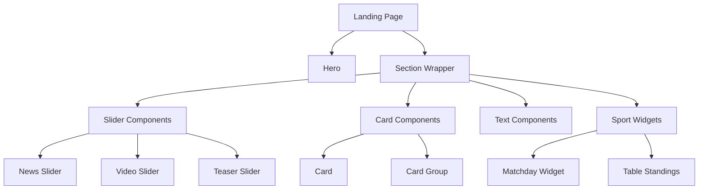

# Paragraph Components

## Übersicht

18 Paragraph-Typen wurden für flexible Seitenlayouts identifiziert:

| # | Paragraph | Komplexität | Stunden |
|---|-----------|-------------|---------|
| 1 | Hero | Complex | 6h |
| 2 | News Slider | Complex | 6h |
| 3 | Video Slider | Complex | 6h |
| 4 | Teaser Slider | Complex | 6h |
| 5 | Product Slider | Complex | 6h |
| 6 | Team Slider | Complex | 6h |
| 7 | Text | Simple | 1.5h |
| 8 | Free HTML | Medium | 3.5h |
| 9 | Media | Simple | 1.5h |
| 10 | CTA | Simple | 1.5h |
| 11 | Card | Medium | 3.5h |
| 12 | Card Group | Medium | 3.5h |
| 13 | Accordion | Medium | 3.5h |
| 14 | Newsletter | Medium | 3.5h |
| 15 | Partner Grid | Medium | 3.5h |
| 16 | Banderole | Medium | 3.5h |
| 17 | Matchday Widget | Complex | 6h |
| 18 | Table Standings | Medium | 3.5h |
| | **Gesamt** | | **74.5h** |

## Detaillierte Beschreibungen

### Hero & Banner

#### 1. Hero

**Komplexität:** Complex (6h)

Hero-Teaser mit Bild/Video und Call-to-Action.

**Felder:**
- Headline (Text)
- Subline (Text)
- Background Image (Entity Reference: Media)
- Background Video (Entity Reference: Media, Optional)
- CTA Button (Link)
- Overlay Style (Select: Dark, Light, Gradient)

---

### Slider Components

#### 2-6. Slider (News, Video, Teaser, Product, Team)

**Komplexität:** Complex (6h each)

Karussell-Komponenten für verschiedene Content-Typen.

**Gemeinsame Felder:**
- Headline (Text)
- View Reference oder Manual Items
- Items per Page (Integer)
- Autoplay (Boolean)
- Show Navigation (Boolean)

**Spezifische Unterschiede:**

| Slider | Content | Quelle |
|--------|---------|--------|
| News | News Nodes | View: news_slider |
| Video | Video Nodes | View: video_slider |
| Teaser | Manual Cards | Entity Reference |
| Product | Shop Items | External API |
| Team | Person Nodes | View: team_slider |

---

### Content Components

#### 7. Text

**Komplexität:** Simple (1.5h)

Rich-Text mit WYSIWYG-Editor.

**Felder:**
- Body (Text, Formatted, Long)

---

#### 8. Free HTML

**Komplexität:** Medium (3.5h)

Custom HTML/Embed für Sonderfälle.

**Felder:**
- HTML Code (Text, Long)
- Admin Label (Text)

::: warning Sicherheit
Free HTML sollte nur für Admins verfügbar sein und Input-Filterung verwenden.
:::

---

#### 9. Media

**Komplexität:** Simple (1.5h)

Bild oder Video einbetten.

**Felder:**
- Media (Entity Reference: Media)
- Caption (Text, Optional)
- Alignment (Select: Left, Center, Right, Full)

---

#### 10. CTA

**Komplexität:** Simple (1.5h)

Call-to-Action Button.

**Felder:**
- Text (Text)
- Link (Link)
- Style (Select: Primary, Secondary, Outline)
- Icon (Text, Optional)

---

### Card Components

#### 11. Card

**Komplexität:** Medium (3.5h)

Einzelne Teaser-Card.

**Felder:**
- Image (Entity Reference: Media)
- Headline (Text)
- Text (Text)
- Link (Link)
- Style (Select: Default, Highlighted)

---

#### 12. Card Group

**Komplexität:** Medium (3.5h)

Grid von Cards.

**Felder:**
- Headline (Text)
- Cards (Entity Reference: Paragraph, Multiple)
- Columns (Select: 2, 3, 4)
- Style (Select: Default, Compact)

---

### Interactive Components

#### 13. Accordion

**Komplexität:** Medium (3.5h)

Akkordeon für FAQ-Style Content.

**Felder:**
- Headline (Text, Optional)
- Items (Field Collection)
  - Question (Text)
  - Answer (Text, Formatted)
- Initially Open (Integer, Optional)

---

#### 14. Newsletter

**Komplexität:** Medium (3.5h)

Newsletter-Anmeldung.

**Felder:**
- Headline (Text)
- Description (Text)
- Form Reference (Entity Reference: Webform)
- Background Style (Select)

---

### Special Components

#### 15. Partner Grid

**Komplexität:** Medium (3.5h)

Partner-Logo-Grid.

**Felder:**
- Headline (Text)
- Category Filter (Entity Reference: Taxonomy)
- Display Style (Select: Grid, Carousel)
- Show All Link (Boolean)

---

#### 16. Banderole

**Komplexität:** Medium (3.5h)

News-Ticker/Banderole.

**Felder:**
- Items (Field Collection)
  - Text (Text)
  - Link (Link, Optional)
- Speed (Integer)
- Background Color (Color)

---

### Sport-Specific Components

#### 17. Matchday Widget

**Komplexität:** Complex (6h)

Spieltag-Widget mit Live-Daten.

**Felder:**
- Match Reference (Entity Reference: Event)
- Display Style (Select: Full, Compact)
- Show Lineup (Boolean)
- Show Statistics (Boolean)

::: info API-Integration
Benötigt Sportdaten-API für Live-Updates.
:::

---

#### 18. Table Standings

**Komplexität:** Medium (3.5h)

Tabellen-Widget.

**Felder:**
- Competition (Entity Reference: Taxonomy)
- Highlight Team (Boolean)
- Show All Link (Boolean)

## Component Hierarchy

