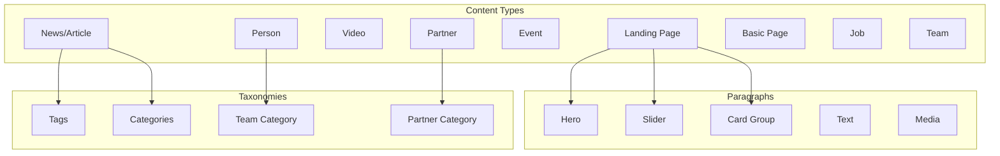

# Content Architecture Overview

## Zusammenfassung

| Metrik | Anzahl |
|--------|--------|
| **Content Types identifiziert** | 25 |
| **Drupal Content Types geplant** | 9 |
| **Paragraph-Komponenten** | 18 |
| **Taxonomien** | 4 |
| **Media-Typen** | 6 |

## Content-Modell

## Content Types

### Geplante Drupal Content Types

| Content Type | Komplexität | Beschreibung |
|--------------|-------------|--------------|
| Landing Page | Complex | Flexible Sektionen-Seiten |
| News/Article | Medium | News-Artikel mit Tags |
| Video | Medium | Video-Content (1848TV) |
| Person | Medium | Spieler- und Staff-Profile |
| Event | Medium | Spiele und Termine |
| Partner | Simple | Sponsoren/Partner |
| Basic Page | Simple | Einfache Textseiten |
| Job | Medium | Stellenanzeigen |
| Team | Simple | Team-Gruppierungen |

[Mehr zu Page Types →](./page-types)

## Paragraph-Komponenten

### 18 identifizierte Komponenten

| Kategorie | Komponenten |
|-----------|-------------|
| **Hero & Banner** | Hero Teaser |
| **Slider** | News, Video, Teaser, Product, Team |
| **Content** | Text, Free HTML, Media, CTA |
| **Cards** | Card, Card Group |
| **Interactive** | Accordion, Newsletter |
| **Sport** | Matchday Widget, Table Standings |
| **Special** | Partner Grid, Banderole |

[Mehr zu Components →](./components)

## Taxonomien

| Vocabulary | Zweck | Terms (ca.) |
|------------|-------|-------------|
| Partner Category | Lead/Premium/Top/Network | 7 |
| Tags | Content-Tags | 50+ |
| Team Category | Profis/Frauen/Talentwerk | 5 |
| Content Category | News-Kategorien | 10 |

[Mehr zu Taxonomies →](./taxonomies)

## Media Types

| Typ | Beschreibung |
|-----|--------------|
| Image | Standard-Bilder mit Focal Point |
| Video | 1848TV, YouTube Embeds |
| Player Image Set | Spielerfotos (verschiedene Formate) |
| Hero Image Set | Hero-Banner (responsive) |
| Logo | Partner-Logos (1c/4c) |
| Document | PDF-Downloads |

[Mehr zu Media →](./media)

## Architektur-Prinzipien

### 1. Flexibilität durch Paragraphs

Alle Landing Pages nutzen ein Paragraph-Feld für flexible Seitenlayouts.

### 2. Strukturierte Content Types

Spezifische Content Types für wiederverwendbare Inhalte (News, Videos, Personen).

### 3. Taxonomie-basierte Organisation

Konsistente Kategorisierung durch zentrale Taxonomien.

### 4. Media Library

Zentrale Medienverwaltung mit definierten Media Types.
