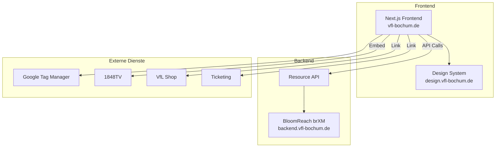

# Technology Stack

## Aktuelle Technologien

### Content Management System

| Komponente | Technologie |
|------------|-------------|
| **CMS** | BloomReach Experience Manager (brXM/Hippo CMS) |
| **Version** | 1.0 |
| **Architektur** | Headless CMS mit API |
| **Backend-API** | https://backend.vfl-bochum.de/site/de/resourceapi |

### Frontend

| Komponente | Technologie |
|------------|-------------|
| **Framework** | Next.js (SSG/SSR) |
| **Rendering** | Server-Side Rendering + Static Generation |
| **Sprache** | JavaScript/TypeScript, React |
| **Design System** | Custom (design.vfl-bochum.de) |

### Backend

| Komponente | Technologie |
|------------|-------------|
| **Sprache** | Java |
| **Webserver** | Nginx |
| **CDN** | Vermutlich CloudFront oder ähnlich |

### Analytics & Tracking

| Dienst | ID |
|--------|---|
| Google Tag Manager | GTM-K5B3MHM |

## Architektur-Diagramm



## API-Struktur

Die BloomReach Resource API liefert strukturierte JSON-Daten:

```
https://backend.vfl-bochum.de/site/de/resourceapi/
├── pages/
│   ├── home
│   ├── verein/
│   ├── stadion/
│   ├── fans/
│   └── ...
├── documents/
│   ├── news/
│   ├── videos/
│   └── ...
└── assets/
```

## Bewertung

### Stärken

- Moderne Headless-Architektur
- Gute Performance durch SSR/SSG
- Saubere API-Trennung
- Strukturierte Content-Modelle

### Schwächen

- Proprietäres CMS mit hohen Lizenzkosten
- Begrenzte Community und Support
- Komplexe Deployment-Pipeline
- Vendor Lock-in

### Migration zu Drupal

| BloomReach | Drupal Äquivalent |
|------------|-------------------|
| Document Types | Content Types |
| Compounds | Paragraphs |
| Channels | Display Modes |
| Resource API | JSON:API / REST |
| Experience Manager | Experience Builder (Canvas) |
