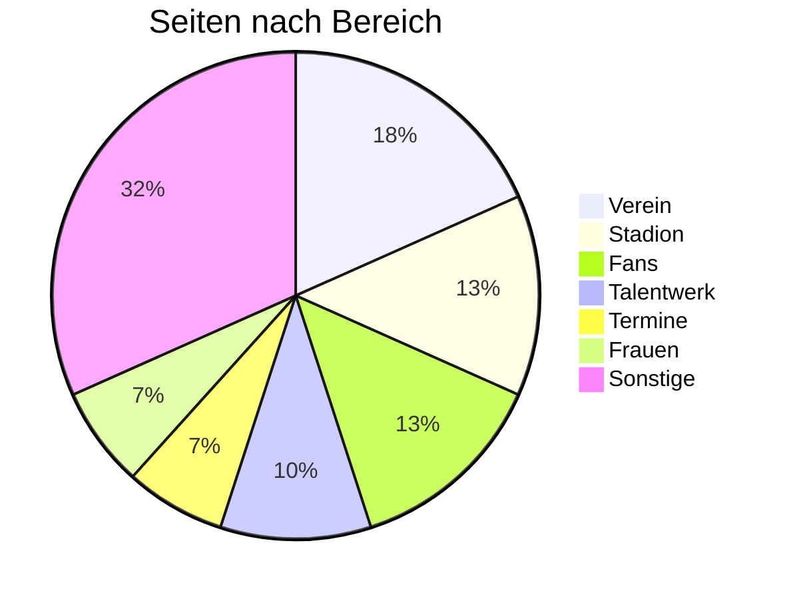

# Content Volume

## Übersicht

| Metrik | Anzahl |
|--------|--------|
| **Seiten in Sitemap** | 60 |
| **Geschätzte News-Artikel** | 500+ |
| **Videos (1848TV)** | 335+ |
| **Team-Mitglieder** | 30+ |
| **Partner/Sponsoren** | 50+ |
| **Media-Dateien (geschätzt)** | 2.000+ |

## Seiten nach Bereich

| Bereich | Anzahl Seiten | Anteil |
|---------|---------------|--------|
| Verein | 11 | 18% |
| Stadion | 8 | 13% |
| Fans | 8 | 13% |
| Talentwerk | 6 | 10% |
| Termine | 4 | 7% |
| Frauen | 4 | 7% |
| Spielplan | 2 | 3% |
| News | 2 | 3% |
| Netzwerk | 2 | 3% |
| Jobs | 2 | 3% |
| 1848TV | 2 | 3% |
| Sonstige | 9 | 15% |
| **Gesamt** | **60** | **100%** |

## Content-Verteilung

## Dynamischer Content

### News/Artikel

- **Geschätzte Anzahl:** 500+ Artikel
- **Frequenz:** Mehrere pro Woche (Spieltage, Training, etc.)
- **Kategorien:** Profis, Frauen, Talentwerk, Verein

### Videos

- **Plattform:** 1848TV (externe Plattform)
- **Anzahl:** 335+ Videos
- **Typen:** Pressekonferenzen, Spielberichte, Interviews

### Team-Profile

| Team | Mitglieder (ca.) |
|------|-----------------|
| Profis (Männer) | 25-30 |
| Frauen | 25-30 |
| Talentwerk | 50+ |
| Staff | 20+ |

### Partner

| Kategorie | Anzahl |
|-----------|--------|
| Lead Partner | 2 |
| Premium Partner | 4 |
| Top Partner | 6 |
| Network Partner | 30+ |
| **Gesamt** | **~50** |

## Migration-Relevanz

### Content-Volumen für Migration

| Content-Typ | Anzahl | Komplexität |
|-------------|--------|-------------|
| Statische Seiten | 60 | Niedrig |
| News-Artikel | 500 | Mittel |
| Videos | 335 | Niedrig (nur Referenzen) |
| Team-Profile | 100 | Mittel |
| Partner | 50 | Niedrig |
| Media-Dateien | 2.000 | Mittel |

### Geschätzter Migrations-Aufwand

- **Nodes gesamt:** ~1.000
- **Media-Dateien:** ~2.000
- **Komplexität:** Hoch (aufgrund der verschachtelten Struktur)
- **Geschätzte Stunden:** 230h
