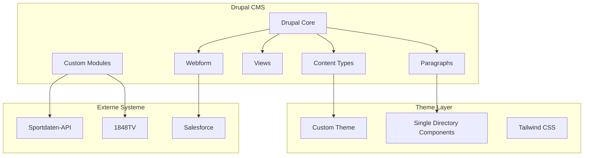

# Drupal Architecture

## Übersicht

Die empfohlene Drupal-Architektur für den VfL Bochum Website Relaunch.

| Komponente | Empfehlung |
|------------|------------|
| **Drupal Version** | Drupal CMS 2.0 |
| **Admin Theme** | Gin |
| **Frontend Theme** | Custom (basierend auf Mercury) |
| **Visual Builder** | Canvas (Experience Builder) |

## Architektur-Übersicht



## Entity-Übersicht

| Entity-Typ | Anzahl | Stunden |
|------------|--------|---------|
| [Content Types](./content-types) | 9 | 51h |
| [Paragraph Types](./paragraphs) | 18 | 74.5h |
| Taxonomies | 4 | 6h |
| Media Types | 4 | 7.5h |
| [Views](./views) | 9 | 60h |
| Webforms | 3 | 21h |
| [Custom Modules](./modules) | 4 | 138h |
| Theme Components | 16 | 117h |
| **Gesamt** | | **475h** |

## Drupal CMS 2.0 Vorteile

### Out-of-the-Box Features

| Feature | Nutzen |
|---------|--------|
| Canvas (Experience Builder) | Visual Page Building |
| Mercury Theme | Modernes Starter-Theme |
| AI Integration | Content-Assistenz |
| Pre-built Recipes | Schnellere Entwicklung |

### Anwendbare Recipes

| Recipe | PT-Ersparnis |
|--------|--------------|
| Blog | 3-5 PT |
| Events | 2-3 PT |
| Person | 2-3 PT |
| Basic SEO | 1-2 PT |
| Forms | 1-2 PT |
| **Gesamt** | **~10-15 PT** |

## Module-Stack

### Core Erweiterungen

| Modul | Zweck |
|-------|-------|
| Paragraphs | Flexible Layouts |
| Webform | Formulare |
| Pathauto | URL-Aliases |
| Metatag | SEO |
| Redirect | URL-Redirects |

### Admin UX

| Modul | Zweck |
|-------|-------|
| Gin | Admin Theme |
| Admin Toolbar | Enhanced Navigation |
| Masquerade | User Switching |

### Media

| Modul | Zweck |
|-------|-------|
| Media Library | Medienverwaltung |
| Focal Point | Responsive Crops |
| Responsive Image | Image Sizes |

### Performance

| Modul | Zweck |
|-------|-------|
| Redis | Cache Backend |
| BigPipe | Streaming |
| Image Optimize | Compression |

### Custom

| Modul | Zweck |
|-------|-------|
| vfl_sportdata | Sportdaten-Integration |
| vfl_video | 1848TV-Integration |
| vfl_migrate | Migration |

## Verzeichnisstruktur

```
web/
├── modules/
│   ├── contrib/
│   │   ├── paragraphs/
│   │   ├── webform/
│   │   └── ...
│   └── custom/
│       ├── vfl_sportdata/
│       ├── vfl_video/
│       └── vfl_migrate/
├── themes/
│   └── custom/
│       └── vfl_theme/
│           ├── components/
│           │   ├── hero/
│           │   ├── slider/
│           │   └── ...
│           ├── templates/
│           ├── css/
│           ├── js/
│           └── vfl_theme.info.yml
└── sites/
    └── default/
        └── files/
```

## Nächste Schritte

1. [Content Types definieren →](./content-types)
2. [Paragraph Types planen →](./paragraphs)
3. [Views konfigurieren →](./views)
4. [Custom Modules entwickeln →](./modules)
