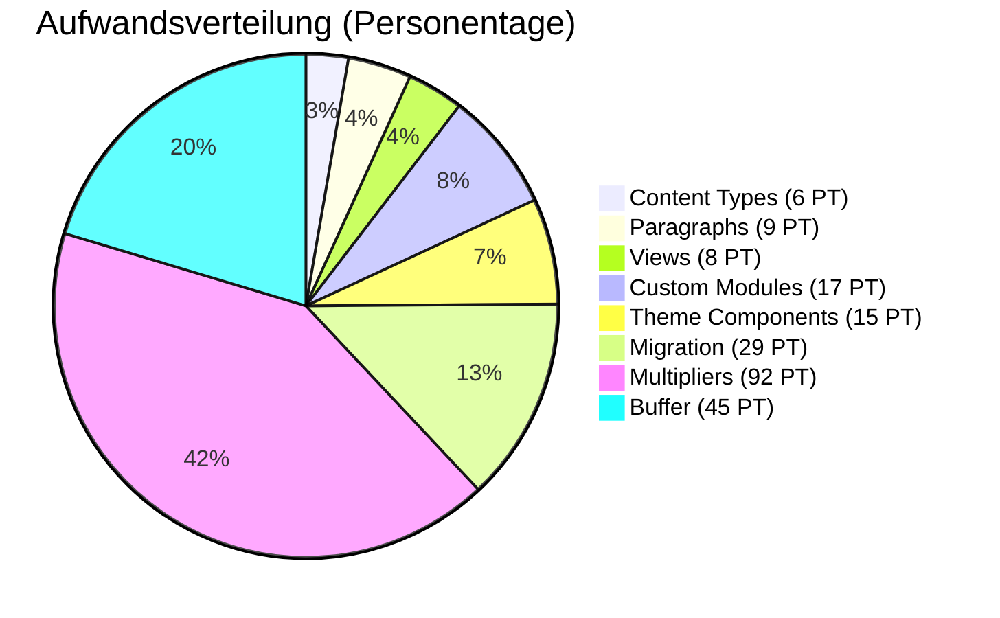

# Project Estimation

## Zusammenfassung

::: tip Drupal CMS 2.0 Einsparungen
Durch Nutzung von Drupal CMS 2.0 Recipes können signifikante Einsparungen erzielt werden.
:::

| Metrik | Tage | Anteil |
|--------|------|--------|
| **Base (Entities)** | 59 PT | 21.9% |
| **Multipliers** | 92 PT | 34.0% |
| **Migration** | 29 PT | 10.6% |
| **Additional Effort** | 46 PT | 16.9% |
| **Subtotal** | 226 PT | 83.3% |
| **Buffer (20%)** | 45 PT | 16.7% |
| **TOTAL ohne Drupal CMS** | **271 PT** | **100%** |
| **Drupal CMS Einsparungen** | **-15 PT** | |
| **TOTAL mit Drupal CMS** | **256 PT** | |

## Drupal CMS 2.0 Einsparungen

Drupal CMS bietet fertige Recipes, die Entwicklungszeit sparen:

| Recipe | Standard-Aufwand | Mit Recipe | Ersparnis |
|--------|------------------|------------|-----------|
| News/Article Recipe | 3 PT | 0.5 PT | **2.5 PT** |
| Person/Profile Recipe | 2 PT | 0.5 PT | **1.5 PT** |
| Event Recipe | 2 PT | 0.5 PT | **1.5 PT** |
| Webform Recipe | 3 PT | 0.5 PT | **2.5 PT** |
| SEO Recipe (Yoast) | 2 PT | 0.5 PT | **1.5 PT** |
| Authentication Recipe | 2 PT | 0.5 PT | **1.5 PT** |
| Anti-Spam Recipe | 1 PT | 0.25 PT | **0.75 PT** |
| Google Analytics Recipe | 1 PT | 0.25 PT | **0.75 PT** |
| Privacy/GDPR Recipe | 2 PT | 0.5 PT | **1.5 PT** |
| **TOTAL Einsparung** | | | **~15 PT** |

## Timeline-Projektionen

| Szenario | PT/Woche | Wochen | Monate |
|----------|----------|--------|--------|
| Vollzeit (1 Dev) | 5 PT | 51 | 12.8 |
| **Realistisch (2 Devs)** | **10 PT** | **26** | **6.5** |
| Aggressive (3 Devs) | 15 PT | 17 | 4.3 |

## Aufwands-Verteilung

## Quick Facts

| Entität | Anzahl | Tage |
|---------|--------|------|
| Content Types | 9 | 6 PT |
| Paragraph Types | 18 | 9 PT |
| Taxonomies | 4 | 1 PT |
| Media Types | 4 | 1 PT |
| Views | 9 | 8 PT |
| Webforms | 3 | 3 PT |
| Custom Modules | 4 | 17 PT |
| Theme Components | 16 | 15 PT |
| **Base Total** | | **59 PT** |

## Konfidenz-Bereiche

| Konfidenz | Tage | Timeline (10 PT/Woche) |
|-----------|------|------------------------|
| Optimistisch | 200 PT | 5 Monate |
| **Wahrscheinlich** | **256 PT** | **6.5 Monate** |
| Pessimistisch (+30%) | 333 PT | 8.5 Monate |

**Empfehlung:** Mit Drupal CMS 2.0 starten für maximale Einsparung.

[Detaillierter Breakdown →](./breakdown)

[Baseline-Vergleich →](./comparison)

[Timeline →](./timeline)

[Risiko-Assessment →](./risks)
