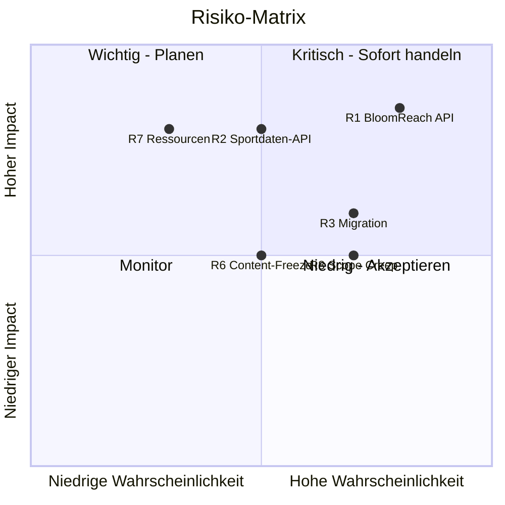

# Risk Assessment

## Risiko-Übersicht

| Risiko-Level | Beschreibung |
|--------------|--------------|
| **Gewählt: Medium** | 20% Buffer |

## Identifizierte Risiken

### Technische Risiken

| # | Risiko | Wahrsch. | Impact | Mitigation |
|---|--------|----------|--------|------------|
| R1 | BloomReach API nicht dokumentiert | Hoch | Hoch | Reverse Engineering, Scraping Backup |
| R2 | Sportdaten-API instabil | Mittel | Hoch | Caching, Fallback-Daten |
| R3 | Migration komplexer als erwartet | Hoch | Mittel | Puffer einplanen, iterativer Ansatz |
| R4 | Performance-Probleme | Mittel | Mittel | Early Optimization, Profiling |
| R5 | 1848TV API-Änderungen | Niedrig | Mittel | Abstraktionsschicht |

### Projektrisiken

| # | Risiko | Wahrsch. | Impact | Mitigation |
|---|--------|----------|--------|------------|
| R6 | Content-Freeze nicht möglich | Mittel | Mittel | Delta-Migration planen |
| R7 | Ressourcen nicht verfügbar | Niedrig | Hoch | Frühzeitig planen |
| R8 | Scope Creep | Hoch | Mittel | Change Management |
| R9 | Verzögerung bei Abnahmen | Mittel | Mittel | Klare Deadlines kommunizieren |
| R10 | Design-Änderungen spät | Mittel | Mittel | Design-Freeze vor Dev |

### Business Risiken

| # | Risiko | Wahrsch. | Impact | Mitigation |
|---|--------|----------|--------|------------|
| R11 | Budget-Überschreitung | Mittel | Hoch | Regelmäßige Reviews |
| R12 | Stakeholder-Wechsel | Niedrig | Mittel | Dokumentation |
| R13 | Externer Anbieter-Wechsel | Niedrig | Hoch | Abstraktion, Flexibilität |

## Risiko-Matrix

## Top-5 Risiken Detail

### R1: BloomReach API Dokumentation

**Beschreibung:** Die BloomReach Experience Manager API ist proprietär und möglicherweise nicht vollständig dokumentiert. Export-Funktionen könnten fehlen.

**Wahrscheinlichkeit:** 70%
**Impact:** Hoch (könnte Migration um 50%+ verzögern)

**Mitigation:**
1. Frühzeitig API-Dokumentation vom Kunden anfordern
2. API-Exploration in Discovery-Phase
3. Scraping als Backup-Option vorbereiten
4. CSV-Export als Alternative prüfen
5. Zusätzlichen Puffer einplanen

**Contingency:** +50h im schlimmsten Fall

---

### R2: Sportdaten-API

**Beschreibung:** Die Sportdaten-API ist möglicherweise nicht stabil, undokumentiert oder könnte sich ändern.

**Wahrscheinlichkeit:** 50%
**Impact:** Hoch (Kern-Feature betroffen)

**Mitigation:**
1. API-Analyse in Discovery
2. Robuste Caching-Strategie
3. Fallback auf statische Daten
4. Abstraktionsschicht für Provider-Wechsel

**Contingency:** +30h

---

### R3: Migration Komplexität

**Beschreibung:** Die Migration von BloomReach zu Drupal ist komplexer als angenommen.

**Wahrscheinlichkeit:** 70%
**Impact:** Mittel

**Mitigation:**
1. Iterativer Ansatz (Test → Validate → Improve)
2. Ausreichend Test-Durchläufe
3. Cleanup-Regeln frühzeitig definieren
4. Manuelle Nacharbeit einplanen

**Contingency:** +50h

---

### R6: Content-Freeze

**Beschreibung:** Der Kunde kann während der Migration keinen Content-Freeze durchsetzen (Live-Betrieb, News-Aktuell).

**Wahrscheinlichkeit:** 50%
**Impact:** Mittel

**Mitigation:**
1. Delta-Migration implementieren
2. Kurzes Migrationsfenster
3. Off-Peak Migration (z.B. Sommerpause)
4. Content-Sync-Prozess

**Contingency:** +20h

---

### R8: Scope Creep

**Beschreibung:** Während des Projekts kommen zusätzliche Anforderungen hinzu.

**Wahrscheinlichkeit:** 70%
**Impact:** Mittel

**Mitigation:**
1. Klares Change Management
2. Schriftliche Scope-Definition
3. Regelmäßige Scope-Reviews
4. Zusätzliche Features als separate Phase

**Contingency:** Budget-Reserve

## Buffer-Berechnung

| Risiko-Level | Buffer | Begründung |
|--------------|--------|------------|
| Niedrig | 15% | Bekannte Technologie, erfahrenes Team |
| **Medium** | **20%** | **Neue Integrationen, Migration** |
| Hoch | 25% | Unbekannte Faktoren, enger Zeitplan |

**Gewählter Buffer:** 20% = 361h

## Annahmen

Diese Schätzung basiert auf folgenden Annahmen:

1. BloomReach API erlaubt strukturierten Export
2. Sportdaten-API bleibt unverändert verfügbar
3. 1848TV bleibt als externe Plattform bestehen
4. Keine grundlegende Redesign erforderlich
5. Bestehendes Design-System kann adaptiert werden
6. Salesforce-Integration wird beibehalten
7. Team hat Drupal 10+ Erfahrung
8. Kunde stellt Ressourcen für UAT bereit

## Empfehlungen

1. **Frühzeitig klären:**
   - API-Zugang BloomReach
   - Sportdaten-API Dokumentation
   - Design-System Verfügbarkeit

2. **Regelmäßige Reviews:**
   - Wöchentliche Risiko-Reviews
   - Monatliche Budget-Reviews
   - Milestone-basierte Scope-Checks

3. **Eskalationspfad:**
   - Technische Risiken → Tech Lead
   - Projekt-Risiken → PM
   - Business-Risiken → Steering Committee
