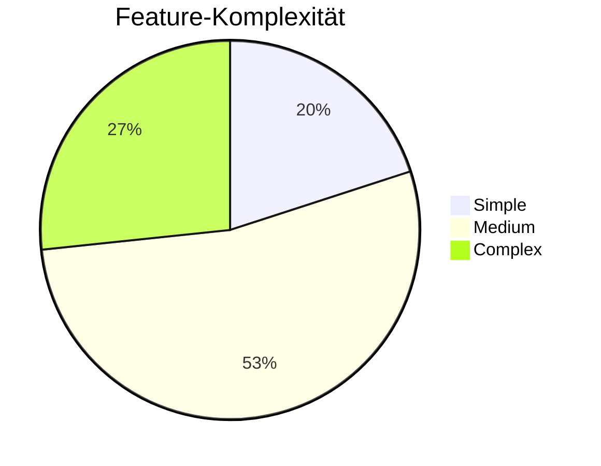

# Features & Functionality

## Übersicht

Die VfL Bochum Website bietet umfangreiche Funktionalitäten für Fans, Partner und Mitglieder.

| Kategorie | Features |
|-----------|----------|
| **Navigation** | Mega-Menu, Mobile Burger, Sticky Nav |
| **Interaktiv** | Suche, Formulare, Newsletter |
| **Sport** | Spielplan, Tabelle, Liveticker |
| **Media** | Video-Player, Galleries |
| **E-Commerce** | Shop-Integration, Ticketing |

## Feature-Kategorien

### Navigation
- Multi-level Mega-Menu (Desktop)
- Burger-Navigation (Mobile)
- Sticky Navigation on Scroll
- Match Center Navigation
- Footer Navigation

[Mehr zu Navigation →](./navigation)

### Interaktive Features
- Suchfunktion
- Kontaktformulare (Salesforce)
- Newsletter-Anmeldung
- Mitgliedsantrag

[Mehr zu Interactive Features →](./interactive)

### Sport-Features
- Spielplan mit Live-Updates
- Bundesliga-Tabelle
- Liveticker (Spieltage)
- Statistiken

### Content Listings
- News Grid/Slider
- Video Grid/Slider
- Team-Übersichten
- Partner-Grid
- Job-Liste

[Mehr zu Listings →](./listings)

## Drupal-Module Mapping

| Feature | Drupal-Lösung |
|---------|---------------|
| Suche | Search API |
| Formulare | Webform + Salesforce |
| Newsletter | Simplenews oder Custom |
| Spielplan | Custom Module + API |
| Listings | Views |
| Media | Media Library |

## Komplexitäts-Übersicht

## Aufwand

| Feature-Kategorie | Stunden |
|-------------------|---------|
| Navigation | 18h |
| Formulare | 21h |
| Sport-Integration | 70h |
| Views/Listings | 60h |
| **Gesamt** | ~170h |
