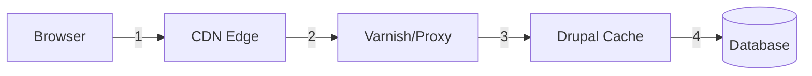

# CDN & Performance

## Aktuelle Infrastruktur

| Komponente | Aktuell |
|------------|---------|
| **Frontend** | Next.js auf Vercel/ähnlich |
| **CMS** | BloomReach Cloud |
| **Assets** | CDN (vermutlich CloudFront) |
| **Design System** | design.vfl-bochum.de |

## CDN-Empfehlung für Drupal

### Option 1: Cloudflare (Empfohlen)

| Feature | Beschreibung |
|---------|--------------|
| **Caching** | Edge Caching weltweit |
| **Security** | DDoS Protection, WAF |
| **Performance** | Brotli, HTTP/2, HTTP/3 |
| **Image Optimization** | Automatische Bildoptimierung |
| **Preis** | Pro Plan ~$20/Monat |

**Drupal-Integration:**
```php
// settings.php
$settings['reverse_proxy'] = TRUE;
$settings['reverse_proxy_addresses'] = ['127.0.0.1'];
$settings['reverse_proxy_header'] = 'CF-Connecting-IP';
```

### Option 2: AWS CloudFront

| Feature | Beschreibung |
|---------|--------------|
| **Caching** | Global Edge Network |
| **Integration** | AWS Services (S3, Lambda@Edge) |
| **Customization** | Cache Behaviors |
| **Preis** | Pay-as-you-go |

### Option 3: Fastly

| Feature | Beschreibung |
|---------|--------------|
| **Caching** | Instant Purge |
| **Customization** | VCL (Varnish Config) |
| **Real-time** | Real-time Analytics |
| **Preis** | Enterprise Pricing |

## Caching-Strategie

### Cache-Hierarchie



### Cache-Ebenen

| Ebene | Typ | TTL |
|-------|-----|-----|
| Browser | Client Cache | 1h - 1y |
| CDN | Edge Cache | 5min - 1d |
| Varnish | Reverse Proxy | 5min - 1h |
| Drupal Dynamic | Page Cache | Request |
| Drupal Render | Render Cache | Tag-based |

### Drupal Cache Settings

```php
// settings.php

// Page Cache für anonyme User
$config['system.performance']['cache']['page']['max_age'] = 3600;

// CSS/JS Aggregation
$config['system.performance']['css']['preprocess'] = TRUE;
$config['system.performance']['js']['preprocess'] = TRUE;

// Redis/Memcached Backend
$settings['cache']['default'] = 'cache.backend.redis';
$settings['redis.connection']['host'] = 'redis';
$settings['redis.connection']['port'] = 6379;
```

### Cache-Control Headers

```nginx
# Nginx Configuration

# Static Assets (1 Jahr)
location ~* \.(css|js|woff2|woff|ttf|eot)$ {
  expires 1y;
  add_header Cache-Control "public, immutable";
}

# Images (1 Monat)
location ~* \.(jpg|jpeg|png|gif|webp|avif|svg|ico)$ {
  expires 1M;
  add_header Cache-Control "public";
}

# HTML (Kein Browser-Cache, CDN cached)
location / {
  add_header Cache-Control "public, s-maxage=300, max-age=0";
}
```

## Cache-Invalidierung

### Drupal Cache Tags

```php
// Automatische Invalidierung bei Content-Änderung
return [
  '#markup' => $content,
  '#cache' => [
    'tags' => [
      'node:123',
      'node_list:news',
      'taxonomy_term:5',
    ],
  ],
];
```

### CDN Purge

**Cloudflare (API):**
```bash
curl -X POST "https://api.cloudflare.com/client/v4/zones/{zone_id}/purge_cache" \
  -H "Authorization: Bearer {token}" \
  -H "Content-Type: application/json" \
  --data '{"purge_everything":true}'
```

**Drupal Module:** Cloudflare, Purge

## Asset-Strategie

### Static Assets

| Asset | Location | CDN |
|-------|----------|-----|
| CSS/JS | /sites/default/files/css | ✅ |
| Images | /sites/default/files | ✅ |
| Uploads | /sites/default/files | ✅ |
| Private | /sites/default/files/private | ❌ |

### Image CDN (Optional)

Dienste wie imgix, Cloudinary:

```html
<!-- Automatische Optimierung -->

```

**Vorteile:**
- Automatische Format-Wahl (WebP/AVIF)
- On-the-fly Resize
- Lazy Loading
- Responsive Images

## Performance-Monitoring

### Tools

| Tool | Zweck |
|------|-------|
| New Relic | APM |
| Datadog | Infrastructure |
| Cloudflare Analytics | CDN Stats |
| Google Analytics | RUM |

### Key Metrics

```javascript
// Web Vitals Tracking
import {getLCP, getFID, getCLS} from 'web-vitals';

function sendToAnalytics(metric) {
  gtag('event', metric.name, {
    value: Math.round(metric.value),
    metric_id: metric.id,
    metric_value: metric.value,
    metric_delta: metric.delta,
  });
}

getCLS(sendToAnalytics);
getFID(sendToAnalytics);
getLCP(sendToAnalytics);
```

## Aufwand

| Task | Stunden |
|------|---------|
| CDN Setup & Config | 8h |
| Cache-Strategie | 8h |
| Purge-Integration | 4h |
| Monitoring Setup | 4h |
| **Gesamt** | **24h** |
