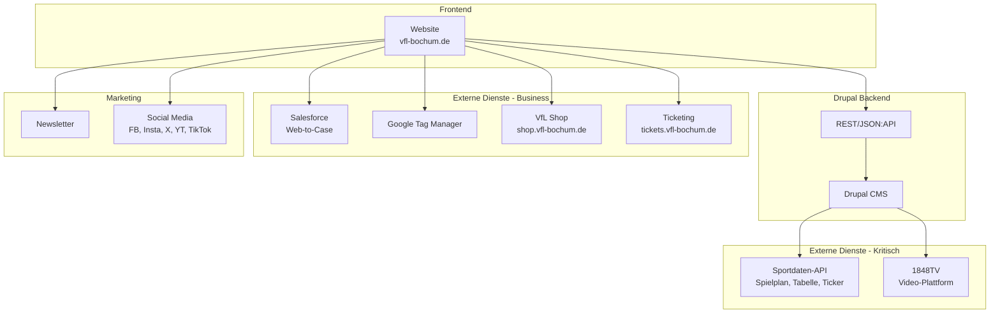

# Integrationen & Systemlandschaft

## Übersicht

Die VfL Bochum Website integriert mehrere externe Systeme und Dienste:

| System | Typ | Kritikalität |
|--------|-----|--------------|
| **Sportdaten-API** | API | Hoch |
| **1848TV** | Video | Hoch |
| **Salesforce** | CRM | Mittel |
| **Google Tag Manager** | Analytics | Mittel |
| **Shop** | E-Commerce | Mittel |
| **Ticketing** | Ticketing | Mittel |
| **Social Media** | Marketing | Niedrig |
| **Newsletter** | Marketing | Niedrig |

## Systemlandschaft

## Integrations-Übersicht

### Kritische Integrationen

| Integration | Aufwand | Komplexität |
|-------------|---------|-------------|
| Sportdaten-API | 70h | Hoch |
| 1848TV Video | 28h | Mittel |
| **Gesamt** | **98h** | |

[Details zu APIs →](./apis)

### Business-Integrationen

| Integration | Aufwand | Komplexität |
|-------------|---------|-------------|
| Salesforce Web-to-Case | 28h | Mittel |
| Google Tag Manager | 4h | Niedrig |
| Shop-Integration | 8h | Niedrig |
| Ticketing-Integration | 8h | Niedrig |
| **Gesamt** | **48h** | |

[SSO & Authentication →](./sso)

[CDN & Performance →](./cdn)

### Marketing-Integrationen

| Integration | Aufwand | Komplexität |
|-------------|---------|-------------|
| Newsletter | 8h | Niedrig |
| Social Media Feeds | 8h | Niedrig |
| **Gesamt** | **16h** | |

## Drupal-Module für Integrationen

| Integration | Drupal-Modul |
|-------------|--------------|
| Sportdaten | Custom Module |
| 1848TV | Custom Module / oEmbed |
| Salesforce | Salesforce Suite / Webform |
| GTM | Google Tag Manager |
| Newsletter | Simplenews / Custom |
| Social | Social Media Links |

## Migration-Strategie

### Phase 1: Kritische Integrationen
1. Sportdaten-API analysieren und dokumentieren
2. Custom Module entwickeln
3. API-Caching implementieren

### Phase 2: Business-Integrationen
1. Salesforce-Anbindung konfigurieren
2. GTM migrieren
3. Shop/Ticket-Links aktualisieren

### Phase 3: Marketing-Integrationen
1. Newsletter-System anbinden
2. Social Media Feeds einrichten

## Risiken

| Risiko | Wahrscheinlichkeit | Impact | Mitigation |
|--------|-------------------|--------|------------|
| Sportdaten-API undokumentiert | Hoch | Hoch | Reverse Engineering, Puffer |
| 1848TV API-Änderungen | Mittel | Mittel | Abstraktion, Fallback |
| Salesforce-Umstellung | Niedrig | Mittel | Webform-Backup |
