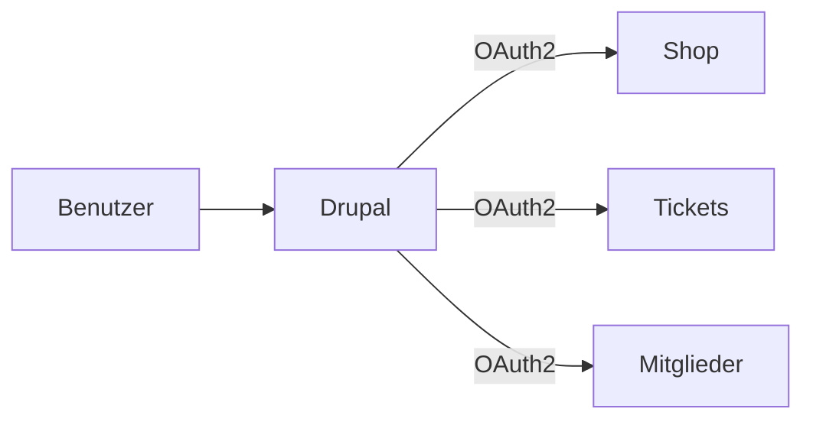
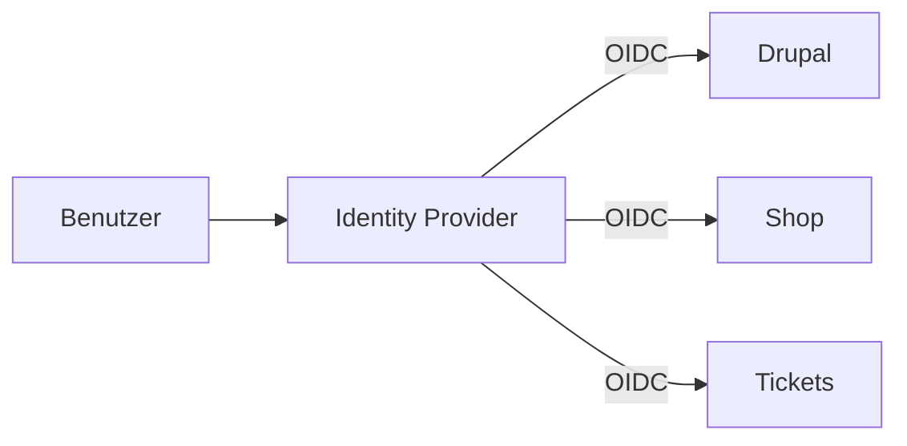

# SSO & Authentication

## Aktueller Stand

Die VfL Bochum Website verwendet **keine zentrale SSO-Lösung** für Endbenutzer. Es gibt separate Logins für:

| System | Authentifizierung |
|--------|-------------------|
| Website | Keine User-Registration sichtbar |
| Shop | Eigenes Account-System |
| Ticketing | Eigenes Account-System |
| Mitgliederbereich | Unklar (evtl. separat) |

## Empfehlung für Drupal

### Option 1: Drupal als Identity Provider

Drupal verwaltet Benutzerkonten zentral:



**Module:**
- Simple OAuth (OAuth 2.0 Server)
- Consumers (API Client Management)

**Vorteile:**
- Zentrale Benutzerverwaltung
- Single Sign-On möglich
- Volle Kontrolle

**Nachteile:**
- Externe Systeme müssen OAuth unterstützen
- Implementierungsaufwand

### Option 2: External Identity Provider

Nutzung eines externen Providers (Keycloak, Auth0):



**Module:**
- OpenID Connect / OAuth client

**Vorteile:**
- Professionelle SSO-Lösung
- Unterstützt alle Systeme
- MFA möglich

**Nachteile:**
- Zusätzlicher Service
- Lizenzkosten (je nach Provider)

### Option 3: Separate Accounts (Status Quo)

Jedes System behält eigene Benutzerverwaltung:

**Vorteile:**
- Keine Migration nötig
- Unabhängigkeit der Systeme

**Nachteile:**
- Schlechte User Experience
- Mehrfach-Registrierung
- Keine Datenkonsistenz

## Drupal User-Management

### Rollen-Konzept

| Rolle | Rechte |
|-------|--------|
| Anonymous | Öffentliche Inhalte lesen |
| Authenticated | Kommentare, Downloads |
| Member | Mitglieder-Bereich |
| Editor | Content erstellen/bearbeiten |
| Admin | Vollzugriff |

### Registrierung (falls gewünscht)

```yaml
# user.settings.yml
register: visitors_admin_approval
verify_mail: true
password_strength: true
```

### Social Login (optional)

**Module:** Social Auth

Unterstützte Provider:
- Facebook
- Google
- Apple
- Twitter/X

```php
// Installation
composer require drupal/social_auth_facebook
composer require drupal/social_auth_google
```

## Mitgliederbereich

Falls ein Mitgliederbereich gewünscht ist:

### Funktionalitäten

| Feature | Modul |
|---------|-------|
| Login/Registration | Core User |
| Profile | User Profile |
| Premium Content | Content Access / Group |
| Downloads | File Permissions |
| Membership Management | Commerce Membership |

### Content Access

```php
// Zugriff auf Premium-Inhalte einschränken
function vfl_member_node_access(NodeInterface $node, $op, AccountInterface $account) {
  if ($node->bundle() === 'premium_content') {
    if ($account->hasRole('member')) {
      return AccessResult::allowed();
    }
    return AccessResult::forbidden();
  }
  return AccessResult::neutral();
}
```

## Security Best Practices

### Password Policy

```yaml
# password_policy.yml
min_length: 12
require_uppercase: true
require_lowercase: true
require_number: true
require_special: false
max_age: 0  # Never expire for regular users
```

### Two-Factor Authentication (optional)

**Module:** TFA

Unterstützte Methoden:
- TOTP (Google Authenticator, etc.)
- Recovery Codes
- Trusted Browsers

### Session Management

```php
// settings.php
ini_set('session.cookie_secure', TRUE);
ini_set('session.cookie_httponly', TRUE);
ini_set('session.cookie_samesite', 'Strict');

// Session Timeout
$config['system.session']['cookie_lifetime'] = 2000000;
$config['system.session']['gc_maxlifetime'] = 200000;
```

## Aufwand

| Feature | Aufwand |
|---------|---------|
| Basic User Management | 8h |
| Mitgliederbereich (basic) | 24h |
| SSO mit externem Provider | 40h |
| Social Login | 8h |
| **Gesamt (empfohlen)** | **8-40h** |

**Empfehlung:** Zunächst ohne User-Registration starten, später bei Bedarf erweitern.
