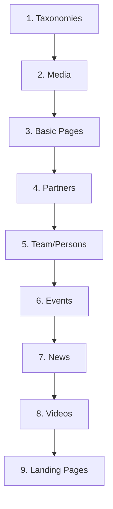

# Migration Approach

## Strategie: API Export + Custom Scripts

Da BloomReach kein Standard-Export-Format bietet, wird die Migration über die vorhandene REST-API durchgeführt.

## Phasen

### Phase 1: API-Analyse & Mapping

**Aufwand:** 50h

**Tasks:**
1. BloomReach API dokumentieren
2. Datenstruktur analysieren
3. Mapping auf Drupal-Entitäten erstellen
4. Transformations-Regeln definieren

**API-Endpunkte zu analysieren:**
```
/site/de/resourceapi/
├── pages/{slug}
├── documents/news/{id}
├── documents/videos/{id}
├── documents/team/{id}
├── documents/partners/{id}
└── assets/{path}
```

### Phase 2: Migrate-Module entwickeln

**Aufwand:** 80h

**Drupal Migrate Framework:**

```php
// vfl_migrate.info.yml
name: 'VfL Migration'
type: module
dependencies:
  - migrate
  - migrate_plus
  - migrate_tools
```

**Migration Definitions:**

```yaml
# migrate_plus.migration.vfl_news.yml
id: vfl_news
label: 'VfL News Migration'
source:
  plugin: url
  data_fetcher_plugin: http
  data_parser_plugin: json
  urls:
    - 'https://backend.vfl-bochum.de/site/de/resourceapi/documents/news'
  item_selector: items
  fields:
    - name: id
      selector: id
    - name: title
      selector: title
    - name: body
      selector: content/html
    - name: image
      selector: image/url
    - name: created
      selector: publishedDate
    - name: tags
      selector: tags
process:
  type:
    plugin: default_value
    default_value: article
  title: title
  body/value: body
  body/format:
    plugin: default_value
    default_value: full_html
  field_image:
    plugin: migration_lookup
    migration: vfl_media_images
    source: image
  created:
    plugin: format_date
    source: created
    from_format: 'Y-m-d\TH:i:s'
    to_format: 'U'
  field_tags:
    plugin: migration_lookup
    migration: vfl_tags
    source: tags
destination:
  plugin: 'entity:node'
```

### Phase 3: Media-Migration

**Aufwand:** 30h

**Schritte:**
1. Asset-URLs aus API extrahieren
2. Dateien herunterladen
3. In Drupal Media importieren
4. URL-Mapping erstellen

```yaml
# migrate_plus.migration.vfl_media_images.yml
id: vfl_media_images
label: 'VfL Media Images'
source:
  plugin: url
  urls:
    - 'https://backend.vfl-bochum.de/site/de/resourceapi/assets'
process:
  field_media_image:
    plugin: file_copy
    source: url
    destination: 'public://images/'
destination:
  plugin: 'entity:media'
  default_bundle: image
```

### Phase 4: Test-Migration

**Aufwand:** 30h

**Durchläufe:**
1. **Dry-Run:** Nur Logs, keine Schreiboperationen
2. **Sample-Run:** 10% des Contents
3. **Full Test:** Kompletter Content in Staging
4. **Validation:** Automatisierte Prüfungen

**Validierungs-Checks:**
```php
// Validation Service
public function validateMigration(): array {
  $issues = [];

  // Node Count Check
  $source_count = $this->getSourceCount('news');
  $target_count = $this->nodeStorage->loadByProperties(['type' => 'article']);
  if (count($target_count) !== $source_count) {
    $issues[] = "News count mismatch: $source_count vs " . count($target_count);
  }

  // Missing Images
  $nodes_without_image = $this->findNodesWithoutImage();
  if (!empty($nodes_without_image)) {
    $issues[] = count($nodes_without_image) . " nodes without images";
  }

  return $issues;
}
```

### Phase 5: Production Migration

**Aufwand:** 20h

**Ablauf:**
1. Content-Freeze auf Quellsystem
2. Finale Migration durchführen
3. Validierung
4. Redirects aktivieren
5. Go-Live

## Migrations-Reihenfolge



**Begründung:**
- Taxonomien zuerst (werden referenziert)
- Media vor Content (Entity References)
- Einfache Typen vor komplexen
- Landing Pages zuletzt (referenzieren alles)

## Rollback-Strategie

1. **Database Backup** vor jeder Migration
2. **Migrate Rollback** bei Fehlern:
   ```bash
   drush migrate:rollback vfl_news
   ```
3. **Full Rollback** möglich bis zum Go-Live

## Tools

| Tool | Zweck |
|------|-------|
| Drush | Migrate Commands |
| Migrate Tools | Import/Export |
| Migrate Plus | Extended Sources |
| Migrate Source CSV | Fallback |
