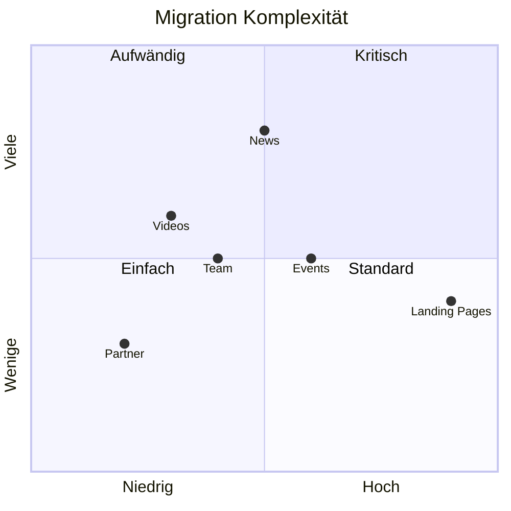

# Migration Complexity

## Komplexitäts-Bewertung: HOCH

### Faktoren

| Faktor | Bewertung | Begründung |
|--------|-----------|------------|
| **Quellsystem** | Komplex | Proprietäres CMS ohne Standard-Export |
| **Datenstruktur** | Komplex | Verschachtelte Komponenten |
| **Content-Volumen** | Mittel | ~1.000 Nodes, ~2.000 Media |
| **Integrationen** | Hoch | Sportdaten, 1848TV, Salesforce |
| **URL-Struktur** | Mittel | Redirect-Mapping erforderlich |

## Komplexitäts-Matrix



## Content-Typ Komplexität

### Einfach (Simple)

| Content-Typ | Aufwand/100 | Begründung |
|-------------|-------------|------------|
| Partner | 8h | Wenige Felder, klare Struktur |
| Basic Pages | 8h | Nur Text und Bilder |

### Mittel (Medium)

| Content-Typ | Aufwand/100 | Begründung |
|-------------|-------------|------------|
| News | 16h | Tags, Kategorien, Media |
| Videos | 16h | Externe Referenzen, Metadaten |
| Team | 16h | Multiple Image-Formate |
| Events | 16h | Date Handling, Referenzen |

### Komplex (Complex)

| Content-Typ | Aufwand/100 | Begründung |
|-------------|-------------|------------|
| Landing Pages | 32h | Verschachtelte Paragraphs |

## Spezielle Herausforderungen

### 1. Paragraph-Migration

BloomReach verwendet "Compounds" als flexible Komponenten. Diese müssen auf Drupal Paragraphs gemappt werden.

**Problem:**
```json
{
  "components": [
    {
      "type": "hero",
      "fields": { ... }
    },
    {
      "type": "slider",
      "items": [ ... ]
    }
  ]
}
```

**Lösung:** Custom Process Plugin für Component-zu-Paragraph-Transformation

```php
class ComponentToParagraph extends ProcessPluginBase {
  public function transform($value, ...) {
    $paragraphs = [];
    foreach ($value as $component) {
      $paragraph = $this->createParagraph($component);
      if ($paragraph) {
        $paragraphs[] = ['target_id' => $paragraph->id()];
      }
    }
    return $paragraphs;
  }
}
```

### 2. Media-Referenzen

Bilder sind in BloomReach als URLs referenziert, müssen aber in Drupal als Media-Entities existieren.

**Strategie:**
1. Alle Media-URLs extrahieren
2. Dateien herunterladen
3. Media-Entities erstellen
4. Mapping-Tabelle pflegen
5. Bei Content-Migration referenzieren

### 3. URL-Redirects

Alle alten URLs müssen auf neue redirecten.

**Volumen:** ~1.000 Redirects

```php
// Redirect Creation
$redirect = Redirect::create([
  'redirect_source' => '/site/de/news/artikel-123',
  'redirect_redirect' => 'internal:/news/neuer-slug',
  'status_code' => 301,
]);
$redirect->save();
```

### 4. Multimediale Inhalte

Videos von 1848TV sind externe Embeds, keine lokalen Dateien.

**Lösung:** oEmbed oder Custom Media Type für 1848TV

## Risiko-Mitigation

### API-Zugang

**Risiko:** BloomReach API nicht vollständig zugänglich

**Mitigation:**
1. Frühzeitig API-Dokumentation anfordern
2. Scraping als Backup-Option
3. CSV-Export als Alternative
4. Ausreichend Pufferzeit einplanen

### Datenqualität

**Risiko:** Inkonsistente Daten im Quellsystem

**Mitigation:**
1. Daten-Analyse vor Migration
2. Cleanup-Regeln definieren
3. Validierung nach Migration
4. Manuelle Nacharbeit einplanen

### Content-Freeze

**Risiko:** Content wird während Migration geändert

**Mitigation:**
1. Klare Kommunikation mit Redaktion
2. Kurzes Migrationsfenster
3. Delta-Migration für Änderungen
4. Rollback-Plan

## Aufwand nach Komplexität

| Komplexität | Nodes | Aufwand |
|-------------|-------|---------|
| Simple | 110 | ~9h |
| Medium | 835 | ~134h |
| Complex | 55 | ~18h |
| **Gesamt** | **1.000** | **~161h** |

*Plus Setup und Validierung: ~70h*
*Gesamt-Migration: ~230h*
