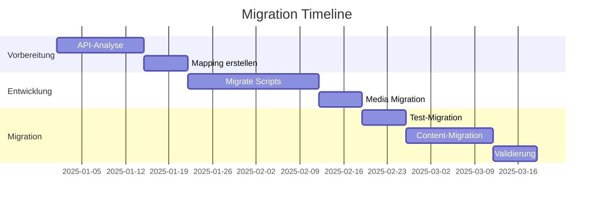

# Migration Plan

## Übersicht

| Aspekt | Wert |
|--------|------|
| **Quellsystem** | BloomReach Experience Manager (brXM) |
| **Zielsystem** | Drupal CMS 2.0 |
| **Migrationsansatz** | API Export + Custom Scripts |
| **Komplexität** | Hoch |
| **Geschätzter Aufwand** | 230h |

## Migrations-Umfang

### Content-Volumen

| Content-Typ | Anzahl | Komplexität |
|-------------|--------|-------------|
| Statische Seiten | 60 | Niedrig |
| News-Artikel | 500 | Mittel |
| Videos | 335 | Niedrig (nur Refs) |
| Team-Profile | 100 | Mittel |
| Partner | 50 | Niedrig |
| Events | 200 | Mittel |
| **Gesamt Nodes** | **~1.000** | |

### Media-Volumen

| Typ | Anzahl |
|-----|--------|
| Bilder | ~1.500 |
| Videos | 335 (Referenzen) |
| Dokumente | ~50 |
| Logos | ~50 |
| **Gesamt** | **~2.000** |

## Phasenplan

[Ansatz Details →](./approach)

[Content Cleanup →](./cleanup)

[Komplexität →](./complexity)

## Risiken

| Risiko | Wahrscheinlichkeit | Impact | Mitigation |
|--------|-------------------|--------|------------|
| API-Zugang eingeschränkt | Mittel | Hoch | Scraping als Backup |
| Datenstruktur komplex | Hoch | Mittel | Ausreichend Analyse-Zeit |
| Content-Freeze | Mittel | Mittel | Delta-Migration |
| URL-Änderungen | Niedrig | Mittel | Redirect-Mapping |

## Aufwand-Breakdown

| Phase | Stunden |
|-------|---------|
| Setup & Analyse | 30h |
| Mapping & Planung | 20h |
| Script-Entwicklung | 80h |
| Media-Migration | 30h |
| Test-Durchläufe | 30h |
| Final-Migration | 20h |
| Validierung | 20h |
| **Gesamt** | **230h** |
