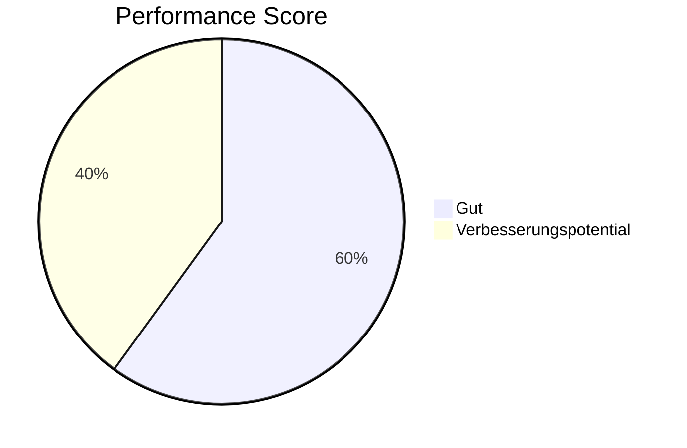

# Performance Analysis

## Zusammenfassung

| Metrik | Wert | Bewertung |
|--------|------|-----------|
| **TTFB** | 172ms | ✅ Gut |
| **Total Load** | 371ms | ✅ Gut |
| **Page Size** | 1.17 MB | ⚠️ Mittel |
| **Requests** | ~50 | ⚠️ Mittel |

## Gesamt-Bewertung

## Key Metrics

### Time to First Byte (TTFB)

**Aktuell:** 172ms
**Ziel:** < 200ms
**Status:** ✅ Erreicht

Der Server antwortet schnell dank der Headless-Architektur mit SSR/SSG.

### Largest Contentful Paint (LCP)

**Geschätzt:** ~2-3s
**Ziel:** < 2.5s
**Status:** ⚠️ Grenzwertig

Hero-Images und eingebettete JSON-Daten beeinflussen LCP.

### Cumulative Layout Shift (CLS)

**Geschätzt:** < 0.1
**Ziel:** < 0.1
**Status:** ✅ Gut

Durch SSR werden Layouts server-seitig gerendert.

### Total Blocking Time (TBT)

**Status:** ⚠️ Zu analysieren

JavaScript-Bundle-Größe durch Next.js könnte TBT beeinflussen.

## Stärken

1. **Schneller Server:** TTFB von 172ms ist sehr gut
2. **SSR/SSG:** Next.js sorgt für schnelles Initial Rendering
3. **CDN:** Assets werden über CDN ausgeliefert
4. **Moderne Architektur:** Headless-Setup ermöglicht Optimierungen

## Verbesserungspotential

1. **JSON-Payload:** Eingebettete Daten im HTML reduzieren
2. **Image-Optimierung:** WebP/AVIF Format verwenden
3. **Lazy Loading:** Below-the-fold Content verzögert laden
4. **JavaScript:** Bundle-Splitting optimieren

[Mehr zu Core Web Vitals →](./core-web-vitals)

[Asset-Optimierung →](./assets)

[Empfehlungen →](./recommendations)

## Drupal-Migration Impact

### Performance-Vorteile von Drupal

| Feature | Beschreibung |
|---------|--------------|
| BigPipe | Streaming von Inhalten |
| Dynamic Page Cache | Authenticated User Caching |
| Internal Page Cache | Anonymous User Caching |
| Cache Tags | Granulare Cache-Invalidierung |

### Erwartete Verbesserungen

- **Caching:** Drupal's Cache-System ist sehr ausgereift
- **Image Styles:** Automatische Responsive Images
- **Lazy Loading:** Native Unterstützung in Drupal 10+
- **CDN-Integration:** Einfache Integration möglich
