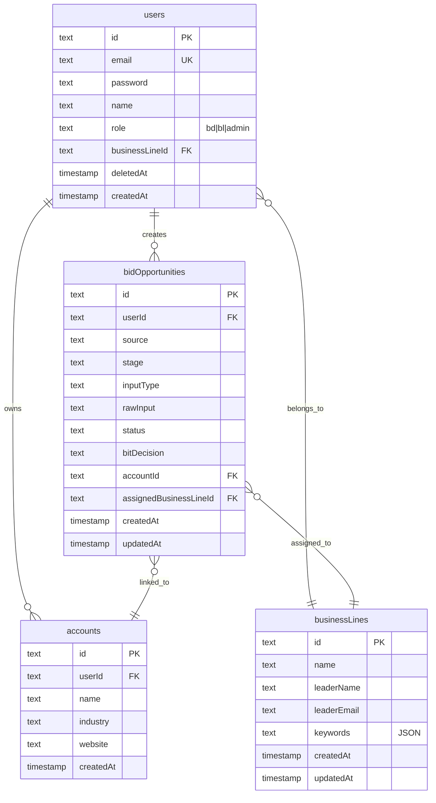

# Epic 1: Foundation & Infrastructure

**Status:** MOSTLY COMPLETE - Gaps Identified
**Priority:** Kritisch (Blocker for all other Epics)
**Dependencies:** None

---

## Overview

Epic 1 establishes the foundational infrastructure for Dealhunter, an AI-driven BD decision platform for adesso SE. This includes database schema, authentication, base layout, API routes, and environment configuration.

## Implementation Status

| ID | Feature | Status | Notes |
|----|---------|--------|-------|
| F-001 | Database Schema | COMPLETE | 10 tables implemented in `lib/db/schema.ts` |
| F-002 | Auth System | COMPLETE | NextAuth v5 with JWT, 3 roles (bd, bl, admin) |
| F-003 | Base Layout | COMPLETE | ShadCN Sidebar with navigation |
| F-004 | API Route Structure | COMPLETE | Server Actions pattern preferred |
| F-005 | Environment Config | COMPLETE | `.env.example` documented |

---

## Identified Gaps (from SpecFlow Analysis)

### Critical Gaps (Must Fix)

#### 1. User Deletion Cascade Failure
**Problem:** Deleting a user with related data crashes with FK constraint violation.
**Location:** `lib/db/schema.ts` - Foreign keys lack `ON DELETE CASCADE`
**Impact:** Admin cannot delete users who have created bids, references, or accounts.

```typescript
// lib/db/schema.ts - Current (broken)
userId: text('user_id').notNull().references(() => users.id)

// Fix needed - add cascade or implement soft delete
userId: text('user_id').notNull().references(() => users.id, { onDelete: 'cascade' })
```

#### 2. Password Hash Exposed in Admin API
**Problem:** `getUsers()` returns all columns including password hash.
**Location:** `lib/admin/users-actions.ts:14`
**Impact:** Security vulnerability - password hashes visible in network tab.

```typescript
// Current (vulnerable)
const result = await db.select().from(users);

// Fix needed - exclude password
const result = await db.select({
  id: users.id,
  email: users.email,
  name: users.name,
  role: users.role,
  createdAt: users.createdAt
}).from(users);
```

#### 3. First Admin Bootstrap Problem
**Problem:** No way to create initial admin user.
**Impact:** First user is always 'bd', requires manual DB edit.

**Solution:** Create database seed script `lib/db/seed.ts`

### Important Gaps (Should Fix)

#### 4. Auth Errors Not Displayed
**Problem:** Login/register errors returned but not shown in UI.
**Location:** `app/login/page.tsx`, `app/register/page.tsx`

#### 5. NavUser Shows Hardcoded Data
**Problem:** Sidebar shows "Max Mustermann" regardless of actual user.
**Location:** `components/app-sidebar.tsx:28-32`

#### 6. Admin Menu Visible to All Roles
**Problem:** Non-admins see Admin menu (clicking redirects, but confusing UX).
**Location:** `components/app-sidebar.tsx` - no role filtering

#### 7. Missing businessLineId on Users
**Problem:** BL users not linked to specific business lines.
**Location:** `lib/db/schema.ts` - users table

#### 8. Logout in NavUser Non-Functional
**Problem:** Logout menu item has no action attached.
**Location:** `components/nav-user.tsx`

#### 9. Static Breadcrumbs
**Problem:** Breadcrumb shows "Dashboard > Overview" on all pages.
**Location:** `app/(dashboard)/layout.tsx`

---

## Acceptance Criteria

### Functional Requirements

- [x] Database schema supports all core entities (users, bids, accounts, etc.)
- [x] Authentication with email/password credentials
- [x] JWT session strategy configured
- [x] Three user roles: bd, bl, admin
- [x] Role-based route protection via middleware
- [x] ShadCN Sidebar layout with navigation
- [x] Environment variables documented
- [ ] User deletion handles related data gracefully
- [ ] Password hashes never exposed to client
- [ ] Admin bootstrap mechanism exists
- [ ] Auth errors displayed in UI
- [ ] Sidebar shows actual user data
- [ ] Navigation filtered by role

### Non-Functional Requirements

- [x] TypeScript strict mode
- [x] Drizzle ORM type safety
- [x] NextAuth v5 best practices
- [ ] No security vulnerabilities (password exposure)
- [ ] Clean UX (no dead links, working logout)

---

## Implementation Plan

### Phase 1: Critical Security Fixes

#### Task 1.1: Fix Password Exposure
**File:** `lib/admin/users-actions.ts`
```typescript
// Line 14 - Change from:
const result = await db.select().from(users);

// To:
const result = await db.select({
  id: users.id,
  email: users.email,
  name: users.name,
  role: users.role,
  createdAt: users.createdAt
}).from(users);
```

#### Task 1.2: Add Soft Delete to Users
**File:** `lib/db/schema.ts`
```typescript
// Add to users table:
deletedAt: integer('deleted_at', { mode: 'timestamp' }),
```

**File:** `lib/admin/users-actions.ts`
```typescript
// Change deleteUser to soft delete:
export async function deleteUser(userId: string) {
  'use server';
  await db.update(users)
    .set({ deletedAt: new Date() })
    .where(eq(users.id, userId));
  revalidatePath('/admin/users');
}
```

#### Task 1.3: Create Database Seed Script
**File:** `lib/db/seed.ts`
```typescript
import { db } from './index';
import { users } from './schema';
import bcrypt from 'bcryptjs';

async function seed() {
  const adminExists = await db.query.users.findFirst({
    where: eq(users.role, 'admin')
  });

  if (!adminExists) {
    const hashedPassword = await bcrypt.hash('admin123', 10);
    await db.insert(users).values({
      email: 'admin@adesso.de',
      password: hashedPassword,
      name: 'System Administrator',
      role: 'admin'
    });
    console.log('Admin user created: admin@adesso.de');
  }
}

seed().catch(console.error);
```

### Phase 2: UX Improvements

#### Task 2.1: Display Auth Errors
**Files:** `app/login/page.tsx`, `app/register/page.tsx`
- Use `useActionState` hook to capture and display errors
- Add error Alert component below form

#### Task 2.2: Fix NavUser with Real Session Data
**File:** `app/(dashboard)/layout.tsx`
- Pass session user to AppSidebar
**File:** `components/app-sidebar.tsx`
- Accept user prop, use in NavUser

#### Task 2.3: Role-Based Sidebar Filtering
**File:** `components/app-sidebar.tsx`
- Filter navMain items based on user.role
- Hide Admin section for non-admins

#### Task 2.4: Make Logout Functional
**File:** `components/nav-user.tsx`
- Wrap logout in form with action={logout}

#### Task 2.5: Dynamic Breadcrumbs
**File:** `app/(dashboard)/layout.tsx`
- Create breadcrumb config mapping routes to labels
- Use pathname to generate dynamic breadcrumbs

### Phase 3: Schema Enhancements

#### Task 3.1: Add businessLineId to Users
**File:** `lib/db/schema.ts`
```typescript
// Add to users table:
businessLineId: text('business_line_id').references(() => businessLines.id),
```

Run migration: `npm run db:push`

---

## ERD Update (Mermaid)



---

## References

### Internal Files
- Schema: `lib/db/schema.ts`
- Auth config: `lib/auth.ts`
- Auth types: `lib/auth/types.ts`
- Middleware: `middleware.ts`
- Dashboard layout: `app/(dashboard)/layout.tsx`
- App sidebar: `components/app-sidebar.tsx`
- Admin users: `lib/admin/users-actions.ts`
- Login page: `app/login/page.tsx`

### External Documentation
- Drizzle ORM: https://orm.drizzle.team/docs/overview
- NextAuth v5: https://authjs.dev/getting-started
- ShadCN Sidebar: https://ui.shadcn.com/docs/components/sidebar
- Next.js App Router: https://nextjs.org/docs/app

---

## Success Metrics

| Metric | Target | Current |
|--------|--------|---------|
| Core features implemented | 5/5 | 5/5 |
| Critical gaps fixed | 3/3 | 0/3 |
| Important gaps fixed | 6/6 | 0/6 |
| Security vulnerabilities | 0 | 1 (password exposure) |

---

**Last Updated:** 2026-01-16
**Author:** Claude Code
