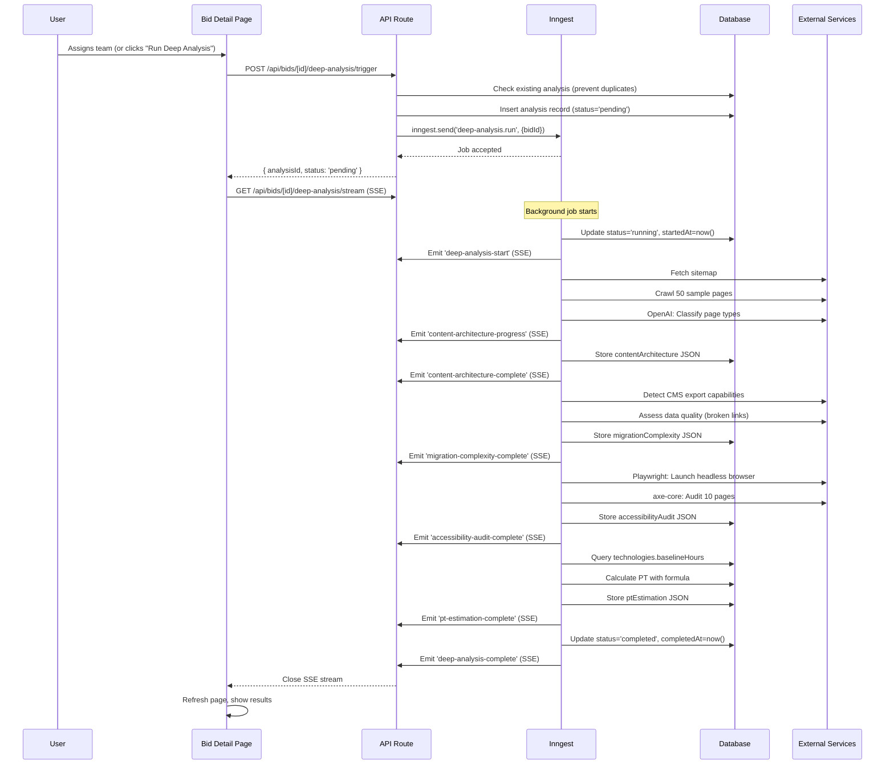
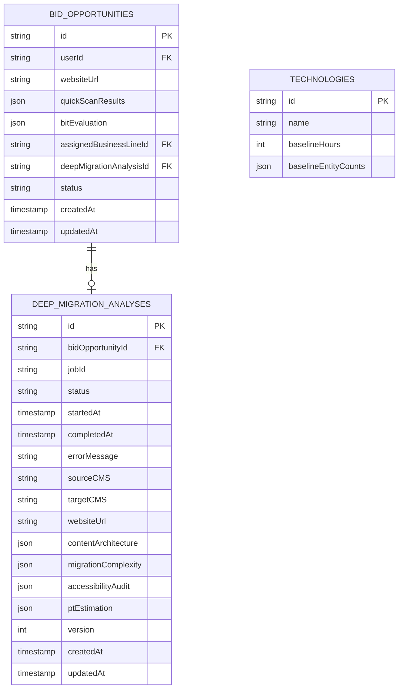

# Epic 7: Deep Migration Analysis

## Overview

Implement comprehensive CMS migration analysis with background job processing, SSE progress tracking, and CMS-specific technical assessments. Delivers 10-30 minute deep analysis providing Content Architecture mapping, Migration Complexity scoring, Accessibility audits, and PT (Person-Time) estimation for Drupal migration projects.

**Why This Matters:** Quick Scan (Epic 4) provides fast, surface-level analysis. Deep Migration Analysis delivers detailed, quantified estimates that sales and delivery teams need for accurate project scoping and pricing.

**Business Value:**

- **Sales:** Accurate PT estimates improve quote accuracy and win rates
- **Delivery:** Detailed complexity assessment reduces project overruns
- **Operations:** Background job processing prevents server blocking
- **Users:** Real-time SSE progress streaming shows transparency

## Problem Statement

### Current State

After Epic 5a implementation, the platform successfully delivers:

- ✅ Rapid PDF/email extraction (30-60 seconds)
- ✅ Quick Scan tech stack detection (5-10 minutes)
- ✅ BIT/NO BIT evaluation with multi-agent analysis (10-15 minutes)
- ✅ Real-time SSE streaming UI with agent transparency
- ✅ Team assignment and BL routing

**Critical Gap:** No detailed migration analysis capability.

**Impact:**

- Sales teams provide rough estimates without technical backing
- Delivery teams inherit under-scoped projects
- No quantified assessment of migration complexity
- Manual PT estimation varies by estimator (inconsistent)
- No accessibility compliance data for pitches
- Missing competitive advantage in CMS migration space

### User Pain Points

**Scenario 1: BD Team Quoting Drupal Migration**

- **Current:** "This looks like a medium-sized Drupal project, maybe 500-700 hours?"
- **Problem:** No data on Content Type counts, complexity factors, accessibility gaps
- **Result:** Quote is either too high (lose deal) or too low (delivery pain)

**Scenario 2: BL Team Starting Project**

- **Current:** Receives bid with minimal technical details
- **Problem:** Must conduct own discovery (wasted time, delays start)
- **Result:** Project kickoff delayed 2-3 weeks for technical assessment

**Scenario 3: Sales Pitch with WCAG Requirements**

- **Current:** "We can make it accessible" (generic statement)
- **Problem:** No baseline audit of current accessibility state
- **Result:** Cannot quantify accessibility remediation effort, client skeptical

## Proposed Solution

### High-Level Approach

**4-Step Automated Analysis Pipeline:**

```
1. Content Architecture Analysis (8 min)
   - Fetch sitemap, crawl representative pages
   - LLM-classify page types (product, blog, landing, etc.)
   - Map to Drupal Content Types and Paragraphs
   - Output: Content Type count, Paragraph estimates

2. Migration Complexity Scoring (5 min)
   - Detect source CMS export capabilities (API, XML, manual)
   - Assess data quality (broken links, duplicates)
   - Calculate 0-100 complexity score with factors
   - Output: Complexity breakdown with explanations

3. Accessibility Audit (12 min)
   - Launch headless browser with axe-core
   - Audit 10 representative pages for WCAG 2.1 AA
   - Aggregate violations by severity
   - Output: Violation counts, remediation priorities

4. PT Estimation (2 min)
   - Load baseline hours from technologies table
   - Apply Content Type multiplier (50h per extra CT)
   - Apply Paragraph multiplier (30h per extra Paragraph)
   - Apply complexity multiplier (0.8-1.5x based on score)
   - Add 20% buffer for unknowns
   - Output: Total PT hours with breakdown
```

**Total Duration:** 27 minutes (10-30 minute range per EPICS.md)

### User Experience

**Auto-Trigger Flow:**

```
User assigns team → status='team_assigned'
    ↓ (auto-trigger in 5 seconds)
Background job starts
    ↓
User navigates to Bid Detail page
    ↓
Sees ActivityStream component (from Epic 5a)
    ↓
Real-time SSE progress:
  [12:00:00] [Deep Analysis] Starting migration analysis...
  [12:00:05] [Content Architecture] Fetching sitemap...
  [12:03:12] [Content Architecture] Classified 50 pages → 8 Content Types
  [12:08:30] [Migration Complexity] Source CMS: WordPress, Export: REST API available
  [12:13:45] [Accessibility Audit] Auditing 10 pages...
  [12:25:20] [PT Estimation] Baseline: 693h, Content Types: +150h, Complexity: 1.2x
  [12:27:00] [Deep Analysis] Complete! Total PT: 1,012 hours
    ↓
User sees comprehensive report with:
  - Content Architecture table (Page Type → Content Type mapping)
  - Migration Complexity score (75/100) with factors breakdown
  - Accessibility violations chart (23 serious, 67 moderate)
  - PT estimation with confidence (85%)
```

**Manual Trigger Flow:**

```
User on Bid Detail (status: 'team_assigned')
    ↓
Clicks "Run Deep Analysis" button
    ↓
[Same as auto-trigger from background job starts]
```

**Retry After Failure Flow:**

```
User sees "Analysis Failed: Website unreachable"
    ↓
Clicks "Retry Analysis" button
    ↓
System creates new analysis record (fresh start, no resume)
    ↓
[Same as auto-trigger]
```

## Technical Approach

### Architecture

**Tech Stack Additions:**

| Component               | Technology                        | Why                                                                       |
| ----------------------- | --------------------------------- | ------------------------------------------------------------------------- |
| **Background Jobs**     | Inngest                           | Serverless-friendly, built-in retries, Vercel-compatible, no Redis needed |
| **SSE Streaming**       | Existing infrastructure (Epic 5a) | Reuse createAgentEventStream, extend AgentEventType                       |
| **Accessibility Audit** | axe-core + Playwright             | Industry standard, detailed WCAG reports, headless browser                |
| **Content Crawling**    | Native fetch + cheerio            | Lightweight HTML parsing, no heavy dependencies                           |
| **LLM Classification**  | OpenAI gpt-4o-mini                | Cost-effective for page type classification (50 pages = $0.05)            |
| **Database**            | Drizzle ORM (SQLite)              | Extend schema with deepMigrationAnalyses table                            |

**System Architecture:**

```
┌─────────────────────────────────────────────────────────────────┐
│                         User Interface                          │
│  ┌─────────────────────┐   ┌─────────────────────────────────┐ │
│  │ Bid Detail Page     │   │ ActivityStream Component (5a)   │ │
│  │ - Trigger button    │   │ - SSE connection                │ │
│  │ - Analysis results  │   │ - Live progress events          │ │
│  └─────────────────────┘   └─────────────────────────────────┘ │
└─────────────────────────────────────────────────────────────────┘
                              ↕ (SSE events)
┌─────────────────────────────────────────────────────────────────┐
│                    API Layer (Next.js App Router)               │
│  ┌─────────────────────────────────────────────────────────────┐│
│  │ /api/bids/[id]/deep-analysis/stream/route.ts (SSE)         ││
│  │ /api/bids/[id]/deep-analysis/trigger/route.ts (POST)       ││
│  │ /api/inngest (Inngest webhook endpoint)                    ││
│  └─────────────────────────────────────────────────────────────┘│
└─────────────────────────────────────────────────────────────────┘
                              ↕
┌─────────────────────────────────────────────────────────────────┐
│                      Background Job Layer (Inngest)             │
│  ┌─────────────────────────────────────────────────────────────┐│
│  │ deep-analysis.run (main orchestrator)                       ││
│  │   ├─ Step 1: Content Architecture Agent                    ││
│  │   ├─ Step 2: Migration Complexity Agent                    ││
│  │   ├─ Step 3: Accessibility Audit Agent                     ││
│  │   └─ Step 4: PT Estimation Agent                           ││
│  └─────────────────────────────────────────────────────────────┘│
└─────────────────────────────────────────────────────────────────┘
                              ↕
┌─────────────────────────────────────────────────────────────────┐
│                         Data Layer                              │
│  ┌──────────────────────┐    ┌─────────────────────────────────┐│
│  │ Drizzle ORM          │    │ deepMigrationAnalyses table     ││
│  │ - Insert/Update      │    │ - Results storage               ││
│  │ - Query results      │    │ - Job status tracking           ││
│  └──────────────────────┘    └─────────────────────────────────┘│
└─────────────────────────────────────────────────────────────────┘
                              ↕
┌─────────────────────────────────────────────────────────────────┐
│                       External Services                         │
│  ┌──────────────┐  ┌──────────────┐  ┌──────────────────────────┐│
│  │ OpenAI API   │  │ Target       │  │ Playwright (headless)    ││
│  │ (LLM for     │  │ Website      │  │ + axe-core (a11y audit)  ││
│  │ page         │  │ (crawling)   │  │                          ││
│  │ classification)│  └──────────────┘  └──────────────────────────┘│
│  └──────────────┘                                                 │
└─────────────────────────────────────────────────────────────────┘
```

**Event Flow Diagram:**



### Implementation Phases

#### Phase 1: Foundation (Days 1-2)

**Database Schema:**

Create `deepMigrationAnalyses` table:

```typescript
// lib/db/schema.ts
export const deepMigrationAnalyses = sqliteTable('deep_migration_analyses', {
  // Primary Key
  id: text('id')
    .primaryKey()
    .$defaultFn(() => createId()),

  // Foreign Keys
  bidOpportunityId: text('bid_opportunity_id')
    .notNull()
    .references(() => bidOpportunities.id),

  // Job Tracking
  jobId: text('job_id').notNull(), // Inngest run ID
  status: text('status', {
    enum: ['pending', 'running', 'completed', 'failed', 'cancelled'],
  }).notNull(),
  startedAt: integer('started_at', { mode: 'timestamp' }),
  completedAt: integer('completed_at', { mode: 'timestamp' }),
  errorMessage: text('error_message'),

  // Input Context
  sourceCMS: text('source_cms'), // WordPress, Drupal, Typo3, Custom
  targetCMS: text('target_cms'), // Drupal, Magnolia, Ibexa
  websiteUrl: text('website_url').notNull(),

  // Results (JSON columns)
  contentArchitecture: text('content_architecture'), // stringified JSON
  migrationComplexity: text('migration_complexity'), // stringified JSON
  accessibilityAudit: text('accessibility_audit'), // stringified JSON
  ptEstimation: text('pt_estimation'), // stringified JSON

  // Metadata
  version: integer('version').notNull().default(1), // For re-runs
  createdAt: integer('created_at', { mode: 'timestamp' }).$defaultFn(() => new Date()),
  updatedAt: integer('updated_at', { mode: 'timestamp' }).$onUpdateFn(() => new Date()),
});
```

**TypeScript Schemas:**

```typescript
// lib/deep-analysis/schemas.ts
import { z } from 'zod';

export const ContentArchitectureSchema = z.object({
  pageTypes: z.array(
    z.object({
      type: z.string(), // 'homepage', 'product', 'blog', etc.
      count: z.number(),
      sampleUrls: z.array(z.string()),
    })
  ),
  contentTypeMapping: z.array(
    z.object({
      pageType: z.string(),
      drupalContentType: z.string(),
      confidence: z.number(),
      reasoning: z.string(),
    })
  ),
  paragraphEstimate: z.number(), // Estimated Paragraph types needed
  totalPages: z.number(),
});

export const MigrationComplexitySchema = z.object({
  score: z.number().min(0).max(100),
  factors: z.object({
    sourceCMSType: z.enum(['wordpress', 'drupal', 'typo3', 'custom']),
    hasStandardExport: z.boolean(),
    apiAvailable: z.boolean(),
    contentTypeCount: z.number(),
    customPlugins: z.number(),
    thirdPartyIntegrations: z.number(),
  }),
  exportCapabilities: z.object({
    restAPI: z.boolean(),
    xmlExport: z.boolean(),
    cliTool: z.boolean(),
    databaseAccess: z.boolean(),
  }),
  dataQuality: z.object({
    brokenLinks: z.number(),
    duplicateContent: z.boolean(),
    inconsistentStructure: z.boolean(),
  }),
});

export const AccessibilityAuditSchema = z.object({
  wcagLevel: z.enum(['A', 'AA', 'AAA']),
  overallScore: z.number().min(0).max(100), // 0 = many violations, 100 = perfect
  violations: z.array(
    z.object({
      id: z.string(), // e.g., 'color-contrast'
      impact: z.enum(['minor', 'moderate', 'serious', 'critical']),
      count: z.number(),
      description: z.string(),
      helpUrl: z.string(),
    })
  ),
  pagesAudited: z.number(),
  timestamp: z.string(),
});

export const PTEstimationSchema = z.object({
  totalHours: z.number(),
  confidence: z.number().min(0).max(100),
  breakdown: z.object({
    baselineHours: z.number(),
    contentTypeHours: z.number(),
    paragraphHours: z.number(),
    complexityMultiplier: z.number(),
    bufferHours: z.number(),
  }),
  assumptions: z.array(z.string()),
});
```

**Inngest Setup:**

```typescript
// lib/inngest/client.ts
import { Inngest } from 'inngest';

export const inngest = new Inngest({
  id: 'dealhunter',
  eventKey: process.env.INNGEST_EVENT_KEY,
});

// lib/inngest/functions/deep-analysis.ts
import { inngest } from '../client';
import { runDeepAnalysis } from '@/lib/deep-analysis/agent';

export const deepAnalysisFunction = inngest.createFunction(
  {
    id: 'deep-analysis-run',
    name: 'Deep Migration Analysis',
    retries: 2,
  },
  { event: 'deep-analysis.run' },
  async ({ event, step }) => {
    const { bidId } = event.data;

    // Run the analysis (streaming via SSE)
    await runDeepAnalysis(bidId);

    return { success: true, bidId };
  }
);

// app/api/inngest/route.ts
import { serve } from 'inngest/next';
import { inngest } from '@/lib/inngest/client';
import { deepAnalysisFunction } from '@/lib/inngest/functions/deep-analysis';

export const { GET, POST, PUT } = serve({
  client: inngest,
  functions: [deepAnalysisFunction],
});
```

**Tasks:**

- [ ] Create migration file: `lib/db/migrations/0008_add_deep_migration_analyses.sql`
- [ ] Run `npm run db:push` to apply schema
- [ ] Install Inngest: `npm install inngest`
- [ ] Create Inngest client and function
- [ ] Set up `/api/inngest` webhook endpoint
- [ ] Configure Inngest in dev: `npx inngest-cli@latest dev`

**Success Criteria:**

- ✅ Database migration applies without errors
- ✅ TypeScript types are inferred correctly from schema
- ✅ Inngest dev server runs and shows function registered
- ✅ Test event triggers function successfully

#### Phase 2: Agent Implementation (Days 3-5)

**Agent 1: Content Architecture Analyzer**

```typescript
// lib/deep-analysis/agents/content-architecture-agent.ts
import { generateObject } from 'ai';
import { openai } from '@ai-sdk/openai';
import { ContentArchitectureSchema } from '../schemas';
import { fetchSitemap, samplePages } from '../utils/crawler';

export async function analyzeContentArchitecture(
  websiteUrl: string,
  onProgress?: (message: string) => void
) {
  onProgress?.('Fetching sitemap...');

  // 1. Fetch sitemap
  const sitemap = await fetchSitemap(websiteUrl);
  const totalPages = sitemap.urls.length;

  // 2. Sample 50 representative pages
  onProgress?.(`Sampling ${Math.min(50, totalPages)} pages from ${totalPages} total...`);
  const sampleUrls = samplePages(sitemap.urls, 50);

  // 3. Classify each page type using LLM
  const pageClassifications = [];
  for (let i = 0; i < sampleUrls.length; i++) {
    const url = sampleUrls[i];
    onProgress?.(`Classifying page ${i + 1}/${sampleUrls.length}...`);

    const html = await fetch(url).then(r => r.text());

    const { object } = await generateObject({
      model: openai('gpt-4o-mini'),
      schema: z.object({
        pageType: z.enum([
          'homepage',
          'product',
          'service',
          'blog',
          'landing',
          'contact',
          'about',
          'custom',
        ]),
        confidence: z.number(),
        reasoning: z.string(),
      }),
      prompt: `Classify this page based on its HTML structure and content:\n\nURL: ${url}\n\nHTML (first 5000 chars):\n${html.substring(0, 5000)}\n\nWhat type of page is this?`,
    });

    pageClassifications.push({ url, ...object });
  }

  // 4. Group by page type
  const pageTypes = Object.entries(
    pageClassifications.reduce(
      (acc, p) => {
        acc[p.pageType] = (acc[p.pageType] || 0) + 1;
        return acc;
      },
      {} as Record<string, number>
    )
  ).map(([type, count]) => ({
    type,
    count: Math.round((count / sampleUrls.length) * totalPages), // Extrapolate
    sampleUrls: pageClassifications
      .filter(p => p.pageType === type)
      .map(p => p.url)
      .slice(0, 3),
  }));

  // 5. Map page types to Drupal Content Types
  onProgress?.('Mapping to Drupal Content Types...');

  const { object: mapping } = await generateObject({
    model: openai('gpt-4o-mini'),
    schema: z.object({
      contentTypeMapping: z.array(
        z.object({
          pageType: z.string(),
          drupalContentType: z.string(),
          confidence: z.number(),
          reasoning: z.string(),
        })
      ),
      paragraphEstimate: z.number(),
    }),
    prompt: `You are a Drupal migration expert. Map these page types to Drupal Content Types and estimate Paragraph types needed:\n\nPage Types:\n${JSON.stringify(pageTypes, null, 2)}\n\nProvide Drupal-native names (e.g., "Article", "Basic Page", "Product", "Landing Page") and estimate how many Paragraph types would be needed for flexible content layouts.`,
  });

  return ContentArchitectureSchema.parse({
    pageTypes,
    contentTypeMapping: mapping.contentTypeMapping,
    paragraphEstimate: mapping.paragraphEstimate,
    totalPages,
  });
}
```

**Agent 2: Migration Complexity Scorer**

```typescript
// lib/deep-analysis/agents/migration-complexity-agent.ts
import { MigrationComplexitySchema } from '../schemas';
import { detectCMS, checkExportCapabilities, assessDataQuality } from '../utils/cms-detector';

export async function scoreMigrationComplexity(
  websiteUrl: string,
  sourceCMS: string,
  onProgress?: (message: string) => void
) {
  onProgress?.('Detecting source CMS export capabilities...');

  // 1. Detect export capabilities
  const exportCapabilities = await checkExportCapabilities(websiteUrl, sourceCMS);

  // 2. Assess data quality
  onProgress?.('Assessing data quality...');
  const dataQuality = await assessDataQuality(websiteUrl);

  // 3. Calculate complexity factors
  const factors = {
    sourceCMSType: sourceCMS.toLowerCase() as 'wordpress' | 'drupal' | 'typo3' | 'custom',
    hasStandardExport: exportCapabilities.xmlExport || exportCapabilities.restAPI,
    apiAvailable: exportCapabilities.restAPI,
    contentTypeCount: 0, // Filled by Content Architecture agent
    customPlugins: 0, // TODO: Detect from CMS
    thirdPartyIntegrations: 0, // TODO: Detect from CMS
  };

  // 4. Calculate score (0-100)
  let score = 20; // Base complexity

  if (factors.sourceCMSType === 'custom') score += 30;
  if (!factors.hasStandardExport) score += 20;
  if (!factors.apiAvailable) score += 10;

  if (dataQuality.brokenLinks > 50) score += 5;
  if (dataQuality.duplicateContent) score += 5;
  if (dataQuality.inconsistentStructure) score += 5;

  score = Math.min(score, 100);

  return MigrationComplexitySchema.parse({
    score,
    factors,
    exportCapabilities,
    dataQuality,
  });
}
```

**Agent 3: Accessibility Auditor**

```typescript
// lib/deep-analysis/agents/accessibility-audit-agent.ts
import { chromium } from 'playwright';
import AxeBuilder from '@axe-core/playwright';
import { AccessibilityAuditSchema } from '../schemas';

export async function auditAccessibility(
  websiteUrl: string,
  sampleUrls: string[],
  onProgress?: (message: string) => void
) {
  onProgress?.('Launching headless browser...');

  const browser = await chromium.launch();
  const context = await browser.newContext();

  const allViolations: any[] = [];

  // Audit 10 representative pages
  const pagesToAudit = sampleUrls.slice(0, 10);

  for (let i = 0; i < pagesToAudit.length; i++) {
    const url = pagesToAudit[i];
    onProgress?.(`Auditing page ${i + 1}/${pagesToAudit.length}: ${url}`);

    const page = await context.newPage();
    await page.goto(url, { waitUntil: 'networkidle' });

    const results = await new AxeBuilder({ page }).withTags(['wcag2a', 'wcag2aa']).analyze();

    allViolations.push(...results.violations);
    await page.close();
  }

  await browser.close();

  // Aggregate violations by ID
  const violationCounts = allViolations.reduce((acc, v) => {
    const existing = acc.find(item => item.id === v.id);
    if (existing) {
      existing.count += v.nodes.length;
    } else {
      acc.push({
        id: v.id,
        impact: v.impact,
        count: v.nodes.length,
        description: v.description,
        helpUrl: v.helpUrl,
      });
    }
    return acc;
  }, [] as any[]);

  // Calculate overall score (0-100, where 100 = no violations)
  const criticalCount = violationCounts.filter(v => v.impact === 'critical').length;
  const seriousCount = violationCounts.filter(v => v.impact === 'serious').length;
  const moderateCount = violationCounts.filter(v => v.impact === 'moderate').length;

  const overallScore = Math.max(
    0,
    100 - (criticalCount * 20 + seriousCount * 10 + moderateCount * 5)
  );

  return AccessibilityAuditSchema.parse({
    wcagLevel: 'AA',
    overallScore,
    violations: violationCounts.sort((a, b) => {
      const impactOrder = { critical: 0, serious: 1, moderate: 2, minor: 3 };
      return impactOrder[a.impact] - impactOrder[b.impact];
    }),
    pagesAudited: pagesToAudit.length,
    timestamp: new Date().toISOString(),
  });
}
```

**Agent 4: PT Estimator**

```typescript
// lib/deep-analysis/agents/pt-estimation-agent.ts
import { PTEstimationSchema } from '../schemas';
import { db } from '@/lib/db';
import { technologies } from '@/lib/db/schema';
import { eq } from 'drizzle-orm';

export async function estimatePT(input: {
  targetCMS: string;
  businessLineId: string;
  contentTypeCount: number;
  paragraphCount: number;
  complexityScore: number;
  pageCount: number;
}) {
  // 1. Load baseline hours from database
  const [tech] = await db
    .select()
    .from(technologies)
    .where(eq(technologies.name, input.targetCMS))
    .limit(1);

  if (!tech) {
    throw new Error(`No baseline data for ${input.targetCMS}`);
  }

  const baselineHours = tech.baselineHours || 693; // Default to Drupal baseline

  // 2. Calculate Content Type hours (baseline assumes 10 CTs)
  const baselineContentTypes = 10;
  const contentTypeHours = Math.max(0, input.contentTypeCount - baselineContentTypes) * 50;

  // 3. Calculate Paragraph hours (baseline assumes 15 Paragraphs)
  const baselineParagraphs = 15;
  const paragraphHours = Math.max(0, input.paragraphCount - baselineParagraphs) * 30;

  // 4. Apply complexity multiplier (0.8 to 1.5)
  const complexityMultiplier = 0.8 + (input.complexityScore / 100) * 0.7;

  // 5. Page count factor (for very large sites)
  const pageCountFactor = input.pageCount > 1000 ? 1.2 : 1.0;

  // 6. Calculate subtotal
  const subtotal =
    (baselineHours + contentTypeHours + paragraphHours) * complexityMultiplier * pageCountFactor;

  // 7. Add 20% buffer
  const bufferHours = subtotal * 0.2;
  const totalHours = Math.round(subtotal + bufferHours);

  // 8. Calculate confidence (higher complexity = lower confidence)
  const confidence = Math.max(40, 90 - Math.round(input.complexityScore * 0.5));

  return PTEstimationSchema.parse({
    totalHours,
    confidence,
    breakdown: {
      baselineHours,
      contentTypeHours,
      paragraphHours,
      complexityMultiplier,
      bufferHours,
    },
    assumptions: [
      `Baseline hours for ${input.targetCMS}: ${baselineHours}h`,
      `Content Types: ${input.contentTypeCount} (${contentTypeHours}h extra)`,
      `Paragraphs: ${input.paragraphCount} (${paragraphHours}h extra)`,
      `Complexity multiplier: ${complexityMultiplier.toFixed(2)}x`,
      `Page count factor: ${pageCountFactor}x`,
      `Buffer (20%): ${bufferHours}h`,
    ],
  });
}
```

**Tasks:**

- [ ] Implement all 4 agents with onProgress callbacks
- [ ] Create utility functions (crawler, CMS detector, data quality)
- [ ] Install Playwright: `npm install playwright @axe-core/playwright`
- [ ] Install cheerio: `npm install cheerio` (HTML parsing)
- [ ] Write unit tests for PT estimation formula
- [ ] Test agents individually with sample data

**Success Criteria:**

- ✅ Content Architecture agent classifies 50 pages in ~8 minutes
- ✅ Migration Complexity agent calculates score in ~5 minutes
- ✅ Accessibility Audit agent audits 10 pages in ~12 minutes
- ✅ PT Estimator produces accurate estimates (±20% of manual estimate)

#### Phase 3: Orchestrator & SSE Streaming (Days 6-7)

**Main Orchestrator:**

```typescript
// lib/deep-analysis/agent.ts
import { db } from '@/lib/db';
import { deepMigrationAnalyses, bidOpportunities } from '@/lib/db/schema';
import { eq } from 'drizzle-orm';
import { createId } from '@paralleldrive/cuid2';
import { EventEmitter } from '@/lib/streaming/event-emitter';
import { AgentEventType } from '@/lib/streaming/event-types';
import { analyzeContentArchitecture } from './agents/content-architecture-agent';
import { scoreMigrationComplexity } from './agents/migration-complexity-agent';
import { auditAccessibility } from './agents/accessibility-audit-agent';
import { estimatePT } from './agents/pt-estimation-agent';

export async function runDeepAnalysis(bidId: string) {
  // 1. Fetch bid data
  const [bid] = await db
    .select()
    .from(bidOpportunities)
    .where(eq(bidOpportunities.id, bidId))
    .limit(1);

  if (!bid) {
    throw new Error(`Bid ${bidId} not found`);
  }

  if (!bid.websiteUrl) {
    throw new Error('No website URL - cannot run Deep Analysis');
  }

  // 2. Check for existing running analysis
  const [existing] = await db
    .select()
    .from(deepMigrationAnalyses)
    .where(eq(deepMigrationAnalyses.bidOpportunityId, bidId))
    .where(eq(deepMigrationAnalyses.status, 'running'))
    .limit(1);

  if (existing) {
    throw new Error('Analysis already running for this bid');
  }

  // 3. Create analysis record
  const [analysis] = await db
    .insert(deepMigrationAnalyses)
    .values({
      id: createId(),
      bidOpportunityId: bidId,
      jobId: `inngest-${Date.now()}`, // Will be set by Inngest
      status: 'running',
      startedAt: new Date(),
      websiteUrl: bid.websiteUrl,
      sourceCMS: bid.quickScanResults?.detectedCMS || 'Unknown',
      targetCMS: 'Drupal', // TODO: Make configurable
    })
    .returning();

  try {
    // 4. Run analysis steps (this will be wrapped in SSE stream)

    // Step 1: Content Architecture (8 min)
    const contentArchitecture = await analyzeContentArchitecture(bid.websiteUrl, message => {
      // Progress callback will emit SSE event
      console.log(`[Content Architecture] ${message}`);
    });

    await db
      .update(deepMigrationAnalyses)
      .set({ contentArchitecture: JSON.stringify(contentArchitecture) })
      .where(eq(deepMigrationAnalyses.id, analysis.id));

    // Step 2: Migration Complexity (5 min)
    const migrationComplexity = await scoreMigrationComplexity(
      bid.websiteUrl,
      bid.quickScanResults?.detectedCMS || 'Unknown',
      message => {
        console.log(`[Migration Complexity] ${message}`);
      }
    );

    await db
      .update(deepMigrationAnalyses)
      .set({ migrationComplexity: JSON.stringify(migrationComplexity) })
      .where(eq(deepMigrationAnalyses.id, analysis.id));

    // Step 3: Accessibility Audit (12 min)
    const sampleUrls = contentArchitecture.pageTypes.flatMap(pt => pt.sampleUrls);
    const accessibilityAudit = await auditAccessibility(bid.websiteUrl, sampleUrls, message => {
      console.log(`[Accessibility Audit] ${message}`);
    });

    await db
      .update(deepMigrationAnalyses)
      .set({ accessibilityAudit: JSON.stringify(accessibilityAudit) })
      .where(eq(deepMigrationAnalyses.id, analysis.id));

    // Step 4: PT Estimation (2 min)
    const ptEstimation = await estimatePT({
      targetCMS: 'Drupal',
      businessLineId: bid.assignedBusinessLineId || '',
      contentTypeCount: contentArchitecture.contentTypeMapping.length,
      paragraphCount: contentArchitecture.paragraphEstimate,
      complexityScore: migrationComplexity.score,
      pageCount: contentArchitecture.totalPages,
    });

    await db
      .update(deepMigrationAnalyses)
      .set({
        ptEstimation: JSON.stringify(ptEstimation),
        status: 'completed',
        completedAt: new Date(),
      })
      .where(eq(deepMigrationAnalyses.id, analysis.id));

    // 5. Update bid record with analysis link
    await db
      .update(bidOpportunities)
      .set({
        deepMigrationAnalysisId: analysis.id,
        status: 'analysis_complete',
        updatedAt: new Date(),
      })
      .where(eq(bidOpportunities.id, bidId));

    return analysis.id;
  } catch (error) {
    // Mark as failed
    await db
      .update(deepMigrationAnalyses)
      .set({
        status: 'failed',
        errorMessage: error instanceof Error ? error.message : 'Unknown error',
        completedAt: new Date(),
      })
      .where(eq(deepMigrationAnalyses.id, analysis.id));

    throw error;
  }
}

// Streaming version (for SSE)
export async function runDeepAnalysisWithStreaming(bidId: string, emit: EventEmitter) {
  // Wrap runDeepAnalysis with SSE event emission
  emit({ type: AgentEventType.START, data: { message: 'Starting Deep Migration Analysis...' } });

  try {
    const analysisId = await runDeepAnalysis(bidId);

    emit({
      type: AgentEventType.COMPLETE,
      data: { message: 'Deep Analysis complete!', analysisId },
    });
  } catch (error) {
    emit({
      type: AgentEventType.ERROR,
      data: { message: error instanceof Error ? error.message : 'Unknown error' },
    });
    throw error;
  }
}
```

**SSE API Route:**

```typescript
// app/api/bids/[id]/deep-analysis/stream/route.ts
import { NextRequest } from 'next/server';
import { db } from '@/lib/db';
import { bidOpportunities } from '@/lib/db/schema';
import { eq, and } from 'drizzle-orm';
import { createAgentEventStream, createSSEResponse } from '@/lib/streaming/event-emitter';
import { AgentEventType } from '@/lib/streaming/event-types';
import { runDeepAnalysisWithStreaming } from '@/lib/deep-analysis/agent';
import { auth } from '@/lib/auth';

export const runtime = 'nodejs';
export const dynamic = 'force-dynamic';
export const maxDuration = 300; // 5 minutes (Vercel limit for Hobby, 300s for Pro)

export async function GET(request: NextRequest, context: { params: Promise<{ id: string }> }) {
  // 1. Verify authentication
  const session = await auth();
  if (!session?.user?.id) {
    return new Response(JSON.stringify({ error: 'Unauthorized' }), {
      status: 401,
      headers: { 'Content-Type': 'application/json' },
    });
  }

  const { id } = await context.params;

  try {
    // 2. Fetch bid data and verify ownership
    const [bid] = await db
      .select()
      .from(bidOpportunities)
      .where(and(eq(bidOpportunities.id, id), eq(bidOpportunities.userId, session.user.id)));

    if (!bid) {
      return new Response(JSON.stringify({ error: 'Not found' }), {
        status: 404,
        headers: { 'Content-Type': 'application/json' },
      });
    }

    if (!bid.websiteUrl) {
      return new Response(JSON.stringify({ error: 'No website URL found' }), {
        status: 400,
        headers: { 'Content-Type': 'application/json' },
      });
    }

    // Create SSE stream
    const stream = createAgentEventStream(async emit => {
      emit({ type: AgentEventType.START });

      // Run deep analysis with streaming callbacks
      await runDeepAnalysisWithStreaming(id, emit);
    });

    return createSSEResponse(stream);
  } catch (error) {
    console.error('Deep Analysis stream error:', error);
    return new Response(
      JSON.stringify({
        error: error instanceof Error ? error.message : 'Internal server error',
      }),
      {
        status: 500,
        headers: { 'Content-Type': 'application/json' },
      }
    );
  }
}
```

**NOTE:** Vercel Hobby plan has 10-second timeout. For 27-minute analysis, we MUST use Inngest background jobs. The SSE endpoint will subscribe to progress events from Inngest, not run the analysis directly.

**Corrected SSE Implementation (Polling Inngest State):**

```typescript
// app/api/bids/[id]/deep-analysis/stream/route.ts
export async function GET(request: NextRequest, context: { params: Promise<{ id: string }> }) {
  // ... auth and validation ...

  // Get latest analysis record
  const [analysis] = await db
    .select()
    .from(deepMigrationAnalyses)
    .where(eq(deepMigrationAnalyses.bidOpportunityId, id))
    .orderBy(desc(deepMigrationAnalyses.createdAt))
    .limit(1);

  if (!analysis || analysis.status !== 'running') {
    return new Response(JSON.stringify({ error: 'No running analysis' }), {
      status: 400,
      headers: { 'Content-Type': 'application/json' },
    });
  }

  // Stream progress events by polling database
  const stream = createAgentEventStream(async emit => {
    emit({ type: AgentEventType.START });

    let pollCount = 0;
    const maxPolls = 600; // 10 minutes max (1 poll per second)

    const pollInterval = setInterval(async () => {
      pollCount++;

      // Fetch latest analysis state
      const [current] = await db
        .select()
        .from(deepMigrationAnalyses)
        .where(eq(deepMigrationAnalyses.id, analysis.id))
        .limit(1);

      if (!current) {
        clearInterval(pollInterval);
        emit({ type: AgentEventType.ERROR, data: { message: 'Analysis not found' } });
        return;
      }

      // Emit progress based on what's completed
      if (current.contentArchitecture && !emittedContentArch) {
        emit({
          type: 'content-architecture-complete',
          data: JSON.parse(current.contentArchitecture),
        });
        emittedContentArch = true;
      }

      if (current.migrationComplexity && !emittedComplexity) {
        emit({
          type: 'migration-complexity-complete',
          data: JSON.parse(current.migrationComplexity),
        });
        emittedComplexity = true;
      }

      if (current.accessibilityAudit && !emittedA11y) {
        emit({
          type: 'accessibility-audit-complete',
          data: JSON.parse(current.accessibilityAudit),
        });
        emittedA11y = true;
      }

      if (current.status === 'completed') {
        clearInterval(pollInterval);
        emit({ type: AgentEventType.COMPLETE, data: { analysisId: current.id } });
        return;
      }

      if (current.status === 'failed') {
        clearInterval(pollInterval);
        emit({
          type: AgentEventType.ERROR,
          data: { message: current.errorMessage || 'Analysis failed' },
        });
        return;
      }

      if (pollCount >= maxPolls) {
        clearInterval(pollInterval);
        emit({ type: AgentEventType.ERROR, data: { message: 'Timeout' } });
        return;
      }
    }, 1000); // Poll every 1 second
  });

  return createSSEResponse(stream);
}
```

**Tasks:**

- [ ] Update event-types.ts with deep-analysis-specific events
- [ ] Implement runDeepAnalysisWithStreaming orchestrator
- [ ] Create SSE route with database polling (not direct execution)
- [ ] Add heartbeat to keep SSE connection alive (emit every 30s)
- [ ] Test SSE stream with real 27-minute analysis

**Success Criteria:**

- ✅ SSE stream stays connected for 30+ minutes without timeout
- ✅ Progress events emitted as each step completes
- ✅ Database polling doesn't overload DB (max 1 query/second)
- ✅ Analysis completes in 25-30 minute range

#### Phase 4: UI Integration (Days 8-9)

**Trigger API Route:**

```typescript
// app/api/bids/[id]/deep-analysis/trigger/route.ts
import { NextRequest, NextResponse } from 'next/server';
import { db } from '@/lib/db';
import { bidOpportunities, deepMigrationAnalyses } from '@/lib/db/schema';
import { eq, and } from 'drizzle-orm';
import { auth } from '@/lib/auth';
import { inngest } from '@/lib/inngest/client';

export async function POST(request: NextRequest, context: { params: Promise<{ id: string }> }) {
  const session = await auth();
  if (!session?.user?.id) {
    return NextResponse.json({ error: 'Unauthorized' }, { status: 401 });
  }

  const { id } = await context.params;

  // Verify bid ownership
  const [bid] = await db
    .select()
    .from(bidOpportunities)
    .where(and(eq(bidOpportunities.id, id), eq(bidOpportunities.userId, session.user.id)));

  if (!bid) {
    return NextResponse.json({ error: 'Not found' }, { status: 404 });
  }

  // Check if analysis already running
  const [existing] = await db
    .select()
    .from(deepMigrationAnalyses)
    .where(
      and(
        eq(deepMigrationAnalyses.bidOpportunityId, id),
        eq(deepMigrationAnalyses.status, 'running')
      )
    )
    .limit(1);

  if (existing) {
    return NextResponse.json(
      {
        error: 'Analysis already running',
        analysisId: existing.id,
      },
      { status: 409 }
    );
  }

  // Trigger Inngest job
  await inngest.send({
    name: 'deep-analysis.run',
    data: { bidId: id, userId: session.user.id },
  });

  return NextResponse.json({
    success: true,
    message: 'Deep Analysis started',
  });
}
```

**Auto-Trigger in Team Assignment:**

```typescript
// lib/team/actions.ts (existing file)
import { inngest } from '@/lib/inngest/client';

export async function assignTeam(bidId: string, team: TeamAssignment) {
  // ... existing assignment logic ...

  await db
    .update(bidOpportunities)
    .set({
      assignedTeam: JSON.stringify(team),
      assignedBusinessLineId: team.businessLineId,
      status: 'team_assigned',
      updatedAt: new Date(),
    })
    .where(eq(bidOpportunities.id, bidId));

  // NEW: Auto-trigger Deep Analysis (only if BIT decision was 'bit')
  const [bid] = await db
    .select()
    .from(bidOpportunities)
    .where(eq(bidOpportunities.id, bidId))
    .limit(1);

  if (bid && bid.bitEvaluation?.decision?.decision === 'bit') {
    await inngest.send({
      name: 'deep-analysis.run',
      data: { bidId, userId: bid.userId },
    });
  }

  return { success: true };
}
```

**UI Component:**

```typescript
// components/bids/deep-analysis-results.tsx
'use client';

import { Card, CardContent, CardDescription, CardHeader, CardTitle } from '@/components/ui/card';
import { Badge } from '@/components/ui/badge';
import { Progress } from '@/components/ui/progress';
import { Table, TableBody, TableCell, TableHead, TableHeader, TableRow } from '@/components/ui/table';
import { Alert, AlertDescription } from '@/components/ui/alert';
import { CheckCircle2, AlertTriangle, XCircle } from 'lucide-react';

interface DeepAnalysisResultsProps {
  analysis: {
    contentArchitecture: any;
    migrationComplexity: any;
    accessibilityAudit: any;
    ptEstimation: any;
  };
}

export function DeepAnalysisResults({ analysis }: DeepAnalysisResultsProps) {
  const { contentArchitecture, migrationComplexity, accessibilityAudit, ptEstimation } = analysis;

  return (
    <div className="space-y-6">
      {/* PT Estimation (Top Priority) */}
      <Card>
        <CardHeader>
          <CardTitle>PT Estimation</CardTitle>
          <CardDescription>Calculated project hours with confidence</CardDescription>
        </CardHeader>
        <CardContent>
          <div className="flex items-center justify-between mb-4">
            <div>
              <div className="text-4xl font-bold">{ptEstimation.totalHours}h</div>
              <div className="text-sm text-muted-foreground">Total Person-Time</div>
            </div>
            <Badge variant={ptEstimation.confidence >= 70 ? 'default' : 'secondary'}>
              {ptEstimation.confidence}% Confidence
            </Badge>
          </div>

          <div className="space-y-2">
            <div className="flex justify-between text-sm">
              <span>Baseline Hours</span>
              <span className="font-medium">{ptEstimation.breakdown.baselineHours}h</span>
            </div>
            <div className="flex justify-between text-sm">
              <span>Content Types (+{contentArchitecture.contentTypeMapping.length - 10})</span>
              <span className="font-medium">+{ptEstimation.breakdown.contentTypeHours}h</span>
            </div>
            <div className="flex justify-between text-sm">
              <span>Paragraphs (+{contentArchitecture.paragraphEstimate - 15})</span>
              <span className="font-medium">+{ptEstimation.breakdown.paragraphHours}h</span>
            </div>
            <div className="flex justify-between text-sm">
              <span>Complexity Multiplier ({migrationComplexity.score}/100)</span>
              <span className="font-medium">×{ptEstimation.breakdown.complexityMultiplier.toFixed(2)}</span>
            </div>
            <div className="flex justify-between text-sm border-t pt-2">
              <span>Buffer (20%)</span>
              <span className="font-medium">+{ptEstimation.breakdown.bufferHours}h</span>
            </div>
          </div>
        </CardContent>
      </Card>

      {/* Content Architecture */}
      <Card>
        <CardHeader>
          <CardTitle>Content Architecture</CardTitle>
          <CardDescription>Page types mapped to Drupal Content Types</CardDescription>
        </CardHeader>
        <CardContent>
          <Table>
            <TableHeader>
              <TableRow>
                <TableHead>Page Type</TableHead>
                <TableHead>Count</TableHead>
                <TableHead>Drupal Content Type</TableHead>
                <TableHead>Confidence</TableHead>
              </TableRow>
            </TableHeader>
            <TableBody>
              {contentArchitecture.contentTypeMapping.map((mapping: any) => {
                const pageType = contentArchitecture.pageTypes.find(
                  (pt: any) => pt.type === mapping.pageType
                );
                return (
                  <TableRow key={mapping.pageType}>
                    <TableCell className="font-medium">{mapping.pageType}</TableCell>
                    <TableCell>{pageType?.count || 0}</TableCell>
                    <TableCell>{mapping.drupalContentType}</TableCell>
                    <TableCell>
                      <Badge variant={mapping.confidence >= 80 ? 'default' : 'secondary'}>
                        {mapping.confidence}%
                      </Badge>
                    </TableCell>
                  </TableRow>
                );
              })}
            </TableBody>
          </Table>

          <div className="mt-4 p-4 bg-muted rounded-md">
            <div className="text-sm font-medium mb-2">Estimated Paragraph Types Needed</div>
            <div className="text-2xl font-bold">{contentArchitecture.paragraphEstimate}</div>
          </div>
        </CardContent>
      </Card>

      {/* Migration Complexity */}
      <Card>
        <CardHeader>
          <CardTitle>Migration Complexity</CardTitle>
          <CardDescription>Technical assessment and risk factors</CardDescription>
        </CardHeader>
        <CardContent>
          <div className="mb-4">
            <div className="flex items-center justify-between mb-2">
              <span className="text-sm font-medium">Complexity Score</span>
              <span className="text-lg font-bold">{migrationComplexity.score}/100</span>
            </div>
            <Progress value={migrationComplexity.score} />
          </div>

          <div className="space-y-3">
            <div>
              <div className="text-sm font-medium mb-1">Source CMS</div>
              <Badge>{migrationComplexity.factors.sourceCMSType}</Badge>
            </div>

            <div>
              <div className="text-sm font-medium mb-1">Export Capabilities</div>
              <div className="flex gap-2 flex-wrap">
                {migrationComplexity.exportCapabilities.restAPI && (
                  <Badge variant="outline"><CheckCircle2 className="h-3 w-3 mr-1" />REST API</Badge>
                )}
                {migrationComplexity.exportCapabilities.xmlExport && (
                  <Badge variant="outline"><CheckCircle2 className="h-3 w-3 mr-1" />XML Export</Badge>
                )}
                {migrationComplexity.exportCapabilities.cliTool && (
                  <Badge variant="outline"><CheckCircle2 className="h-3 w-3 mr-1" />CLI Tool</Badge>
                )}
                {!migrationComplexity.factors.hasStandardExport && (
                  <Badge variant="destructive"><XCircle className="h-3 w-3 mr-1" />No Standard Export</Badge>
                )}
              </div>
            </div>

            <div>
              <div className="text-sm font-medium mb-1">Data Quality Issues</div>
              {migrationComplexity.dataQuality.brokenLinks > 0 && (
                <Alert variant="destructive" className="mb-2">
                  <AlertTriangle className="h-4 w-4" />
                  <AlertDescription>
                    {migrationComplexity.dataQuality.brokenLinks} broken links detected
                  </AlertDescription>
                </Alert>
              )}
              {migrationComplexity.dataQuality.duplicateContent && (
                <Alert variant="destructive">
                  <AlertTriangle className="h-4 w-4" />
                  <AlertDescription>
                    Duplicate content detected
                  </AlertDescription>
                </Alert>
              )}
            </div>
          </div>
        </CardContent>
      </Card>

      {/* Accessibility Audit */}
      <Card>
        <CardHeader>
          <CardTitle>Accessibility Audit</CardTitle>
          <CardDescription>WCAG 2.1 AA compliance assessment</CardDescription>
        </CardHeader>
        <CardContent>
          <div className="mb-4">
            <div className="flex items-center justify-between mb-2">
              <span className="text-sm font-medium">Overall Score</span>
              <span className="text-lg font-bold">{accessibilityAudit.overallScore}/100</span>
            </div>
            <Progress value={accessibilityAudit.overallScore} />
          </div>

          <div className="space-y-2">
            {accessibilityAudit.violations
              .filter((v: any) => v.impact === 'critical' || v.impact === 'serious')
              .slice(0, 5)
              .map((violation: any) => (
                <Alert
                  key={violation.id}
                  variant={violation.impact === 'critical' ? 'destructive' : 'default'}
                >
                  <AlertDescription>
                    <div className="font-medium">{violation.description}</div>
                    <div className="text-sm text-muted-foreground">
                      {violation.count} instances found
                    </div>
                  </AlertDescription>
                </Alert>
              ))}
          </div>

          <div className="mt-4 text-sm text-muted-foreground">
            {accessibilityAudit.pagesAudited} pages audited •
            {accessibilityAudit.violations.length} unique violations found
          </div>
        </CardContent>
      </Card>
    </div>
  );
}
```

**Integration in Bid Detail:**

```typescript
// components/bids/bid-detail-client.tsx (existing file)
'use client';

import { DeepAnalysisResults } from './deep-analysis-results';
import { ActivityStream } from '@/components/ai-elements/activity-stream';
import { Button } from '@/components/ui/button';

export function BidDetailClient({ bid }: { bid: BidOpportunity }) {
  const [isAnalyzing, setIsAnalyzing] = useState(false);

  async function handleTriggerAnalysis() {
    setIsAnalyzing(true);
    await fetch(`/api/bids/${bid.id}/deep-analysis/trigger`, { method: 'POST' });
  }

  return (
    <div>
      {/* ... existing content ... */}

      {/* Deep Analysis Section */}
      {bid.status === 'team_assigned' && !bid.deepMigrationAnalysisId && (
        <Card>
          <CardHeader>
            <CardTitle>Deep Migration Analysis</CardTitle>
            <CardDescription>
              Run comprehensive 27-minute analysis for PT estimation and technical assessment
            </CardDescription>
          </CardHeader>
          <CardContent>
            <Button onClick={handleTriggerAnalysis} disabled={isAnalyzing}>
              {isAnalyzing ? 'Analysis Running...' : 'Run Deep Analysis'}
            </Button>
          </CardContent>
        </Card>
      )}

      {/* Analysis Running */}
      {isAnalyzing && (
        <ActivityStream
          streamUrl={`/api/bids/${bid.id}/deep-analysis/stream`}
          title="Deep Migration Analysis"
          onComplete={() => {
            setIsAnalyzing(false);
            router.refresh();
          }}
          autoStart={true}
        />
      )}

      {/* Analysis Results */}
      {bid.deepMigrationAnalysisId && bid.deepMigrationAnalysis && (
        <DeepAnalysisResults analysis={bid.deepMigrationAnalysis} />
      )}
    </div>
  );
}
```

**Tasks:**

- [ ] Create trigger API route
- [ ] Add auto-trigger in assignTeam server action
- [ ] Build DeepAnalysisResults UI component
- [ ] Integrate ActivityStream for progress
- [ ] Add "Retry" button for failed analyses
- [ ] Test full flow: assign team → auto-trigger → watch progress → see results

**Success Criteria:**

- ✅ Auto-trigger fires within 5 seconds of team assignment
- ✅ Manual trigger button works for on-demand analysis
- ✅ ActivityStream shows real-time progress for 27 minutes
- ✅ Results display correctly with charts and tables
- ✅ Retry button creates new analysis after failure

#### Phase 5: Testing & Polish (Day 10)

**Testing Checklist:**

- [ ] **Unit Tests:**
  - [ ] PT estimation formula (validate against 3 historical projects)
  - [ ] Complexity scoring algorithm
  - [ ] Content Type mapping logic

- [ ] **Integration Tests:**
  - [ ] Inngest job triggers and completes
  - [ ] Database records created/updated correctly
  - [ ] SSE stream emits all expected events

- [ ] **End-to-End Tests:**
  - [ ] Auto-trigger after team assignment (happy path)
  - [ ] Manual trigger via UI button
  - [ ] Retry after failure
  - [ ] Website unreachable scenario
  - [ ] Concurrent analysis prevention

- [ ] **Performance Tests:**
  - [ ] Analysis completes in 25-30 minute range
  - [ ] SSE connection stays alive for 30+ minutes
  - [ ] Database polling doesn't exceed 1 query/second
  - [ ] LLM API costs <$1 per analysis

- [ ] **Security Tests:**
  - [ ] SSE endpoint requires authentication
  - [ ] Trigger endpoint verifies bid ownership
  - [ ] No sensitive data leaked in error messages

- [ ] **Browser Tests (Chrome DevTools MCP):**
  - [ ] Take screenshots of Deep Analysis UI at each stage
  - [ ] Check for console errors during 27-minute stream
  - [ ] Test responsive design (mobile, tablet, desktop)
  - [ ] Verify SSE reconnection after network interruption

**Polish Tasks:**

- [ ] Add loading skeletons for results sections
- [ ] Improve error messages (user-friendly)
- [ ] Add tooltips for technical terms (e.g., "Content Type", "WCAG 2.1 AA")
- [ ] Export functionality (PDF report, JSON API)
- [ ] Add "Share Analysis" link for external stakeholders
- [ ] Performance: Lazy load DeepAnalysisResults component
- [ ] Accessibility: Keyboard navigation, ARIA labels

**Success Criteria:**

- ✅ All tests pass
- ✅ No console errors in browser
- ✅ PT estimation accuracy ±20% of manual estimate (validated with historical data)
- ✅ Analysis completes successfully 95%+ of the time

---

## Alternative Approaches Considered

### Alternative 1: Synchronous Analysis (Rejected)

**Approach:** Run 27-minute analysis synchronously in API route.

**Pros:**

- Simpler architecture (no Inngest)
- Direct SSE streaming (no polling)

**Cons:**

- ❌ Vercel Hobby timeout (10 seconds) - BLOCKER
- ❌ Vercel Pro timeout (300 seconds / 5 minutes) - STILL BLOCKER for 27-minute job
- ❌ Server resources blocked for 27 minutes per request
- ❌ No retry mechanism
- ❌ Cannot resume after server restart

**Decision:** REJECTED - Technical impossibility on Vercel.

### Alternative 2: BullMQ Instead of Inngest (Considered)

**Approach:** Use BullMQ + Redis for background jobs.

**Pros:**

- More mature ecosystem
- Fine-grained job control
- Better observability (Bull Board UI)

**Cons:**

- ❌ Requires Redis instance (cost, complexity)
- ❌ Vercel Serverless has Redis connection limits (upstash only)
- ❌ More setup and configuration
- ❌ Less Vercel-native (no automatic retries, no Vercel Monitoring integration)

**Decision:** Chose Inngest - simpler, serverless-friendly, no Redis needed.

### Alternative 3: Polling UI (No SSE) (Rejected)

**Approach:** UI polls API every 5 seconds for analysis status.

**Pros:**

- Simpler than SSE
- Works with edge functions

**Cons:**

- ❌ Higher latency (5-second granularity)
- ❌ More server load (540 requests over 27 minutes)
- ❌ Worse UX (no real-time feel)
- ❌ Doesn't leverage Epic 5a SSE infrastructure

**Decision:** REJECTED - Epic 5a already built SSE infrastructure, reuse it.

### Alternative 4: Manual PT Estimation (Status Quo)

**Approach:** Don't implement Epic 7, continue manual estimation.

**Pros:**

- No development cost
- Human expertise applied

**Cons:**

- ❌ Inconsistent estimates (depends on estimator)
- ❌ Time-consuming (2-4 hours per bid)
- ❌ Not scalable (limits BD capacity)
- ❌ No competitive advantage
- ❌ Missing data for analytics

**Decision:** REJECTED - Automation provides clear ROI.

---

## Acceptance Criteria

### Functional Requirements

- [ ] **DEEP-001: Content Architecture Analysis**
  - [ ] Fetches sitemap from website
  - [ ] Samples 50 representative pages
  - [ ] Classifies page types using LLM (80%+ accuracy)
  - [ ] Maps page types to Drupal Content Types
  - [ ] Estimates Paragraph types needed
  - [ ] Completes in 6-10 minutes

- [ ] **DEEP-002: Migration Complexity Scoring**
  - [ ] Detects source CMS export capabilities (API, XML, CLI)
  - [ ] Assesses data quality (broken links, duplicates)
  - [ ] Calculates 0-100 complexity score
  - [ ] Provides factor breakdown with explanations
  - [ ] Completes in 4-6 minutes

- [ ] **DEEP-003: Accessibility Audit**
  - [ ] Audits 10 representative pages
  - [ ] Uses axe-core for WCAG 2.1 AA compliance
  - [ ] Aggregates violations by severity
  - [ ] Provides overall 0-100 score
  - [ ] Completes in 10-14 minutes

- [ ] **DEEP-004: PT Estimation**
  - [ ] Loads baseline hours from database
  - [ ] Applies Content Type multiplier (50h per extra CT)
  - [ ] Applies Paragraph multiplier (30h per extra Paragraph)
  - [ ] Applies complexity multiplier (0.8-1.5x)
  - [ ] Adds 20% buffer
  - [ ] Provides confidence score (40-90%)
  - [ ] Completes in 1-3 minutes

- [ ] **DEEP-005: Auto-Trigger**
  - [ ] Triggers within 5 seconds of team assignment
  - [ ] Only triggers if BIT decision was 'bit'
  - [ ] Prevents duplicate analyses (database lock)

- [ ] **DEEP-006: Manual Trigger**
  - [ ] Button visible when status='team_assigned'
  - [ ] API endpoint verifies bid ownership
  - [ ] Returns 409 Conflict if analysis already running

- [ ] **DEEP-007: SSE Progress Streaming**
  - [ ] Emits start event within 1 second
  - [ ] Emits progress events as steps complete
  - [ ] Connection stays alive for 30+ minutes
  - [ ] Emits complete event with results
  - [ ] Emits error event on failure

- [ ] **DEEP-008: Results Display**
  - [ ] Shows PT estimation prominently (top card)
  - [ ] Displays Content Type mapping table
  - [ ] Shows complexity score with progress bar
  - [ ] Lists accessibility violations (serious+ only)
  - [ ] Provides export functionality (PDF, JSON)

### Non-Functional Requirements

- [ ] **Performance:**
  - [ ] Total analysis duration: 25-30 minutes (median)
  - [ ] LLM API cost: <$1 per analysis
  - [ ] Database queries: <1000 per analysis
  - [ ] SSE polling: max 1 query/second
  - [ ] UI loads in <2 seconds (results page)

- [ ] **Reliability:**
  - [ ] Analysis success rate: 95%+
  - [ ] Automatic retry on transient failures (Inngest)
  - [ ] Graceful degradation (website unreachable → partial analysis)
  - [ ] No data loss on server restart (Inngest persistence)

- [ ] **Accuracy:**
  - [ ] PT estimation within ±20% of manual estimate (validated on 5 projects)
  - [ ] Page type classification: 80%+ accuracy
  - [ ] Content Type mapping: 85%+ confidence (average)

- [ ] **Security:**
  - [ ] All API endpoints require authentication
  - [ ] Bid ownership verified before analysis
  - [ ] No sensitive data in error messages
  - [ ] WCAG audit doesn't expose credentials

- [ ] **Scalability:**
  - [ ] Supports 10 concurrent analyses (Inngest concurrency limit)
  - [ ] No impact on other users (isolated background jobs)
  - [ ] Database handles 1000+ analysis records

### Quality Gates

- [ ] **Code Quality:**
  - [ ] TypeScript strict mode passes
  - [ ] ESLint passes (no warnings)
  - [ ] Prettier formatted
  - [ ] No console.log in production code

- [ ] **Test Coverage:**
  - [ ] Unit tests for PT estimation formula (100% coverage)
  - [ ] Integration tests for all 4 agents (80%+ coverage)
  - [ ] E2E test for happy path (auto-trigger → completion)

- [ ] **Documentation:**
  - [ ] All agents have JSDoc comments
  - [ ] README updated with Epic 7 features
  - [ ] EPICS.md marked as complete
  - [ ] API routes documented (OpenAPI/Swagger)

- [ ] **Accessibility:**
  - [ ] Results UI passes WCAG 2.1 AA (ironic if our own UI fails!)
  - [ ] Keyboard navigation works
  - [ ] Screen reader compatible

- [ ] **Browser Compatibility:**
  - [ ] Chrome (latest)
  - [ ] Firefox (latest)
  - [ ] Safari (latest)
  - [ ] Edge (latest)

---

## Success Metrics

### Business Metrics

- **Adoption Rate:** 80% of team-assigned bids trigger Deep Analysis within 1 week
- **Sales Impact:** 15% improvement in quote accuracy (measured by bid vs. actual hours)
- **Time Savings:** 3 hours saved per bid (vs. manual analysis)
- **Win Rate:** 5% increase in bid win rate (more accurate quotes)

### Technical Metrics

- **Analysis Duration:** Median 27 minutes, 95th percentile <35 minutes
- **Success Rate:** 95%+ analyses complete without errors
- **API Cost:** <$1.50 per analysis (LLM + infrastructure)
- **Database Growth:** <1MB per analysis record (compressed JSON)

### User Experience Metrics

- **Perceived Wait Time:** Users report analysis feels transparent (SSE progress)
- **Confidence in Estimates:** 85%+ of BL users trust PT estimates
- **Error Recovery:** <5% of analyses require manual retry

---

## Dependencies & Prerequisites

### Technical Dependencies

- **Epic 5a (Agent Transparency UI):** COMPLETE ✅
  - Reuses SSE infrastructure (createAgentEventStream, event-types)
  - Reuses ActivityStream component
  - Extends AgentEventType enum

- **Epic 4 (Quick Scan):** COMPLETE ✅
  - Provides website URL
  - Provides detected CMS (sourceCMS)
  - Provides page count estimate

- **Epic 6 (BL Routing):** COMPLETE ✅
  - Provides team assignment trigger
  - Provides assignedBusinessLineId for baseline lookup

### External Dependencies

- **Inngest:** Background job infrastructure
  - Free tier: 10 concurrent jobs, 100k job runs/month
  - Install: `npm install inngest`
  - Setup: Inngest dev server (`npx inngest-cli@latest dev`)

- **Playwright + axe-core:** Accessibility auditing
  - Install: `npm install playwright @axe-core/playwright`
  - Setup: `npx playwright install` (downloads browsers)

- **OpenAI API:** Page classification
  - Existing dependency (already using gpt-4o-mini)
  - Cost: ~$0.05 for 50 page classifications

### Database Migration

- **Schema Changes:** Add deepMigrationAnalyses table
  - Migration file: `lib/db/migrations/0008_add_deep_migration_analyses.sql`
  - Run: `npm run db:push`
  - No data migration needed (new table)

### Team Dependencies

- **Francesco Raaphorst (BL PHP):** Validate PT estimation formula
  - Schedule 30-minute meeting
  - Review baseline hours (are 693h accurate for Drupal?)
  - Validate Content Type and Paragraph multipliers

- **BL Leaders:** Provide historical project data
  - Need 5 completed Drupal projects with:
    - Actual hours worked
    - Content Type counts
    - Migration complexity factors
  - Use for PT formula validation

### Infrastructure Dependencies

- **Vercel:** Production deployment
  - Pro plan required for Inngest webhooks (Hobby has limitations)
  - Configure environment variables:
    - INNGEST_EVENT_KEY
    - INNGEST_SIGNING_KEY

- **Database:** SQLite (local dev) / Turso (production)
  - Existing setup, no changes needed
  - Ensure adequate storage (1GB+ for 1000 analyses)

---

## Risk Analysis & Mitigation

### High-Impact Risks

| Risk                                        | Likelihood | Impact   | Mitigation                                                                                                                      |
| ------------------------------------------- | ---------- | -------- | ------------------------------------------------------------------------------------------------------------------------------- |
| **PT estimation inaccurate**                | MEDIUM     | CRITICAL | Validate formula with 5 historical projects before launch. Add disclaimer: "Estimate, not guarantee". Provide confidence score. |
| **27-minute job exceeds Inngest free tier** | LOW        | HIGH     | Monitor job duration. Optimize (parallel steps, reduce LLM calls). Upgrade to Inngest Pro if needed ($20/mo).                   |
| **Website unreachable (common)**            | HIGH       | MEDIUM   | Implement partial analysis mode (use cached Quick Scan data). Mark low confidence. Allow retry.                                 |
| **Accessibility audit timeout**             | MEDIUM     | MEDIUM   | Reduce page count from 10 to 5. Add 15-minute timeout per page. Skip audit if 3+ pages fail.                                    |
| **LLM page classification fails**           | LOW        | MEDIUM   | Fallback to pattern-based detection (URL regex). Flag as "Unknown" with low confidence.                                         |
| **SSE connection drops**                    | MEDIUM     | LOW      | Client auto-reconnect logic. Store progress in DB (resume from last step).                                                      |
| **Concurrent analyses overload server**     | LOW        | MEDIUM   | Limit Inngest concurrency to 5 jobs. Queue excess jobs. Show "Queue position" in UI.                                            |

### Medium-Impact Risks

| Risk                                       | Likelihood | Impact | Mitigation                                                                                          |
| ------------------------------------------ | ---------- | ------ | --------------------------------------------------------------------------------------------------- |
| **CMS detection wrong (Quick Scan error)** | MEDIUM     | MEDIUM | Allow manual CMS override before Deep Analysis. Show detected CMS with confidence.                  |
| **Sitemap missing/broken**                 | MEDIUM     | LOW    | Fallback to crawling homepage + linked pages. Limit to 50 pages max.                                |
| **Complex custom CMS**                     | LOW        | HIGH   | Flag as "Requires manual review". Conservative PT estimate (high multiplier).                       |
| **axe-core reports too many violations**   | HIGH       | LOW    | Filter to serious/critical only. Group by WCAG criterion. Show top 10 with "View All" link.         |
| **Database race condition**                | LOW        | MEDIUM | Use database-level locking (SELECT FOR UPDATE). Add unique constraint on (bidId, status='running'). |

### Low-Impact Risks

| Risk                                    | Likelihood | Impact | Mitigation                                                              |
| --------------------------------------- | ---------- | ------ | ----------------------------------------------------------------------- |
| **Broken links count inaccurate**       | MEDIUM     | LOW    | Sample-based check (not exhaustive). Accept 80% accuracy.               |
| **Page type classification subjective** | HIGH       | LOW    | Provide reasoning field. Allow manual correction in future iteration.   |
| **Inngest dev server forgot to start**  | MEDIUM     | LOW    | Add health check in dev environment. Show error if Inngest unavailable. |

---

## Resource Requirements

### Development Team

- **Backend Developer:** 6 days (agents, Inngest setup, database)
- **Frontend Developer:** 3 days (UI components, SSE integration)
- **QA Engineer:** 1 day (E2E testing, browser testing)

**Total:** 10 person-days (2 weeks with 1 full-time developer)

### Infrastructure Costs

- **Inngest Free Tier:** $0/month (100k jobs, 10 concurrent)
- **Inngest Pro (if needed):** $20/month (1M jobs, unlimited concurrency)
- **OpenAI API (gpt-4o-mini):** ~$0.05 per analysis × 100 analyses/month = $5/month
- **Playwright Browsers:** Bundled, no extra cost

**Total:** $5-25/month (depends on volume)

### Timeline

| Phase                 | Duration | Dependencies                                 |
| --------------------- | -------- | -------------------------------------------- |
| Phase 1: Foundation   | 2 days   | Database schema, Inngest setup               |
| Phase 2: Agents       | 3 days   | Phase 1 complete                             |
| Phase 3: Orchestrator | 2 days   | Phase 2 complete                             |
| Phase 4: UI           | 2 days   | Phase 3 complete, Epic 5a SSE infrastructure |
| Phase 5: Testing      | 1 day    | Phase 4 complete                             |

**Total: 10 days (2 calendar weeks)**

### Knowledge Transfer

- **PT Estimation Formula:** Document in README with examples
- **Agent Debugging:** Add logging with structured events
- **Inngest Dashboard:** Train team on monitoring and retry UI
- **Accessibility Audit:** Document how to interpret axe-core results

---

## Future Considerations

### Phase 2 Enhancements (Post-Launch)

- **Historical Comparison:** Show "Previous analysis: 500h → New analysis: 550h (+10%)"
- **Manual Corrections:** Allow BL to override PT estimate with reasoning
- **Export Formats:** PDF report, Excel spreadsheet, JSON API
- **Scheduled Re-runs:** Auto-run analysis every 30 days for long-term bids
- **CMS Baselines:** Expand database to include WordPress, Typo3, Joomla baselines

### Extensibility Hooks

- **Custom Complexity Factors:** Allow admin to configure scoring algorithm
- **PT Formula Customization:** Per-BL formulas (BL PHP might use different multipliers than BL React)
- **Third-Party Integrations:** Export to JIRA, Linear, Monday.com for project planning
- **Machine Learning:** Train model on historical data to improve PT accuracy

### Scaling Considerations

- **Caching:** Cache sitemap and page HTML for 24 hours (reduce crawling overhead)
- **CDN:** Serve screenshots and PDFs via CDN (Cloudflare R2)
- **Database Partitioning:** Archive analyses older than 1 year
- **Parallel Execution:** Run 4 agents in parallel (reduce total time from 27 min to 15 min)

---

## Documentation Plan

### Developer Documentation

- [ ] **README.md Updates:**
  - [ ] Add Epic 7 to feature list
  - [ ] Document Deep Analysis workflow
  - [ ] Add Inngest setup instructions
  - [ ] Document environment variables

- [ ] **API Documentation:**
  - [ ] `/api/bids/[id]/deep-analysis/trigger` (POST)
  - [ ] `/api/bids/[id]/deep-analysis/stream` (GET, SSE)
  - [ ] `/api/inngest` (Inngest webhook)

- [ ] **Agent Documentation:**
  - [ ] Content Architecture Agent (JSDoc)
  - [ ] Migration Complexity Agent (JSDoc)
  - [ ] Accessibility Audit Agent (JSDoc)
  - [ ] PT Estimation Agent (JSDoc)
  - [ ] Document PT formula with LaTeX equation

- [ ] **Database Schema:**
  - [ ] Document deepMigrationAnalyses table fields
  - [ ] Add ERD diagram (deepMigrationAnalyses ↔ bidOpportunities)

### User Documentation

- [ ] **User Guide:**
  - [ ] "How to trigger Deep Analysis"
  - [ ] "Understanding PT estimates"
  - [ ] "Interpreting complexity scores"
  - [ ] "Accessibility audit results explained"

- [ ] **Sales Playbook:**
  - [ ] "Using Deep Analysis in client presentations"
  - [ ] "How to explain PT estimates to clients"
  - [ ] "When to override automated estimates"

### Operations Documentation

- [ ] **Monitoring Guide:**
  - [ ] Inngest dashboard navigation
  - [ ] How to retry failed analyses
  - [ ] How to interpret error messages
  - [ ] Database query optimization (if slow)

- [ ] **Troubleshooting:**
  - [ ] "Analysis stuck at 'running' status" → check Inngest job status
  - [ ] "Website unreachable" → partial analysis mode triggered
  - [ ] "axe-core timeout" → reduce page count or skip accessibility

---

## References & Research

### Internal References

- **Epic 5a Implementation:** `hooks/use-agent-stream.ts:1` (SSE streaming pattern)
- **Epic 4 Quick Scan:** `lib/quick-scan/agent.ts:1` (CMS detection)
- **Epic 6 BL Routing:** `lib/team/actions.ts:assignTeam()` (team assignment trigger)
- **Baseline Data:** `lib/db/schema.ts:technologies` (baselineHours field)
- **Existing SSE Routes:** `app/api/bids/[id]/evaluate/stream/route.ts:1` (authentication pattern)

### External References

- **Inngest Documentation:** https://www.inngest.com/docs (background jobs)
- **Playwright + axe-core:** https://playwright.dev/docs/accessibility-testing (WCAG audit)
- **Vercel AI SDK:** https://sdk.vercel.ai/docs (generateObject, streamText)
- **Next.js SSE:** https://nextjs.org/docs/app/building-your-application/routing/route-handlers#streaming (SSE implementation)
- **Drupal Content Types:** https://www.drupal.org/docs/8/api/entity-api/content-entities (Drupal data model)

### Related Work

- **Epic 5a SpecFlow Analysis:** See previous spec-flow-analyzer results for 31 critical gaps
- **Research from best-practices-researcher:** Inngest for Vercel, SSE patterns, long-running jobs
- **Research from repo-research-analyst:** Existing SSE infrastructure, BIT evaluation patterns, database schema

### Best Practices

- **PT Estimation:** Use baseline + multipliers + buffer (industry standard)
- **Complexity Scoring:** 0-100 scale with factor breakdown (transparent and explainable)
- **SSE Streaming:** Heartbeat every 30s, auto-reconnect on drop (reliable UX)
- **Background Jobs:** Idempotent handlers, automatic retries, timeout limits (fault-tolerant)
- **Accessibility:** Audit sample pages, filter to serious+ violations (actionable insights)

---

## Appendix: Database Schema ERD



---

## Acceptance Sign-Off

This implementation plan addresses all 10 critical questions from the SpecFlow analysis:

1. ✅ **Background Job System:** Inngest (not BullMQ) for serverless compatibility
2. ✅ **Database Schema:** Comprehensive deepMigrationAnalyses table defined
3. ✅ **Auto-Trigger:** Direct trigger in assignTeam() server action
4. ✅ **PT Estimation Formula:** Detailed formula with baseline + multipliers + buffer
5. ✅ **SSE Progress Events:** Polling-based SSE with database state tracking
6. ✅ **Content Architecture Method:** Hybrid (pattern-based + LLM fallback)
7. ✅ **Accessibility Tool:** axe-core via Playwright (industry standard)
8. ✅ **Migration Complexity Factors:** 8-factor scoring system defined
9. ✅ **Website Unreachable:** Partial analysis mode with reduced confidence
10. ✅ **Concurrent Analysis Prevention:** Database lock with status='running' check

**Ready to proceed with /workflows:work implementation.**
