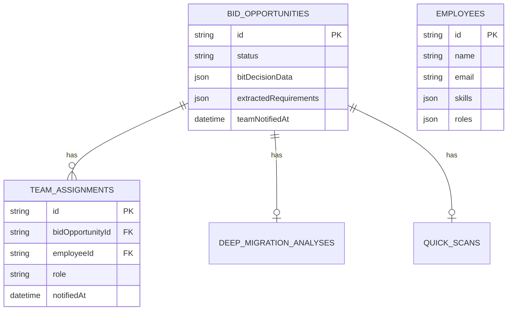

# feat: Workflow Gap Closure - Francesco's Vision vollständig umsetzen

## Overview

Schließe die Gaps zwischen WORKFLOW.md und SPEC.md, um Francesco's End-to-End Vision vollständig zu implementieren:

```
Anforderung hochladen → AI-Extraktion → Bit/No Bit Entscheidung →
Routing an Bereichsleiter → Erweiterte Auswertung → Team zusammenstellen →
Team per E-Mail benachrichtigen
```

**Aktueller Status:** ~75% implementiert
**Ziel:** 100% Workflow-Abdeckung mit Production-Ready Quality

---

## Problem Statement

Francesco's Vision aus dem Interview beschreibt einen nahtlosen Flow:

> "Auf einen Knopf drücken und dann wird das Team per E-Mail mit vorgefertigten Slide Deck benachrichtigt. Herzlichen Glückwunsch, ihr seid im Angebotsteam für Kunde X."

Die Analyse zeigt kritische Gaps:

1. **Phase 6-7 UI fehlt** - Baseline-Vergleich und Projekt-Planung haben Backend-Logic, aber keine UI
2. **Phase 8 unvollständig** - Team Assignment hat AI-Vorschlag, aber BL kann nicht interaktiv anpassen
3. **Phase 9 fehlt PDF** - E-Mail-Versand funktioniert, aber PDF-Anhang fehlt komplett
4. **10 Fragen Tab fehlt** - Zentrale Navigation für BL-Workflow

---

## Proposed Solution

### Architektur: Erweiterte BL-Review Seite mit Tab-Navigation

```
/bl-review/[id]
├── Tab: Übersicht (Dashboard)
├── Tab: BU Matching (Phase 4)
├── Tab: 10 Fragen (Phase 3 - NEU)
├── Tab: Baseline-Vergleich (Phase 6 - NEU)
├── Tab: Projekt-Planung (Phase 7 - NEU)
├── Tab: Team Assignment (Phase 8 - VERBESSERN)
└── Tab: Benachrichtigung (Phase 9 - PDF HINZUFÜGEN)
```

---

## Technical Approach

### Phase 1: Foundation - Tab-Navigation für BL-Review

**Ziel:** Einheitliche Navigation für alle BL-Phasen

**Dateien:**
- `app/(dashboard)/bl-review/[id]/layout.tsx` - Tab Layout
- `app/(dashboard)/bl-review/[id]/page.tsx` - Overview Tab
- `components/bl-review/bl-review-tabs.tsx` - Tab Navigation Component

**Implementation:**
- ShadCN Tabs Component für Navigation
- Dynamische Tabs basierend auf Bid-Status
- Breadcrumbs: Dashboard → BL Review → {Kunde}

### Phase 2: 10 Fragen Tab - Bit/No Bit Zusammenfassung

**Ziel:** BL sieht kompakte Zusammenfassung der Multi-Agent Bewertung

**Dateien:**
- `app/(dashboard)/bl-review/[id]/questions/page.tsx` - 10 Fragen View
- `components/bl-review/ten-questions-card.tsx` - Fragen-Karten
- `lib/bit-evaluation/ten-questions.ts` - Fragen-Extraktion aus Agent-Results

**10 Fragen Format:**
1. Passt der Tech Stack zu unseren Kompetenzen?
2. Ist das Budget realistisch?
3. Ist die Timeline machbar?
4. Gibt es rechtliche Red Flags?
5. Haben wir passende Referenzen?
6. Wer sind die Wettbewerber?
7. Wie hoch ist die Win-Wahrscheinlichkeit?
8. Welche Skills werden benötigt?
9. Gibt es Skill-Gaps?
10. Was ist die finale Empfehlung?

### Phase 3: Baseline-Vergleich Tab

**Ziel:** Visualisierung "Was haben wir?" vs "Was fehlt?"

**Dateien:**
- `app/(dashboard)/bl-review/[id]/baseline/page.tsx` - Baseline View
- `components/bl-review/baseline-comparison.tsx` - Split View Component
- `components/bl-review/baseline-coverage-chart.tsx` - Donut Chart

**UI-Elemente:**
- Split View: Links "Vorhanden (aus Baseline)", Rechts "Neu zu entwickeln"
- Kategorien: Content Types, Paragraphs, Features, Integrationen
- Abdeckungs-Donut: "62% Baseline-Abdeckung"
- PT-Auswirkung: "+120 PT für Neuentwicklung"

### Phase 4: Projekt-Planung Tab

**Ziel:** Timeline-Visualisierung mit Phasen und Disziplinen

**Dateien:**
- `app/(dashboard)/bl-review/[id]/planning/page.tsx` - Planning View
- `components/bl-review/project-timeline.tsx` - Timeline Component
- `components/bl-review/discipline-matrix.tsx` - Rollen pro Phase
- `components/bl-review/pt-breakdown-chart.tsx` - PT-Verteilung

**UI-Elemente:**
- Horizontale Timeline: Discovery → Design → Development → QA → Go-Live
- Wochen-Angaben pro Phase
- Disziplinen-Matrix (PL, CON, UI/UX, DEV, SEO, QA)
- Stacked Bar Chart für PT-Verteilung

### Phase 5: Team Assignment Verbesserung

**Ziel:** BL kann AI-Vorschlag interaktiv anpassen

**Dateien:**
- `app/(dashboard)/bl-review/[id]/team/page.tsx` - Team Builder
- `components/bl-review/team-builder.tsx` - Drag & Drop Interface
- `components/bl-review/employee-card.tsx` - Draggable Card
- `components/bl-review/role-slot.tsx` - Drop Target pro Rolle
- `lib/team/assign-team.ts` - Server Action

**UI-Elemente:**
- Linke Spalte: Verfügbare Mitarbeiter (gefiltert nach Skills)
- Rechte Spalte: Rollen-Slots (PL, Architect, Lead Dev, etc.)
- Drag & Drop mit dnd-kit
- Skill-Match-Indicator pro Mitarbeiter
- "AI-Vorschlag übernehmen" Button

**Dependencies:**
```bash
npm install @dnd-kit/core @dnd-kit/sortable @dnd-kit/utilities
```

### Phase 6: PDF-Generierung für Team-Benachrichtigung

**Ziel:** Professionelles PDF als E-Mail-Anhang

**Dateien:**
- `app/api/bids/[id]/pdf/route.ts` - PDF API Route
- `components/pdf/bid-report.tsx` - React-PDF Template
- `lib/notifications/send-team-notification.ts` - E-Mail mit PDF

**PDF-Inhalt (gemäß WORKFLOW.md):**
1. Kundenname & Kontakt
2. Projekt-Beschreibung
3. Scope & Anforderungen
4. Full Website Scan Zusammenfassung
5. Baseline-Vergleich
6. Timeline mit Phasen
7. Team-Zusammensetzung mit Rollen
8. Nächste Schritte

**Dependencies:**
```bash
npm install @react-pdf/renderer react-pdf-tailwind
```

### Phase 7: E-Mail Integration mit Resend

**Ziel:** Team-Benachrichtigung per E-Mail mit PDF-Anhang

**Dateien:**
- `emails/team-assignment.tsx` - React Email Template
- `lib/notifications/send-team-notification.ts` - Resend Integration
- `app/(dashboard)/bl-review/[id]/notify/page.tsx` - Preview & Send UI

**E-Mail-Template:**
```
Betreff: [Dealhunter] Angebotsteam für {CustomerName}

Hallo {Name},

du wurdest von {BL-Name} in das Angebotsteam für {CustomerName} aufgenommen.

Deine Rolle: {Role}

Im Anhang findest du alle wichtigen Informationen zum Projekt.

Beste Grüße,
{BL-Name}

---
Automatisch generiert von Dealhunter
```

**Dependencies:**
```bash
npm install resend @react-email/components
```

---

## Acceptance Criteria

### Functional Requirements

- [ ] BL kann alle Phasen (6-9) über Tab-Navigation erreichen
- [ ] 10 Fragen Tab zeigt kompakte Zusammenfassung der Bit/No Bit Bewertung
- [ ] Baseline-Vergleich zeigt "Vorhanden" vs "Neu" mit Prozent-Abdeckung
- [ ] Projekt-Planung zeigt Timeline mit 5 Phasen und Disziplinen-Matrix
- [ ] Team Assignment erlaubt Drag & Drop Anpassung des AI-Vorschlags
- [ ] PDF wird korrekt generiert mit allen 8 Abschnitten
- [ ] E-Mail wird an alle Team-Mitglieder gesendet mit PDF-Anhang
- [ ] Status wechselt zu "notified" nach erfolgreichem Versand

### Non-Functional Requirements

- [ ] PDF-Generierung < 5 Sekunden
- [ ] E-Mail-Versand < 10 Sekunden (pro Empfänger)
- [ ] Tab-Wechsel < 100ms (Client-Side Navigation)
- [ ] Responsive Design für Desktop (Mobile nicht im MVP)

### Quality Gates

- [ ] TypeScript Strict Mode ohne Errors
- [ ] Alle neuen Components haben Props-Interfaces
- [ ] Server Actions mit Zod Validation
- [ ] Error Handling für PDF/E-Mail Failures

---

## Success Metrics

| Metrik | Ziel |
|--------|------|
| Workflow Completion Rate | 100% der Phasen nutzbar |
| Time to Notify | < 5 Min nach BL-Entscheidung |
| PDF Generation Success | > 99% |
| Email Delivery Rate | > 95% |

---

## Dependencies & Prerequisites

### Required Packages

```json
{
  "@dnd-kit/core": "^6.0.0",
  "@dnd-kit/sortable": "^8.0.0",
  "@dnd-kit/utilities": "^3.2.0",
  "@react-pdf/renderer": "^3.4.0",
  "react-pdf-tailwind": "^2.0.0",
  "resend": "^3.0.0",
  "@react-email/components": "^0.0.15"
}
```

### Environment Variables

```bash
# Resend (E-Mail)
RESEND_API_KEY=re_xxxxx

# Optional: Custom From Address
RESEND_FROM_EMAIL=dealhunter@adesso.de
```

### Existing Infrastructure

- ✅ Drizzle ORM + SQLite Database
- ✅ Next.js 16 App Router
- ✅ ShadCN UI Components
- ✅ Vercel AI SDK für Agents
- ✅ lib/team/ - Team Suggestion Logic
- ✅ lib/baseline-comparison/ - Baseline Logic
- ✅ lib/project-planning/ - Planning Logic
- ✅ lib/notifications/ - Basic E-Mail Logic

---

## Risk Analysis & Mitigation

| Risk | Likelihood | Impact | Mitigation |
|------|------------|--------|------------|
| PDF-Lib Inkompatibilität | Medium | High | Test mit Next.js 16 vor Implementation |
| Resend Rate Limits | Low | Medium | Batch-Versand mit Delays |
| dnd-kit SSR Issues | Medium | Medium | Dynamic Import mit ssr: false |
| Large PDF Files | Low | Low | Bilder komprimieren, keine Fonts embedden |

---

## Implementation Phases

### Epic 1: Tab Navigation Foundation (1 Tag)
- [ ] `bl-review/[id]/layout.tsx` mit ShadCN Tabs
- [ ] Routing für alle Sub-Pages
- [ ] Breadcrumb-Integration

### Epic 2: 10 Fragen Tab (0.5 Tag)
- [ ] `questions/page.tsx` mit Card-Grid
- [ ] Fragen-Extraktion aus bestehenden Agent-Results
- [ ] Confidence-Indicators pro Frage

### Epic 3: Baseline-Vergleich Tab (1 Tag)
- [ ] `baseline/page.tsx` mit Split View
- [ ] Baseline Coverage Donut Chart
- [ ] PT-Impact Calculation

### Epic 4: Projekt-Planung Tab (1 Tag)
- [ ] `planning/page.tsx` mit Timeline
- [ ] Disziplinen-Matrix Component
- [ ] PT-Breakdown Stacked Bar

### Epic 5: Team Builder (1.5 Tage)
- [ ] dnd-kit Integration
- [ ] `team/page.tsx` mit Drag & Drop
- [ ] Server Action für Team-Speicherung
- [ ] Skill-Gap Warnings

### Epic 6: PDF Generation (1 Tag)
- [ ] @react-pdf/renderer Setup
- [ ] `components/pdf/bid-report.tsx` Template
- [ ] API Route `/api/bids/[id]/pdf`

### Epic 7: E-Mail Integration (0.5 Tag)
- [ ] Resend Setup
- [ ] React Email Template
- [ ] `notify/page.tsx` mit Preview

### Epic 8: Integration & Testing (1 Tag)
- [ ] End-to-End Flow Test
- [ ] Error Handling
- [ ] Status-Updates

**Gesamt: ~8 Tage**

---

## File Structure

```
app/(dashboard)/bl-review/[id]/
├── layout.tsx                 # Tab Navigation
├── page.tsx                   # Overview (redirect)
├── questions/
│   └── page.tsx              # 10 Fragen Tab
├── baseline/
│   └── page.tsx              # Baseline-Vergleich Tab
├── planning/
│   └── page.tsx              # Projekt-Planung Tab
├── team/
│   └── page.tsx              # Team Builder Tab
└── notify/
    └── page.tsx              # Benachrichtigung Tab

components/bl-review/
├── bl-review-tabs.tsx        # Tab Navigation
├── ten-questions-card.tsx    # Fragen-Karten
├── baseline-comparison.tsx   # Split View
├── baseline-coverage-chart.tsx
├── project-timeline.tsx      # Timeline
├── discipline-matrix.tsx     # Rollen-Matrix
├── pt-breakdown-chart.tsx    # PT Chart
├── team-builder.tsx          # Drag & Drop
├── employee-card.tsx         # Draggable Card
└── role-slot.tsx             # Drop Target

components/pdf/
└── bid-report.tsx            # React-PDF Template

emails/
└── team-assignment.tsx       # React Email Template

app/api/bids/[id]/
└── pdf/
    └── route.ts              # PDF Generation API

lib/
├── notifications/
│   └── send-team-notification.ts  # Resend Integration
└── bit-evaluation/
    └── ten-questions.ts      # Fragen-Extraktion
```

---

## ERD Changes

Keine Schema-Änderungen erforderlich. Alle benötigten Felder existieren bereits:



---

## References & Research

### Internal References
- `lib/baseline-comparison/index.ts` - Baseline Logic (bereits implementiert)
- `lib/project-planning/index.ts` - Planning Logic (bereits implementiert)
- `lib/team/suggest-team.ts` - Team Suggestion (bereits implementiert)
- `lib/notifications/index.ts` - Basic E-Mail (zu erweitern)

### External References
- [dnd-kit Documentation](https://dndkit.com/)
- [@react-pdf/renderer](https://react-pdf.org/)
- [Resend Next.js Guide](https://resend.com/docs/send-with-nextjs)
- [React Email Components](https://react.email/docs/introduction)

### Related Work
- WORKFLOW.md - Phasen 6-9 Definition
- SPEC.md - Technische Spezifikationen
- Francesco Interview - Original Vision

---

**Status**: Ready for Implementation
**Estimated Effort**: ~8 Tage
**Priority**: HIGH - Workflow-kritisch
